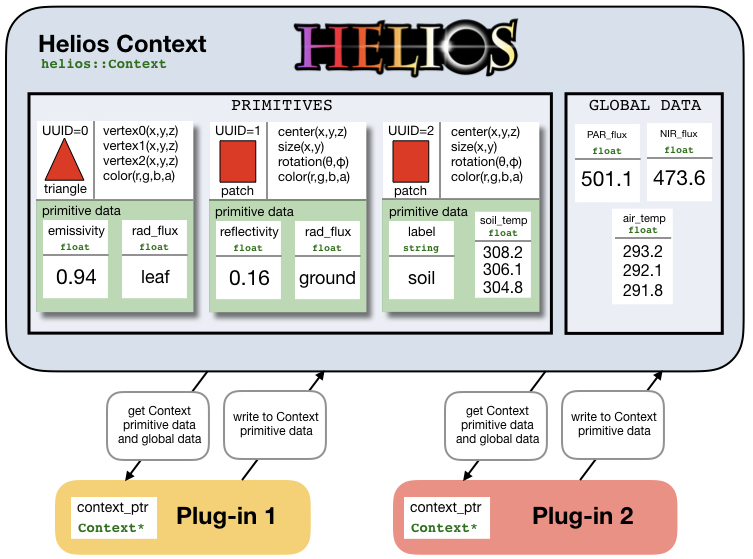

\page Introduction Introduction

# Introduction

## What is PyHelios? {#WhatIsPyHelios}

PyHelios is a Python application programming interface (API) that provides libraries to help with writing programs related to 3D simulation of physical processes. This means that PyHelios itself is not a program that the user runs, rather it is a set of libraries that are incorporated into the program that a user writes. To read more about APIs, see [https://en.wikipedia.org/wiki/Application_programming_interface](https://en.wikipedia.org/wiki/Application_programming_interface).

The PyHelios API consists of many Python [classes](https://docs.python.org/3/tutorial/classes.html) and [functions](https://docs.python.org/3/tutorial/controlflow.html#defining-functions), which are accessible within a Python program by importing the appropriate modules. Specific examples of how this is done are given in the examples and elsewhere in the documentation.

## Model Geometry and Data {#ModelGeometry}

Geometry to be modeled is represented through one or more simple geometric shapes called primitives. Available primitives are triangles, rectangles (patches) and voxels (see Geometry section for more details). Using this set of simple geometric elements, nearly any object can be represented by combining elements.

The basic idea behind Helios is that each primitive element is associated with a set of data, and models are written that operate on this data. This geometry and associated data is what couples models. For example, if we are interested in modeling radiation, each primitive may have data associated with radiative properties such as emissivity, reflectivity, etc. The radiation model would then take that data, along with data that defines the primitive geometry (e.g., position, size), and use that to compute a radiative flux for the individual element.

## The Helios Context {#ContextOverview}

The Context is the primary Python [class](https://docs.python.org/3/tutorial/classes.html) in Helios that is used by every program. It contains many [functions](https://docs.python.org/3/tutorial/controlflow.html#defining-functions) associated with model geometry and data.

You can think of the Context as a package of data, which has many functions that allows you to interface with that data. The Context is used to add model geometry, read/write data associated with that geometry, and manage other model data such as timeseries. The Context is illustrated graphically in the figure below. In the example depicted, the Context contains three primitives - a triangle and two patches - each of which is associated with various types of data (emissivity, temperature, etc.).

## Model Plug-ins {#PluginsOverview}

The Context itself does not do any modeling. It only contains information about model geometry and data. Model plug-ins are Python classes that operate on data contained in the Context to compute some set of values. The figure above illustrates this graphically. A model plug-in is usually given a reference to the Context, and the model uses that reference to access functions associated with the context. For example, a model plug-in may want to access the position of a given primitive, or the temperature associated with a primitive, which it would do by calling a Context function. Generally, a model plug-in class has several member functions that perform tasks such as setting model inputs or running the model. When a model runs, it usually creates some additional data in the Context for each primitive based on model outputs.

## Using the Documentation {#UsingDocumentation}

All classes and member functions are documented, and can be searched using the search functionality in the documentation. For example, you may come across a function where you are unsure of the order or meaning of arguments. Simply search for the name of the function, and you will be taken to a description of the function and all argument definitions.

To continue from here, you may prefer to learn by example using the examples in the `docs/examples/` directory. More detailed explanations of Helios features can be found throughout the User's Guide.
