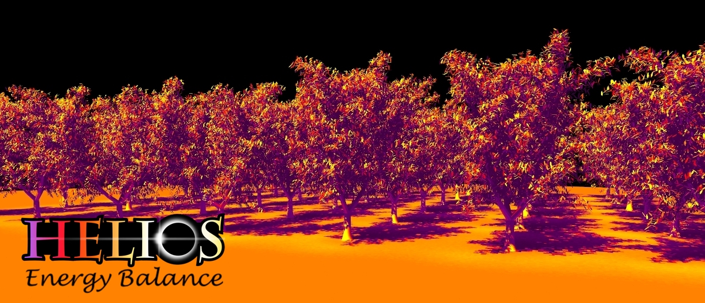

# Energy Balance Model Plugin Documentation {#EnergyBalanceDoc}



[TOC]

<table>
<tr><th>Dependencies</th><td>NVIDIA CUDA 9.0+</td></tr>
<tr><th>Python Import</th><td>`from pyhelios import EnergyBalanceModel`</td></tr>
<tr><th>Main Class</th><td>\ref pyhelios.EnergyBalance.EnergyBalanceModel "EnergyBalanceModel"</td></tr>
</table>

## System Requirements

<table>
  <tr>
    <th>Dependencies</th>
    <td>NVIDIA CUDA 9.0+</td>
  </tr>
  <tr>
    <th>Platforms</th>
    <td>Windows, Linux</td>
  </tr>
  <tr>
    <th>GPU</th>
    <td>Required - NVIDIA CUDA-capable GPU</td>
  </tr>
</table>

## Quick Start

```python
from pyhelios import Context, EnergyBalanceModel
from pyhelios.types import vec3, vec2

with Context() as context:
    # Create minimal geometry
    uuid = context.addPatch(center=vec3(0, 0, 1), size=vec2(1, 1))

    # Set required primitive data
    context.setPrimitiveData(uuid, "air_temperature", 300.0)  # Kelvin

    # Use energy balance plugin
    with EnergyBalanceModel(context) as energybalance:
        # Add radiation bands
        energybalance.addRadiationBand("PAR")
        energybalance.addRadiationBand("NIR")
        energybalance.addRadiationBand("LW")

        # Run steady-state model
        energybalance.run()

        # Get results
        temperature = context.getPrimitiveData(uuid, "temperature")
        print(f"Surface temperature: {temperature[0]:.2f} K")
```

## Dependencies {#EBDepends}

<table>
 <tr>
  <th>Installation Method</th>
  <th>Dependency</th>
  <td>\image html apple-logo.png</td>
  <td>\image html unix-logo.png</td>
  <td>\image html windows-logo.png</td>
 </tr>
 <tr>
  <td rowspan="2">**Runtime**<br>(pip install)</td>
  <td>NVIDIA GPU</td>
  <td>Not supported</td>
  <td colspan="2">Required - CUDA-capable (compute capability 3.5+)</td>
 </tr>
 <tr>
  <td>CUDA Runtime</td>
  <td>Not supported</td>
  <td colspan="2">Version 9.0+<br>Typically installed with NVIDIA drivers<br>Or install <a href="https://developer.nvidia.com/cuda-downloads">CUDA Toolkit</a></td>
 </tr>
 <tr style="border-top: 3px double #888">
  <td>**Build from Source**<br>(additional deps)</td>
  <td>CUDA Toolkit</td>
  <td>Not supported</td>
  <td colspan="2">Version 9.0+ with nvcc compiler<br><a href="https://developer.nvidia.com/cuda-downloads">Download CUDA Toolkit</a></td>
 </tr>
</table>

**For detailed CUDA installation instructions**, see the comprehensive \ref CUDASetup "CUDA Setup Guide", which covers:
- Choosing the correct CUDA toolkit version: \ref ChoosingCUDA
- Platform-specific installation steps (Windows, Linux)
- GPU timeout settings for Windows: \ref PCGPUTimeout
- OptiX requirements: \ref OptiXSetup
- Troubleshooting common issues


## Known Issues {#EBissues}

None.

## Introduction {#EBIntro}

 This model plugin calculates a local energy balance for every primitive, and ultimately predicts sensible, latent, and longwave fluxes as well as surface temperature. The energy balance equation is solved in parallel on the GPU to accelerate calculations.

 The model is solving the steady-state budget between absorbed radiation, emitted radiation, sensible heat exchange, and latent heat exchange, which is written as

 \f[ R-n_s\varepsilon\sigma T_s^4 = c_p g_H \left( T_s-T_a \right) + \lambda g_M \left(\frac{e_s(T_s)f_s-e_s(T_a)h}{p_{atm}}\right)+C_p\frac{dT_s}{dt}+Q_{other}\f]

 Variables in this equation are listed in this table:

 <table>
 <tr><th>Variable (units)</th><th>Description</th></tr>
 <tr><td>\f$R\f$ (W/m<sup>2</sup>)</td><td>Absorbed all-wave radiation flux (shortwave+longwave).</td></tr>
 <tr><td>\f$T_s\f$ (K)</td><td>Primitive surface temperature.
 <tr><td>\f$T_a\f$ (K)</td><td>Air temperature just outside primitive boundary-layer.</td></tr>
 <tr><td>\f$g_H\f$ (mol air/m<sup>2</sup>-s)</td><td>Conductance to heat from primitive surface to outside of boundary-layer.</td></tr>
 <tr><td>\f$g_S\f$ (mol air/m<sup>2</sup>-s)</td><td>Conductance to moisture between sub-surface air spaces to surface (e.g., for leaves this is stomatal conductance).</td></tr>
 <tr><td>\f$g_M\f$ (mol air/m<sup>2</sup>-s)</td><td>Conductance to moisture from primitive surface to outside of boundary-layer.</td></tr>
 <tr><td>\f$e_s(T)\f$ (Pa)</td><td>Saturation vapor pressure at temperature T. Calculated from Tetens equation (see <a href="https://en.wikipedia.org/wiki/Tetens_equation">en.wikipedia.org/wiki/Tetens_equation</a>)</td></tr>
 <tr><td>\f$f_s\f$</td><td>Relative humidity of air at primitive surface.</td></tr>
 <tr><td>\f$h\f$</td><td>Relative humidity of air outside of boundary-layer.</td></tr>
 <tr><td>\f$p_{atm}\f$ (Pa)</td><td>Atmospheric pressure.</td></tr>
 <tr><td>\f$C_p\f$ (J/m<sup>2</sup>/<sup>o</sup>C)</td><td>Heat capacity of object.</td></tr>
 <tr><td>\f$Q_{other}\f$ (W/m<sup>2</sup>)</td><td>Any surface fluxes other than radiation, convection, or latent (e.g., storage).</td></tr>
 <tr><td>\f$n_s\f$</td><td>Number of primitive faces with heat transfer (e.g., typically \f$n_s=1\f$ for leaves, and \f$n_s=0\f$ for the ground.</td></tr>
 </table>

 Constants are given by:

 <table>
 <tr><th>Constant (units) <th>Value <th>Description</th>
 <tr><td>\f$c_p\f$ (J/mol/K) <td>29.25 <td>Heat capacity of air.
 <tr><td>\f$\lambda\f$ (J/mol) <td>44,000 <td> Latent heat of vaporization of air.
 </table>

## Class Constructor {#EBConstructor}

<table>
<tr><th>Constructors</th></tr>
<tr><td>\ref pyhelios.EnergyBalance.EnergyBalanceModel "EnergyBalanceModel"</td></tr>
</table>

The \ref pyhelios.EnergyBalance.EnergyBalanceModel "EnergyBalanceModel" class is initialized by passing the Helios context as an argument to the constructor. 

## Primitive Data {#EBData}

### Input Primitive Data {#EBInputData}

 <table>
 <tr><th>Primitive Data <th>Units <th>Data Type <th>Description <th>Available Plug-ins <th>Default Value
 <tr><td>radiation\_flux\_[*] <td>W/m<sup>2</sup> <td>\htmlonly<span style="font-family: Courier, monospace; color: green;">float</span>\endhtmlonly <td>Net absorbed radiation flux for band [*] (e.g., radiation_flux_PAR). <td>Can be computed by \ref pyhelios.RadiationModel.RadiationModel "RadiationModel" plug-in. <td>N/A (must add at least one band)
 <tr><td>wind\_speed <td>m/s <td>\htmlonly<span style="font-family: Courier, monospace; color: green;">float</span>\endhtmlonly <td>Air wind speed just outside of primitive boundary-layer. <td>N/A <td>1 m/s
 <tr><td>object\_length <td>m <td>\htmlonly<span style="font-family: Courier, monospace; color: green;">float</span>\endhtmlonly <td>Characteristic dimension of object formed by primitive. <td>N/A <td>Square root of primitive surface area
 <tr><td>boundarylayer\_conductance<td>mol air/m<sup>2</sup>-s <td>\htmlonly<span style="font-family: Courier, monospace; color: green;">float</span>\endhtmlonly <td>Leaf boundary-layer conductance to heat. <td>\ref pyhelios.BoundaryLayerConductance.BoundaryLayerConductanceModel "BoundaryLayerConductanceModel" plug-in <td>Try calculating from model \f$0.135\sqrt{\frac{U}{L}}\f$
 <tr><td>air\_temperature <td>Kelvin <td>\htmlonly<span style="font-family: Courier, monospace; color: green;">float</span>\endhtmlonly <td>Ambient air temperature outside of surface boundary layer. <td>N/A <td>300 K
 <tr><td>moisture\_conductance <td>mol air/m<sup>2</sup>-s <td>\htmlonly<span style="font-family: Courier, monospace; color: green;">float</span>\endhtmlonly <td>Conductance to moisture between sub-surface air spaces and surface (e.g., for leaves this is stomatal conductance). <td>Can be computed by \ref pyhelios.StomatalConductance.StomatalConductanceModel "StomatalConductanceModel" plug-in. <td>0
 <tr><td>surface\_humidity <td>unitless <td>\htmlonly<span style="font-family: Courier, monospace; color: green;">float</span>\endhtmlonly <td>Relative humidity of air immediately above surface evaporating site. <td>N/A <td>1.0 (saturated)
 <tr><td>air\_humidity <td>unitless <td>\htmlonly<span style="font-family: Courier, monospace; color: green;">float</span>\endhtmlonly <td>Ambient air relative humidity outside of surface boundary layer. <td>N/A <td>0.5
 <tr><td>air\_pressure <td>Pascals <td>\htmlonly<span style="font-family: Courier, monospace; color: green;">float</span>\endhtmlonly <td>Atmospheric pressure. <td>N/A <td>101,000 Pa
 <tr><td>heat\_capacity <td> J/m<sup>2</sup>/<sup>o</sup>C <td>\htmlonly<span style="font-family: Courier, monospace; color: green;">float</span>\endhtmlonly <td>Heat capacity of object. <td>N/A <td>0
 <tr><td>other\_surface\_flux <td>W/m<sup>2</sup> <td>\htmlonly<span style="font-family: Courier, monospace; color: green;">float</span>\endhtmlonly <td>Other surface energy fluxes. <td>N/A <td>0
 <tr><td>twosided\_flag <td>N/A <td>\htmlonly<span style="font-family: Courier, monospace; color: green;">uint</span>\endhtmlonly <td>Flag indicating the number of primitive faces with heat transfer (twosided\_flag = 0 for one-sided heat transfer; twosided\_flag = 1 for two-sided heat transfer). Can also be set via the material system using Context::setMaterialTwosidedFlag(). When a user-assigned material exists, the material's twosided\_flag takes precedence over primitive data. <td>N/A <td>1 </tr>
 <tr><td>stomatal\_sidedness <td>\f$\zeta\f$ <td>\htmlonly<span style="font-family: Courier, monospace; color: green;">float</span>\endhtmlonly <td>Ratio of stomatal density on the upper leaf surface to the sum of the stomatal density on upper and lower leaf surfaces. Note: if "twosided_flag" is equal to 0, stomatal\_sidedness will be automatically set to 0.<td>N/A <td>0  </tr>
 </table>

### Default Output Primitive Data {#EBOutputData}
 
 <table>
 <tr><th>Primitive Data <th>Units <th>Data Type <th>Description
 <tr><td>temperature <td>Kelvin <td>\htmlonly<span style="font-family: Courier, monospace; color: green;">float</span>\endhtmlonly <td>Primitive surface temperature.
 <tr><td>sensible\_flux <td>W/m<sup>2</sup> <td>\htmlonly<span style="font-family: Courier, monospace; color: green;">float</span>\endhtmlonly <td>Sensible heat flux.
 <tr><td>latent\_flux <td>W/m<sup>2</sup> <td>\htmlonly<span style="font-family: Courier, monospace; color: green;">float</span>\endhtmlonly <td>Latent heat flux.
 </table>

### Optional Output Primitive Data {#EBOptionalOutputData}
 
 <table>
 <tr><th>Primitive Data <th>Units <th>Data Type <th>Description
 <tr><td>boundarylayer\_conductance\_out <td>mol air/m<sup>2</sup>-s <td>\htmlonly<span style="font-family: Courier, monospace; color: green;">float</span>\endhtmlonly <td>Primitive boundary-layer conductance calculated by this plug-in.
 <tr><td>vapor\_pressure\_deficit <td>mol/mol <td>\htmlonly<span style="font-family: Courier, monospace; color: green;">float</span>\endhtmlonly <td>Surface vapor pressure deficit.
 <tr><td>storage\_flux <td>W/m<sup>2</sup> <td>\htmlonly<span style="font-family: Courier, monospace; color: green;">float</span>\endhtmlonly <td>Storage heat flux.
 <tr><td>net\_radiation\_flux <td>W/m<sup>2</sup> <td>\htmlonly<span style="font-family: Courier, monospace; color: green;">float</span>\endhtmlonly <td>Primitive net radiation flux (absorption minus emission).
 </table>

## Using the Energy Balance Model Plug-in {#EBUse}

### Input Variables {#EBPrimData}

 Inputs to the model are set by creating primitive variable data in the usual way. If a variable needed for a model input has not been create in the Context, the default value is assumed.

### Input Radiative Bands {#EBRad}

In order for the model to calculate the absorbed all-wave radiation flux, it needs to know the names of all radiation bands that were added to the radiation model. This is done using the function \ref pyhelios.EnergyBalance.EnergyBalanceModel::addRadiationBand "addRadiationBand()". In the following example, assume we have three radiative wavebands "PAR", "NIR", and "LW".

```python
# Initialize the Model
with EnergyBalanceModel(context) as energybalance:
    energybalance.addRadiationBand("PAR")
    energybalance.addRadiationBand("NIR")
    energybalance.addRadiationBand("LW")
```

### Boundary-layer Conductance Model {#EBblc}

The primitive boundary-layer conductance can either be set using the \ref pyhelios.BoundaryLayerConductance.BoundaryLayerConductanceModel "BoundaryLayerConductanceModel" plug-in, or using the default model which is the Polhausen equation. Note also that custom conductance values can also be provided by setting the value of primitive data labeled 'boundarylayer_conductance', which overrides the computed model value.

 It is also important to note that, by default, the length scale used to calculate the boundary-layer conductance is taken to be the square root of the primitive surface area. If the size of the object is different from the size of the primitive, then it is important to manually set the length scale to be the size of the object, as this is the relevant scale for boundary-layer development.

 The default boundary-layer conductance is calculated as

 \f$g_H = 0.135 n_s\sqrt{\frac{U}{L}}\f$,

 where \f$U\f$ is the wind speed just outside of the primitive boundary-layer, and \f$L\f$ is the characteristic length/dimension of the object that the primitive belongs to. For a leaf consisting of a single primitive, \f$L\f$ could be assumed to be the length of the primitive. \f$n_s\f$ is the number of primitive faces, which is determined by the value of primitive data "twosided_flag" (twosided\_flag=0 is single-sided and \f$n_s=1\f$, twosided\_flag=1 is two-sided and \f$n_s=2\f$).

### Moisture Conductance {#EBgm}

 For surfaces that are not completely dry or completely saturated with water, availability of water at the surface determines the rate of moisture transfer from the surface. This is represented by the surface moisture conductance \f$g_S\f$, and corresponds to the conductance between the sub-surface air spaces and the surface.

  For a dry surface, \f$g_S=0\f$ and thus there is no moisture transfer at the surface. For a surface that is saturated with water (e.g., a lake, puddle), \f$g_S\rightarrow\infty\f$ as the supply of water at the surface is theoretically infinite.

  For surfaces such as leaves and the soil in which surface moisture is present but limited, \f$g_S\f$ will have some intermediate value typically on the order of 0.1 mol air/m<sup>2</sup>-s.

  For leaves, \f$g_S\f$ corresponds to the conductance to water vapor between the intercellular (sub-stomatal) air spaces and the surface of the leaf, which we call the stomatal conductance. When stomata are closed, \f$g_S\rightarrow 0\f$, as water transfer is restricted by the stomata.

  For the soil surface, the physical interpretation of \f$g_S\f$ is slightly less intuitive, and corresponds to the rate at which water vapor can diffuse from just below the soil to the surface. This is impacted by the soil texture, and the "tortuosity" of the path water vapor must take through the soil, among other factors.

   Once the water vapor has diffused to the surface, the rate of transfer is then determined by the surface boundary-layer conductance. The sub-surface conductance and boundary-layer conductance act in serial, and can be combined to yield an overall moisture conductance between the sub-surface air spaces and the outside of the boundary layer according to

   \f$g_M = 1.08g_Hg_S\left[\dfrac{\zeta}{1.08g_H+g_S\zeta}+\dfrac{(1-\zeta)}{1.08g_H+g_S(1-\zeta)}\right]\f$,

   where \f$g_H\f$ is the boundary-layer conductance to heat, and \f$1.08g_H\f$ gives the boundary-layer conductance to moisture considering the differences in diffusivity between water vapor and heat.

   \f$\zeta=\dfrac{D_{upper}}{D_{lower}+D_{upper}}\f$

   is the stomatal sidedness, which is the ratio of the stomatal density of the upper leaf surface to the sum of the upper and lower leaf surface densities, which is set by the primitive data value "stomatal_sidedness". For leaves, \f$\zeta=0\f$ corresponds to hypostomatous leaves (stomata on one side), and \f$\zeta=0.5\f$ to amphistomatous leaves (stomata equally on both sides). It is important to note that if \f$n_s=1\f$, then the value of \f$\zeta\f$ will be overridden and set to 0.

### Running the Steady-State Model {#EBRun}

The model is run assuming steady-state conditions (heat storage term is zero) using the \ref pyhelios.EnergyBalance.EnergyBalanceModel::run "run()" function, which will run the model for all primitives in the Context if no argument is given, or will run the model for a subset of primitives if a list of UUIDs is given as the argument.

<table>
<caption>Functions to run the steady-state energy balance model.</caption>
<tr><th>Model Run Function</th><th>Description</th></tr>
<tr><td>\ref pyhelios.EnergyBalance.EnergyBalanceModel::run "run()"</td><td>Run the model for all primitives in the Context.</td></tr>
<tr><td>\ref pyhelios.EnergyBalance.EnergyBalanceModel::run "run(uuids)"</td><td>Run the model for a select set of primitives in the Context, which are specified by a list of their UUIDs.</td></tr>
</table>

<p> <br><br> </p>

```python
from pyhelios import Context, EnergyBalanceModel
from pyhelios.types import vec3, vec2

# Initialize the Context
with Context() as context:
    # Add Patch primitive
    center = vec3(0, 0, 1)
    size = vec2(1, 1)
    UUID = context.addPatch(center, size)

    with EnergyBalanceModel(context) as energybalance:
        energybalance.addRadiationBand("PAR")
        energybalance.addRadiationBand("NIR")
        energybalance.addRadiationBand("LW")

        energybalance.run()
```

#### Unsteady model with heat storage {#EBRunUS}

 Additional functions are available to run the unsteady energy balance model with heat storage. If the timestep argument "dt" is passed with value greater than 0, and the heat capacity \f$C_p\f$ is greater than 0, the unsteady energy balance equation will be applied with the heat storage term included. The following equation is then solved for the surface temperature at time \f$t+\Delta t\f$

 \f[ R-n_s\varepsilon\sigma T_s(t+\Delta t)^4 - c_p g_H \left( T_s(t+\Delta t)-T_a \right) - \lambda g_M \left(\frac{e_s(T_s(t+\Delta t))f_s-e_s(T_a)h}{p_{atm}}\right)-Q_{other} + C_p\dfrac{T_s(t+\Delta t) - T_s(t)}{\Delta t}.\f]

 The timestep should be chosen such that it is significantly smaller than the characteristic time constant of heat storage.

 Functions for running the unsteady energy balance model are listed below.

<table>
<caption>Functions to run the unsteady energy balance model.</caption>
<tr><th>Model Run Function</th><th>Description</th></tr>
<tr><td>\ref pyhelios.EnergyBalance.EnergyBalanceModel::run "run(dt)"</td><td>Run the model for all primitives in the Context and advance in time by dt seconds.</td></tr>
<tr><td>\ref pyhelios.EnergyBalance.EnergyBalanceModel::run "run(uuids, dt)"</td><td>Run the model for a select set of primitives in the Context, which are specified by a list of their UUIDs, and advance in time by dt seconds.</td></tr>
</table>

 Note that you can run the steady-state model for some primitives but run the unsteady model for others simply by changing the value of the heat capacity primitive data. This is illustrated in the code example below.

<p> <br><br> </p>

```python
from pyhelios import Context, EnergyBalanceModel
from pyhelios.types import vec3, vec2

# Initialize the Context
with Context() as context:
    # Add one Patch primitive
    center = vec3(0, 0, 1)
    size = vec2(1, 1)
    UUID1 = context.addPatch(center, size)

    # Add a second Patch primitive
    center = vec3(2, 0, 1)
    UUID2 = context.addPatch(center, size)

    # Set the heat capacity of the first patch so that the unsteady energy balance model will be run
    Cp = 10000  # J/m^2-oC
    context.setPrimitiveData(UUID1, "heat_capacity", Cp)

    with EnergyBalanceModel(context) as energybalance:
        energybalance.addRadiationBand("PAR")
        energybalance.addRadiationBand("NIR")
        energybalance.addRadiationBand("LW")

        dt = 180
        energybalance.run(dt)
```
