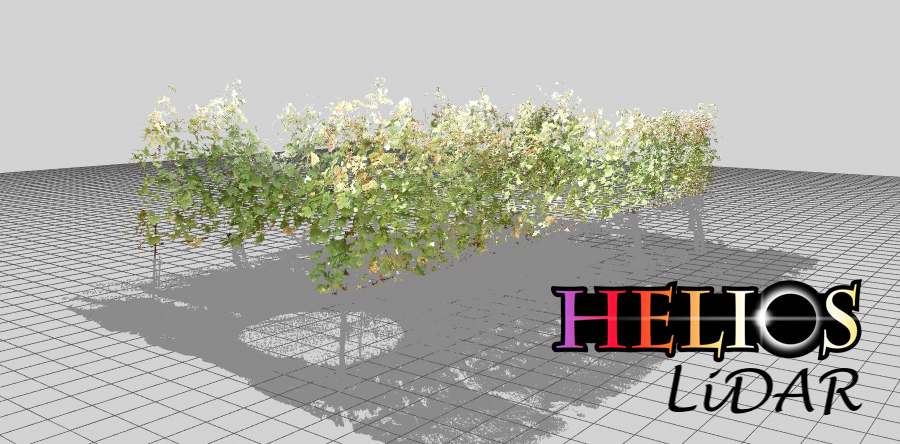
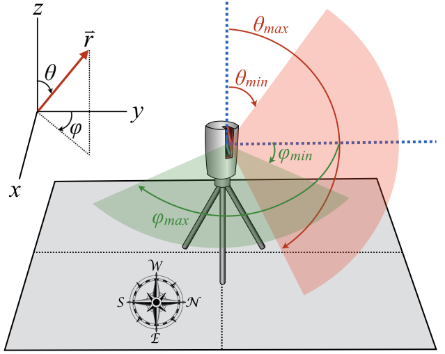
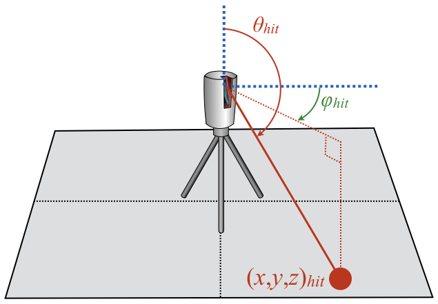
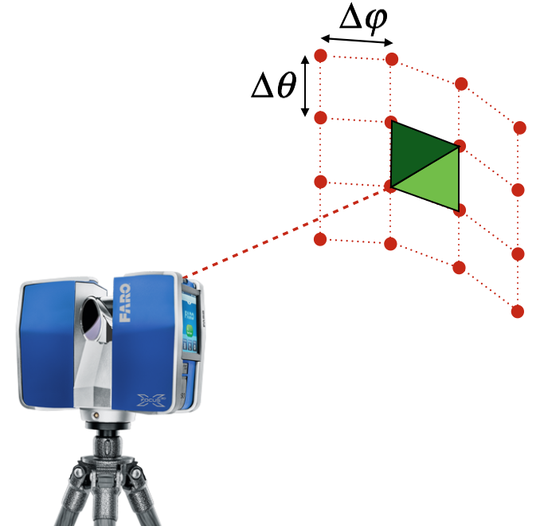
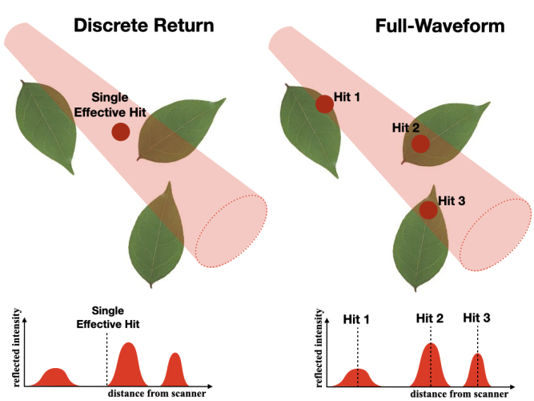
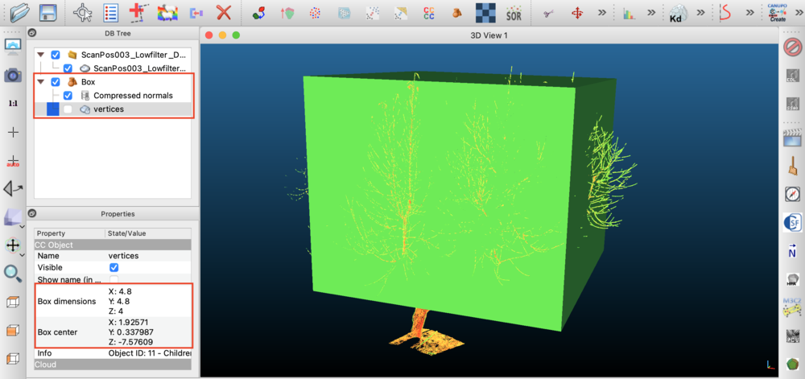

# LiDAR Point Cloud Plugin Documentation {#LiDARDoc}



[TOC]

<table>
<tr><th>Dependencies</th><td>Visualizer plugin<br>CollisionDetection plugin</td></tr>
<tr><th>Python Import</th><td>`from pyhelios import LiDARCloud`</td></tr>
<tr><th>Main Class</th><td>\ref pyhelios.LiDARCloud.LiDARCloud "LiDARCloud"</td></tr>
</table>

## Known Issues {#LiDARissues}

- The LiDAR plugin requires the Visualizer plugin to be loaded in the build (it is a build-time dependency).
- The current version of `calculateLeafArea()` handles both single-return and multi-return data automatically.

## Introduction {#LiDARintro}

The LiDAR plugin is used to process terrestrial LiDAR data into information that is useful for plant models. For example, this may be to determine leaf area and angle distributions at the voxel scale, or to reconstruct individual leaves and add them to the Context.

## Dependencies {#LiDARdepends}

The LiDAR plugin uses the CollisionDetection plugin for ray tracing. GPU acceleration is optional and controlled through the CollisionDetection plugin:
- For CPU-only operation: No additional dependencies required
- For GPU acceleration: NVIDIA CUDA-capable GPU and CUDA runtime (managed by CollisionDetection plugin)

To enable GPU acceleration for faster processing of large point clouds, call `enableCDGPUAcceleration()` before running scans:

```python
from pyhelios import LiDARCloud

with LiDARCloud() as pointcloud:
    pointcloud.enableCDGPUAcceleration()   # Enable GPU acceleration before running scans
```

GPU acceleration can be turned off again with `disableCDGPUAcceleration()`. To check whether a usable GPU is present before enabling it, call `isGPUAvailable()` (true only if the plugin was compiled with CUDA, a CUDA device is present at runtime, and `HELIOS_NO_GPU` is unset); `isGPUAccelerationEnabled()` reports whether GPU acceleration is currently toggled on.

For long-running synthetic scans you can observe progress without blocking: `setSyntheticScanProgressPointer(ctypes.c_int)` registers a caller-owned counter that `syntheticScan()` updates with the 0-based index of the scan currently being ray-traced (set to `getScanCount()` when finished), and `setProgressCallback(fn)` registers a Python callback invoked with `(progress_fraction, message)` during the scan (pass `None` to clear either one).

## Class Constructor {#LiDARConstructor}

<table>
<tr><th>Constructors</th></tr>
<tr><td>\ref pyhelios.LiDARCloud.LiDARCloud "LiDARCloud()"</td></tr>
</table>

The \ref pyhelios.LiDARCloud.LiDARCloud "LiDARCloud" class contains point cloud data, and is used to perform processing operations on the data. The class constructor does not take any arguments. It supports the context manager protocol for automatic resource cleanup.

```python
from pyhelios import LiDARCloud

# Initialize the LiDAR point cloud
with LiDARCloud() as pointcloud:
    # Perform operations
    pass
```

## Input Primitive Data {#LiDARInputData}

<table>
  <tr><th>Primitive Data Label</th><th>Symbol</th><th>Units</th><th>Data Type</th><th>Description</th><th>Available Plug-ins</th><th>Default Value</th></tr>
  <tr><td>reflectivity_lidar</td><td>\f$\rho_l\f$</td><td>unitless</td><td>\htmlonly<span style="font-family: Courier, monospace; color: green;">float</span>\endhtmlonly</td><td>Primitive reflectivity in the waveband of the laser. This is used to calculate the return intensity in synthetic scans.</td><td>N/A</td><td>1.0</td></tr>
</table>

## Background Information {#LiDARbg}

### Coordinates and Scan Pattern {#LiDARcoord}

The algorithms associated with the LiDAR plugin work with data obtained from a rectangular scan pattern. In this scan pattern, points are sampled at equally spaced intervals in both the zenithal (\f$\theta\f$) and azimuthal (\f$\varphi\f$) directions. At a given azimuthal angle, some range of zenithal angles are consecutively scanned, which represents a "scan line". Each scan line starts at some zenithal angle \f$\theta\f$<sub>min</sub> and ends at some zenithal angle \f$\theta\f$<sub>max</sub>. After recording a scan line at the first azimuthal angle \f$\varphi\f$<sub>min</sub>, the scanner incrementally moves to the next adjacent azimuthal scan direction and records the next scan line until it reaches the azimuthal angle \f$\varphi\f$<sub>max</sub>.

The number of zenithal points within each scan line is given by \f$\mathrm{N}_{\theta}\f$, and the total number of scan lines (i.e., number of individual azimuthal directions) is given by \f$\mathrm{N}_{\varphi}\f$.

Angles passed to the Python API (e.g. `addScan()`) are specified in **radians**. Angles given in an XML scan file are specified in **degrees** (matching the C++ XML convention). Distance units are arbitrary, but must be used consistently.


*Scan pattern: the scanner traverses some range of zenithal and azimuthal angles to explore a portion of the spherical space surrounding the scanner.*


*For each scan direction, the scanner records the (x,y,z) Cartesian position of the point of intersection between the ray path and the object's surface. Each Cartesian position corresponds to spherical coordinate (zenith,azimuth) representing the scan direction.*


*The rectangular scan pattern creates quadrilateral polygons between four neighboring points.*

### Single-return vs. multi-return LiDAR data {#LiDARreturn}

The laser beam emitted from a LiDAR instrument has some finite diameter, which increases with distance from the scanner. In many cases, the beam diameter may be larger than the width of individual leaves by the time it reaches the canopy. This means that a single laser pulse may intersect multiple objects along its path to the ground.

LiDAR data is commonly classified along two independent axes that are easy to conflate. The first is the instrument's *detection method*: a **discrete-return** instrument detects peaks in the returning signal in real time and records a small number of discrete points per pulse, whereas a **full-waveform** instrument digitizes and stores the entire returned signal as a function of time (the "waveform"), from which the individual returns are later extracted. The second axis is the number of returns recorded per pulse: **single-return** (one hit point per pulse) versus **multi-return** (several hit points per pulse, e.g. first, second, ..., last). These two axes are independent: discrete-return instruments routinely record multiple returns per pulse, and full-waveform instruments also ultimately output discrete returns once the waveform is decomposed.

The Helios LiDAR plugin works entirely with **discrete return points** — it does not produce, store, or export a digitized waveform. What it distinguishes, and what this documentation refers to throughout, is the number of returns recorded per pulse:
- **Single-return** data records a single hit point per laser pulse. The distance recorded for the hit point is an effective average distance to all objects intersected by the beam.
- **Multi-return** data records multiple hit point locations along a single laser pulse. Multi-return data is preferred in dense canopies, where a single-return measurement would rarely record the location of the ground beneath the foliage.

Real instruments that produce multi-return data (such as the RIEGL VZ series) are often full-waveform internally, but the exported point cloud — and everything Helios simulates and processes — consists of discrete returns, not waveforms.



### Scan Metadata {#ScanMetadata}

Each scan has a set of parameters or "metadata" that must be specified in order to process the data. Some parameters are optional, while some are required. The following metadata is needed to define the overall scan itself, in addition to individual scan hit points. Note that XML tags are case-sensitive.

The tags in the table below are common to *all* scan types. The tags that define the *geometry* of the scan depend on the scan pattern (selected with the \<scanPattern> tag) and are listed separately for each pattern in \ref ScanRaster and \ref ScanSpinningMultibeam below.

<table>
<tr><th>Metadata</th><th>XML tag</th><th>Description</th><th>Python parameter (addScan/addScanSpinning)</th><th>Default behavior</th></tr>
<tr><td>Scanner origin</td><td>\<origin></td><td>(x,y,z) coordinate of the scanner. This is the position where the scanner rays are sent from.</td><td>origin (vec3)</td><td>None: REQUIRED</td></tr>
<tr><td>Scan pattern</td><td>\<scanPattern></td><td>Geometric pattern of beam directions: either raster (a uniform angular grid in zenith and azimuth — the default panoramic terrestrial-scanner pattern) or spinning_multibeam (a rotating multi-channel sensor such as a Velodyne, Ouster, or Hesai unit). The geometry of each pattern is defined by additional tags listed below.</td><td>addScan() (raster) or addScanSpinning() (spinning multibeam)</td><td>raster</td></tr>
<tr><td>Translation</td><td>\<translation></td><td>Global (x,y,z) translation to be applied to entire scan, including the origin and all hit points.</td><td>Use coordinateShift()</td><td>No translation</td></tr>
<tr><td>Rotation</td><td>\<rotation></td><td>Global spherical rotation (theta,phi) to be applied to the entire scan, including the origin and all hit points.</td><td>Use coordinateRotation()</td><td>No rotation</td></tr>
<tr><td>Beam exit diameter (meters)</td><td>\<exitDiameter></td><td>Effective diameter of laser beam exiting the instrument. Only used for multi-return synthetic data generation.</td><td>exit_diameter</td><td>0 (single return)</td></tr>
<tr><td>Beam divergence angle (rad)</td><td>\<beamDivergence></td><td>Angle of laser beam divergence after exiting the instrument. Only used for multi-return synthetic data generation.</td><td>beam_divergence</td><td>0</td></tr>
<tr><td>Range noise std. dev. (meters)</td><td>\<rangeNoiseStdDev></td><td>Standard deviation of zero-mean Gaussian noise added to the measured range (distance) of each return during synthetic scan generation. The hit point is displaced along the beam direction, producing the along-beam component of the positional error. Only used for synthetic data generation.</td><td>range_noise_stddev</td><td>0 (no noise)</td></tr>
<tr><td>Angular noise std. dev. (rad)</td><td>\<angleNoiseStdDev></td><td>Standard deviation of zero-mean Gaussian jitter applied to the pointing direction of each pulse during synthetic scan generation. This produces the across-beam (lateral) component of the positional error, which grows with range. Only used for synthetic data generation.</td><td>angle_noise_stddev</td><td>0 (no jitter)</td></tr>
<tr><td>Scanner tilt (roll, pitch)</td><td>\<scanTilt></td><td>Global scanner tilt applied to the entire scan frame about the scanner origin during synthetic scan generation. This models the residual tilt of the scanner spin axis away from true vertical (plumb) that a real terrestrial scanner's dual-axis inclinometer reports. Two angles are given (roll then pitch), applied in that order, in a right-handed, Z-up body frame: roll is a right-hand rotation about the body lateral axis and pitch is a right-hand rotation about the body forward (azimuth-zero) axis. Commercial scanners do not share a universal inclinometer sign convention, so verify signs against the specific instrument. Only used for synthetic data generation. **XML uses degrees; Python API uses radians.**</td><td>scan_tilt_roll, scan_tilt_pitch (radians)</td><td>0 0 (perfectly level)</td></tr>
<tr><td>Return mode</td><td>\<returnMode></td><td>How a pulse reports detected returns during analytic-waveform synthetic scan generation (more than one ray per pulse): <tt>multi</tt> reports every detected return with no limit (discrete multi-return instrument), while <tt>single</tt> reports a limited number of points per pulse — at most \<maxReturns> of them, selected by \<singleReturnSelection>. A single ray per pulse always produces an idealized exact intersection. Set in Python with `setScanReturnMode()` (`ReturnMode.MULTI`/`ReturnMode.SINGLE`) or the `return_mode` argument of `syntheticScan()`. Only used for synthetic data generation.</td><td>setScanReturnMode() / syntheticScan(return_mode=...)</td><td>multi</td></tr>
<tr><td>Single-return selection</td><td>\<singleReturnSelection></td><td>Which return(s) are kept when \<returnMode> is <tt>single</tt> and more returns than \<maxReturns> are resolved: <tt>strongest</tt> (largest echo amplitude), <tt>first</tt> (nearest), or <tt>last</tt> (farthest). The kept returns are always reported nearest-first. Only used for synthetic data generation.</td><td>setScanSingleReturnSelection() (SingleReturnSelection enum)</td><td>strongest</td></tr>
<tr><td>Maximum returns per pulse</td><td>\<maxReturns></td><td>Maximum number of returns reported per pulse when \<returnMode> is <tt>single</tt>: <tt>1</tt> = single-return, <tt>2</tt> = dual-return, <tt>N</tt> = N-return. When a pulse resolves more returns than this, the \<singleReturnSelection> policy chooses which to keep. Must be at least 1. Ignored when \<returnMode> is <tt>multi</tt>. Only used for synthetic data generation.</td><td>setScanMaxReturns()</td><td>1 (single-return)</td></tr>
<tr><td>Pulse width / range resolution (meters)</td><td>\<pulseWidth></td><td>Range-resolution distance used to merge sub-ray hits into discrete returns: two surfaces closer than this distance merge into a single return, reproducing the range-resolution (dead-zone) limit of a real instrument. (Alternatively specify \<pulseDuration> in seconds in XML.) When 0, the synthetic scanner uses the `pulse_distance_threshold` argument of `syntheticScan()` instead. Only used for synthetic data generation.</td><td>setScanPulseWidth()</td><td>0 (use syntheticScan argument)</td></tr>
<tr><td>Detection threshold (energy fraction)</td><td>\<detectionThreshold></td><td>Minimum return energy fraction (range-normalized echo amplitude as a fraction of total per-pulse beam energy) for a return to be detected. Returns weaker than this are discarded, modeling the noise floor of a real instrument. Only used for synthetic data generation.</td><td>setScanDetectionThreshold()</td><td>0 (no suppression)</td></tr>
<tr><td>ASCII point cloud file</td><td>\<filename></td><td>File containing point cloud data to be read.</td><td>Loaded via loadXML()</td><td>No file will be read</td></tr>
<tr><td>ASCII file column format</td><td>\<ASCII_format></td><td>Labels for columns in ASCII point cloud file. See \ref ScanIO for possible values and examples.</td><td>column_format, or loaded via loadXML()</td><td>x y z</td></tr>
</table>

#### Rectangular raster scan pattern {#ScanRaster}

The default scan pattern (\<scanPattern> raster \</scanPattern>, or simply omitting the \<scanPattern> tag) is a rectangular raster: a uniform angular grid of \f$\mathrm{N}_\theta\times\mathrm{N}_\varphi\f$ beam directions spanning the zenith range [\f$\theta\f$<sub>min</sub>,\f$\theta\f$<sub>max</sub>] and the azimuth range [\f$\varphi\f$<sub>min</sub>,\f$\varphi\f$<sub>max</sub>]. This corresponds to a panoramic terrestrial laser scanner operating in gridded mode (e.g. RIEGL VZ, Leica, FARO Focus). In the Python API a raster scan is created with `addScan()`. The geometry is defined by the following tags, in addition to the common tags above:

<table>
<tr><th>Metadata</th><th>XML tag</th><th>Description</th><th>Python parameter (addScan)</th><th>Default behavior</th></tr>
<tr><td>Size</td><td>\<size></td><td>Number of scan points in the theta (zenithal) and phi (azimuthal) directions, \f$\mathrm{N}_\theta\f$ and \f$\mathrm{N}_\varphi\f$.</td><td>Ntheta, Nphi (int)</td><td>None: REQUIRED</td></tr>
<tr><td>\f$\theta\f$<sub>min</sub></td><td>\<thetaMin></td><td>Minimum scan theta (zenithal) angle. \f$\theta\f$<sub>min</sub>=0 if the scan starts from upward vertical, \f$\theta\f$<sub>min</sub>=90° (π/2 rad) if the scan starts from horizontal. **XML uses degrees; Python API uses radians.**</td><td>theta_range[0] (radians)</td><td>0</td></tr>
<tr><td>\f$\theta\f$<sub>max</sub></td><td>\<thetaMax></td><td>Maximum scan theta (zenithal) angle. \f$\theta\f$<sub>max</sub>=90° (π/2 rad) if the scan ends at horizontal, \f$\theta\f$<sub>max</sub>=180° (π rad) if the scan ends at downward vertical. **XML uses degrees; Python API uses radians.**</td><td>theta_range[1] (radians)</td><td>π</td></tr>
<tr><td>\f$\varphi\f$<sub>min</sub></td><td>\<phiMin></td><td>Minimum scan phi (azimuthal) angle. \f$\varphi\f$<sub>min</sub>=0 if the scan starts pointing in the +y direction, \f$\varphi\f$<sub>min</sub>=90° (π/2 rad) if the scan starts pointing in the +x direction. **XML uses degrees; Python API uses radians.**</td><td>phi_range[0] (radians)</td><td>0</td></tr>
<tr><td>\f$\varphi\f$<sub>max</sub></td><td>\<phiMax></td><td>Maximum scan phi (azimuthal) angle. NOTE: \f$\varphi\f$<sub>max</sub> can be greater than 360° (2π rad) if \f$\varphi\f$<sub>min</sub> > 0 and the scanner makes a full rotation in the azimuthal direction, in which case \f$\varphi\f$<sub>max</sub> = \f$\varphi\f$<sub>min</sub> + 360°. **XML uses degrees; Python API uses radians.**</td><td>phi_range[1] (radians)</td><td>2π</td></tr>
</table>

```xml
<scan>
  <origin> 0 0 0 </origin>
  <size> 2500 4500 </size>
  <thetaMin> 30 </thetaMin>
  <thetaMax> 130 </thetaMax>
  <phiMin> 0 </phiMin>
  <phiMax> 360 </phiMax>
</scan>
```

#### Spinning multibeam scan pattern {#ScanSpinningMultibeam}

A rotating multi-channel sensor (e.g. Velodyne, Ouster, Hesai) is the most common pattern for mobile and UAV plant scanning. \f$\mathrm{N}_\theta\f$ laser channels are each fixed at their own (generally non-uniformly spaced) elevation angle, and the whole head rotates continuously while the platform moves along a trajectory. The pattern is represented internally as the same \f$\mathrm{N}_\theta\times\mathrm{N}_\varphi\f$ scan table used by a raster scan, so all downstream processing — ray tracing, hit tables, leaf-area and leaf-angle inversion — is identical to a raster scan. Each synthetic hit additionally records a `channel` data value giving the laser channel (scan-table row) that produced it.

A spinning sensor is set up from its **physical parameters** — channel elevation angles, azimuth resolution, pulse repetition rate (PRF), and a platform trajectory — not from a hand-sized azimuth grid. In the Python API this is `addScanSpinning()`; in XML it is the `<azimuthStep>`, `<PRF>`, and trajectory tags. See \ref LiDARphysical for the full setup (including a stationary "spin in place" capture) and \ref LiDARspinning for the `addScanSpinning()` reference. The geometric pattern of a stored scan can be queried with `getScanPattern()` (returns `ScanPattern.SPINNING_MULTIBEAM`) and its per-channel zenith angles with `getScanBeamZenithAngles()`; the acquisition mode is `getScanMode()` (`ScanMode.SPINNING`).

\note Leaf-area inversion requires the population of transmitted (miss) beams. For raster scans loaded from real instruments these can be reconstructed with `gapfillMisses()`, which assumes a regular angular grid. For non-raster patterns, generate synthetic scans with miss recording enabled by calling `syntheticScan()` with `record_misses=True` (see \ref LiDARsynthmisses), which records the misses directly and does not rely on grid reconstruction.

\note The triangulation distance passed to `triangulateHitPoints()` should be matched to the point spacing of the pattern. Spinning multibeam channels are spaced more coarsely in the vertical (zenithal) direction than a dense raster scan, so a larger triangulation distance may be needed for leaf-angle and leaf-area reconstruction.

The scan pattern of a stored scan can be queried with `getScanPattern()` (returns `ScanPattern.RASTER` or `ScanPattern.SPINNING_MULTIBEAM`), and the per-channel zenith angles of a multibeam scan with `getScanBeamZenithAngles()` (returns an empty list for a raster scan).

### Hit Point Data {#AddHits}

In addition to scan metadata, the data collected by the scan itself must also be added to the plugin. This can be achieved by either reading data from an ASCII text file, or performing a synthetic scan. At a minimum, point cloud data consists of the Cartesian (x,y,z) coordinates of each hit in the scan. Additionally, hit points may also have an associated r-g-b color value, or some other scalar data value such as intensity or temperature.

For the processing algorithms to work, the scan direction associated with each hit point must also be known. This can be specified directly as a (\f$\theta\f$,\f$\varphi\f$) spherical coordinate, or using the row (i.e., index in the scanline: 1...\f$\mathrm{N}_\theta\f$) and column (i.e., scanline index: 1...\f$\mathrm{N}_\varphi\f$). Otherwise, it will calculate the scan direction by drawing a line between the scan origin position and the hit point.

For multi-return data, additional information is needed about the hit points. Specifically, the total number of hit points along the pulse. The index can start at 0 or 1 for the first hit along the pulse, it just should be consistent for all points.

## Loading Scan Data from File {#ScanIO}

Scan metadata is typically specified by loading an XML file containing the relevant metadata for each scan. For real data, the XML file specifies the path to an ASCII text file that contains the data for each scan. For synthetic data, the parameters of the simulated scan are loaded from the XML file and used to perform the scan.

The code below gives a sample XML file for loading multiple scans. As specified in the metadata table above, not all entries are required.

```xml
<helios>
  <scan>
    <filename> /path/to/data/file.xyz </filename>
    <ASCII_format> x y z r255 g255 b255 target_count target_index timestamp </ASCII_format>
    <origin> 0 0 0 </origin>
    <size> 2500 4500 </size>
    <thetaMin> 30 </thetaMin>
    <thetaMax> 130 </thetaMax>
    <phiMin> 0 </phiMin>
    <phiMax> 360 </phiMax>
    <translation> 1.2 1.5 -10.2 </translation>
    <rotation> 20 180 </rotation>
    <exitDiameter> 0.005 </exitDiameter>
    <beamDivergence> 0.003 </beamDivergence>
  </scan>
</helios>
```

The ASCII text file containing the data is a plain text file, where each row corresponds to a hit point and each column is some data value associated with that hit point. The "ASCII_format" tag defines the column format of the ASCII text file (in this case, file.xyz). Each entry in the list specifies the meaning of each column. Possible fields are listed in the table below:

<table>
<tr><th>Label</th><th>Description</th><th>Default behavior</th></tr>
<tr><td>x</td><td>x-component of the (x,y,z) Cartesian coordinate of the hit point.</td><td>None: REQUIRED</td></tr>
<tr><td>y</td><td>y-component of the (x,y,z) Cartesian coordinate of the hit point.</td><td>None: REQUIRED</td></tr>
<tr><td>z</td><td>z-component of the (x,y,z) Cartesian coordinate of the hit point.</td><td>None: REQUIRED</td></tr>
<tr><td>zenith (or zenith_rad)</td><td>Zenithal angle (degrees) of scan ray direction corresponding to the hit point. If "zenith_rad" is used, theta has units of radians rather than degrees.</td><td>Calculated from scan origin and hit (x,y,z)</td></tr>
<tr><td>azimuth (or azimuth_rad)</td><td>Azimuthal angle (degrees) of scan ray direction corresponding to the hit point. If "azimuth_rad" is used, phi has units of radians rather than degrees.</td><td>Calculated from scan origin and hit (x,y,z)</td></tr>
<tr><td>r (or r255)</td><td>Red component of (r,g,b) hit color. If "r" tag is used, r is a floating point value between 0 and 1. If "r255" is used, r is an integer between 0 and 255.</td><td>r=1 or r255=255</td></tr>
<tr><td>g (or g255)</td><td>Green component of (r,g,b) hit color. If "g" tag is used, g is a floating point value between 0 and 1. If "g255" is used, g is an integer between 0 and 255.</td><td>g=0 or g255=0</td></tr>
<tr><td>b (or b255)</td><td>Blue component of (r,g,b) hit color. If "b" tag is used, b is a floating point value between 0 and 1. If "b255" is used, b is an integer between 0 and 255.</td><td>b=0 or b255=0</td></tr>
<tr><td>target_count</td><td>Number of hits along scan pulse.</td><td>Assumed to be single-return data</td></tr>
<tr><td>target_index</td><td>Index of hit along scan pulse.</td><td>Assumed to be single-return data</td></tr>
<tr><td>timestamp</td><td>Unique timestamp of hit point.</td><td>Assumed to be single-return data</td></tr>
<tr><td>row</td><td>Scan-grid row index (zenithal/theta direction) of the hit point. Used by gapfillMisses() to reconstruct miss directions when timestamps are unavailable (see below).</td><td>N/A</td></tr>
<tr><td>column</td><td>Scan-grid column index (azimuthal/phi direction) of the hit point. Used by gapfillMisses() to reconstruct miss directions when timestamps are unavailable (see below).</td><td>N/A</td></tr>
<tr><td>is_miss</td><td>Miss flag for the hit (1 = miss/transmitted beam, 0 = return). When present in the imported file, misses are read directly and no reconstruction is needed (see \ref LiDARmisses).</td><td>N/A</td></tr>
<tr><td>deviation</td><td>Indication of variability in return within a given hit point. Note: this is never used for real data, but can be output for synthetic data.</td><td>N/A</td></tr>
<tr><td>echo_width</td><td>Range spread (width) of the return in meters: the transmit pulse range-extent combined in quadrature with the range spread of the surfaces that merged into the return. Note: this is computed for synthetic data only (analytic-waveform multi-ray scans).</td><td>N/A</td></tr>
<tr><td>intensity</td><td>Range-normalized intensity of return, equal to \f$\rho\,\cos\theta\f$ (per-primitive reflectivity times the incidence-angle cosine) with the \f$1/R^2\f$ range loss of the LiDAR range equation normalized out, so it is independent of the scanner-to-target range. Note: this is never used for real data, but can be output for synthetic data.</td><td>N/A</td></tr>
<tr><td>reflectance</td><td>Synthetic return reflectance in decibels, \f$10\,\log_{10}|I|\f$ where \f$I\f$ is the range-normalized intensity, relative to a perfect Lambertian reflector at normal incidence (0 dB). Output only when "reflectance" is listed in the ASCII_format. Note: this is computed for synthetic data only.</td><td>N/A</td></tr>
<tr><td>(label)</td><td>User-defined floating-point data value. "label" can be any string describing data. For example, "temperature", etc.</td><td>N/A</td></tr>
</table>

\note When a point cloud is written with `exportPointCloud()` or `exportScans()`, each ASCII data file begins with a comment-line header that starts with '#' and lists the column field names (the same fields given in the "ASCII_format" tag), for example \# x y z intensity reflectance. This makes the exported file self-describing and follows the conventional ASCII point-cloud header recognized by tools such as CloudCompare. The header is written by default; pass `write_header=False` to `exportPointCloud()` to suppress it. When loading, any line beginning with '#' is treated as a comment and skipped, so headered files round-trip without modification.

The XML file can be automatically loaded into the point cloud using the `loadXML()` method:

```python
from pyhelios import LiDARCloud

with LiDARCloud() as pointcloud:
    pointcloud.loadXML("/path/to/file.xml")
```

### Miss points (transmitted beams) and how to export them {#LiDARmisses}

\warning **This is the single most common source of inaccurate leaf-area results from real scan data.** The leaf-area inversion (`calculateLeafArea()`) **requires** the population of *miss points* — laser pulses that were fired but did not return from any object, having passed through the canopy to the sky. The canopy gap fraction that the inversion is built on is, by definition, the number of pulses with no canopy return divided by the total number of pulses fired in that direction range, so the no-return pulses are an essential part of the measurement, not optional metadata. An ordinary point cloud contains *only* points where something was hit, so most instrument software **drops the no-return pulses when it exports a point cloud**. If you import such a "returns-only" file and run the leaf-area inversion without taking one of the steps below, the gap fraction has no valid denominator and the result will be badly biased. `calculateLeafArea()` detects this case and raises an error rather than silently producing a wrong number.

A hit point is flagged as a miss with the per-hit `is_miss` data value (1 = miss, 0 = return). You can check programmatically whether the cloud contains any misses with `hasMisses()`, and whether a particular hit is a miss with `isHitMiss(index)`. The miss points themselves are placed along their beam at the distance returned by `LiDARCloud.getMissDistance()`. You can satisfy the requirement in one of three ways, listed from most to least faithful to the original measurement:

<table>
<tr><th>#</th><th>Approach</th><th>What you must provide in the imported ASCII file</th><th>When to use</th></tr>
<tr><td>1</td><td>**Import the misses directly**</td><td>An ASCII file that includes the no-return pulses, with an is_miss column (1 for the no-return pulses, 0 for returns) listed in the \<ASCII_format>. Including row/column or timestamp as well is recommended but not required once is_miss is present.</td><td>**Preferred.** The true fired-beam geometry is used directly, with no reconstruction or assumptions.</td></tr>
<tr><td>2</td><td>**Reconstruct the misses** with gapfillMisses()</td><td>A returns-only ASCII file that still carries either row and column scan-grid indices, or a per-return timestamp, in the \<ASCII_format>. gapfillMisses() infers the empty (sky) directions of the scan grid from the returns and emits a miss for each.</td><td>When you cannot export the no-return pulses but *can* export the row/column indices or timestamps. Works only for a regular raster scan grid.</td></tr>
<tr><td>3</td><td>**Generate a synthetic scan** with miss recording</td><td>Helios geometry plus a scan definition; call syntheticScan() with record_misses=True (see \ref LiDARsynthmisses).</td><td>When you are simulating, not importing, real data. Misses are recorded directly; this is the only option for non-raster (e.g. spinning-multibeam) patterns.</td></tr>
</table>

If you import a returns-only file with *none* of `is_miss`, `row`/`column`, or `timestamp`, there is no information from which the miss directions can be recovered, and neither approach 1 nor 2 is possible. The triangulation, leaf-angle, and plant-reconstruction routines do not require misses and will still run, but the leaf-area inversion cannot. In that case you must re-export the data from the original instrument project so that the necessary information is retained, because it was discarded at export time and cannot be reconstructed afterward.

#### Exporting from instrument software so that misses survive {#LiDARmissexport}

Helios imports plain ASCII/text point-cloud files (see `loadXML()` and the column table above); it does not read vendor binary formats (PTX, FLS, RDB, E57, LAS, etc.) directly. The task at export time is therefore to produce an ASCII file that satisfies approach 1 or 2 above. Exact menu names and options vary between software packages and versions, so the guidance below describes *what capability to look for* and how it maps to the Helios columns, rather than an exact click-path; verify the specifics against your software's current documentation.

- **FARO (SCENE, Focus).** The simplest path is approach 2: export the scan to ASCII `XYZ` with the **"Include row/col"** option enabled, which writes the scan-grid row and column index of each return as additional columns. This is an ordinary *unstructured* export — it contains only the returns, not the empty cells — but because every return is tagged with its grid row and column, `gapfillMisses()` can reconstruct the empty (miss) directions. Map those columns to the Helios `row` and `column` tokens in the \<ASCII_format> (together with x, y, z and any intensity/color you want), then call `gapfillMisses()`.
- **Leica (Cyclone, RTC360 / ScanStation / BLK) and any scanner that exports a gridded PTX file.** The PTX format is an ASCII grid: its header records the number of columns and rows, and it then writes one line for *every* cell of the scan grid — including the no-return cells, which are written with zero coordinates and zero intensity (a line such as 0 0 0 0) so that the full scan-line grid is preserved. The practical workflow is to export the structured scan as PTX, then convert it to a Helios ASCII file with a short script that walks the PTX grid and writes, for each cell, the columns row column x y z plus `is_miss` (1 for a zero/no-return cell, 0 otherwise). With `is_miss` present you are using approach 1; with only `row`/`column` present you are using approach 2 and call `gapfillMisses()`.
- **RIEGL (RiSCAN PRO / RDB, V-Line scanners).** RiSCAN PRO's ASCII export has an option to omit invalid/no-return measurements, so check that this option is *not* applied if you intend to export them directly. The most robust RIEGL path is approach 2 using timestamps: export the per-return `timestamp` (mapped to the Helios `timestamp` column) along with x, y, z, and let `gapfillMisses()` reconstruct the miss directions.
- **Mobile / UAV spinning sensors (Velodyne, Ouster, Hesai, etc.).** These do not produce a regular raster grid, so `gapfillMisses()` cannot be used (it assumes a raster grid). Either export the no-return shots directly if the sensor driver emits them (flag those as `is_miss=1`), or model the measurement as a synthetic scan in Helios with `record_misses=True`.
- **CloudCompare and generic ASCII/CSV tools.** These operate on returns only and have no concept of a transmitted/no-return beam, so they cannot create misses that were not already present in their input. Use them only to *re-save* a cloud that already carries the `is_miss` flag or the `row`/`column`/`timestamp` columns, and check that those columns survive the round-trip and that the column order matches the \<ASCII_format> tag used on import.

\note If you only have a returns-only export and cannot regenerate it from the original instrument project, the leaf-area inversion cannot be made accurate for that data. Helios deliberately fails fast in this situation rather than returning a misleadingly precise but biased leaf area.

The example below shows the import-and-reconstruct workflow (approach 2) for a returns-only export that carries per-return timestamps:

```xml
<helios>
  <scan>
    <filename> /path/to/data/returns_only.xyz </filename>
    <ASCII_format> x y z timestamp target_index target_count </ASCII_format>
    <origin> 0 0 0 </origin>
    <size> 2500 4500 </size>
    <thetaMin> 30 </thetaMin>
    <thetaMax> 130 </thetaMax>
    <phiMin> 0 </phiMin>
    <phiMax> 360 </phiMax>
  </scan>
</helios>
```

```python
from pyhelios import Context, LiDARCloud

with Context() as context:
    with LiDARCloud() as pointcloud:
        pointcloud.loadXML("/path/to/file.xml")
        pointcloud.gapfillMisses()                  # reconstruct transmitted-beam (miss) directions
        pointcloud.triangulateHitPoints(Lmax=0.05, max_aspect_ratio=5)
        pointcloud.calculateLeafArea(context)
```

If the file already contains the misses (approach 1, e.g. converted from a PTX grid), include `is_miss` in the \<ASCII_format> and the `gapfillMisses()` call can be omitted:

```xml
<ASCII_format> row column x y z is_miss </ASCII_format>
```

### Adding scan data programmatically {#ScanIOAPI}

Scans do not have to be defined in an XML file — they can also be created entirely in code through the API, which is useful when scan parameters are computed at runtime, when hit points come from another source, or when building automated tests. A raster scan is registered with `addScan()` (a spinning multibeam scan with `addScanSpinning()`, see \ref LiDARphysical), which returns the integer scan ID. Hit points are then added to that scan with `addHitPoint()`.

The example below creates a rectangular raster scan, adds it to the point cloud, and adds a single hit point. Angles passed to `addScan()` are in **radians**.

```python
import math
from pyhelios import LiDARCloud
from pyhelios.types import vec3, SphericalCoord

with LiDARCloud() as pointcloud:
    # Define a rectangular raster scan (angles in radians)
    scan_id = pointcloud.addScan(
        origin=vec3(0.0, 0.0, 1.0),
        Ntheta=250, theta_range=(0.0, math.pi),        # zenith range [rad]
        Nphi=450, phi_range=(0.0, 2.0 * math.pi),      # azimuth range [rad]
        exit_diameter=0.0, beam_divergence=0.0
    )

    # Add a hit point to the scan. The ray direction is given as a
    # SphericalCoord (radius, elevation, azimuth); addHitPoint also accepts an
    # optional RGBcolor as a fourth argument.
    pointcloud.addHitPoint(
        scan_id,
        vec3(5.0, 0.0, 1.0),
        SphericalCoord(radius=5.0, elevation=0.0, azimuth=0.0)
    )
```

A spinning multibeam scan is created with `addScanSpinning()` from physical instrument parameters — per-channel **elevation** angles, an azimuth resolution, a PRF, and a trajectory — rather than a hand-sized azimuth grid. See \ref LiDARphysical for the full reference; a stationary tripod capture is shown below:

```python
import math
from pyhelios import LiDARCloud
from pyhelios.types import vec3

with LiDARCloud() as pointcloud:
    # Define a 16-channel spinning sensor spanning -15 deg to +15 deg elevation, spun in place for 1 s
    beam_elev = [math.radians(e) for e in range(-15, 16, 2)]  # elevation above horizon (radians)
    scan_id = pointcloud.addScanSpinning(
        beam_elevation_angles=beam_elev,
        azimuth_step=math.radians(0.2),     # 0.2 deg azimuth resolution
        pulse_rate_hz=600000.0,             # 600 kHz PRF
        traj_t=[0.0, 1.0],
        traj_pos=[[0, 0, 1.5], [0, 0, 1.5]],     # two coincident poses = spin in place
        traj_rot=[[0, 0, 0, 1], [0, 0, 0, 1]],
    )
```

`addHitPoint()` also accepts an optional hit color (\ref pyhelios.types.RGBcolor "RGBcolor"). For loading many hit points at once, PyHelios provides bulk helpers that pass contiguous buffers to the native library in a single FFI call: `addHitPoints()` (positions, directions, optional colors) and `addHitPointsWithData()` (additionally a per-hit named-scalar data map — the in-memory equivalent of the non-standard ASCII columns, which is what multi-return leaf-area workflows need so that `gapfillMisses()` can group beams by pulse). For synthetic (simulated) scans, hit points are generated automatically by ray tracing the Helios geometry instead of being added by hand — see \ref LiDARsynthetic.

A raster scan can also carry a global azimuth (heading) offset via the `scan_azimuth_offset` keyword (radians; default 0), a right-hand rotation about the world +z axis applied on top of the azimuth sweep. Together with `scan_tilt_roll`/`scan_tilt_pitch` it completes the roll/pitch/yaw orientation of a static scanner. It is queryable with `getScanAzimuthOffset()`.

### Moving-platform (mobile/airborne) scans {#LiDARmoving}

Terrestrial scans (`addScan()`) fire all pulses from a single fixed origin. For mobile or airborne LiDAR the scanner moves during the sweep, so PyHelios provides `addScanMoving()`, which drives the scanner pose from a timestamped 6-DOF trajectory. For each pulse the synthetic-scan generator computes its acquisition time \f$t = t_0 + \mathrm{ordinal}/\mathrm{pulse\_rate\_hz}\f$, interpolates the platform pose at that time (linear position, SLERP orientation), and emits a per-pulse origin \f$\mathbf{o} = \mathbf{pos} + R(\mathbf{q})\,\mathbf{lever\_arm}\f$ and direction \f$\mathbf{d} = R(\mathbf{q})\,R(\mathbf{boresight})\,\mathbf{d}_{body}\f$. Every resulting hit and miss records its own origin (queryable with `getHitOrigin()`), real timestamp, and firing index. The static tilt fields are not used in this mode — attitude comes entirely from the trajectory quaternions composed with the fixed boresight misalignment.

The orientation trajectory may be supplied either as quaternions `(qx, qy, qz, qw)` (Hamilton body→world; `rot_is_quaternion=True`, the default) or as roll/pitch/yaw Euler angles in radians (`rot_is_quaternion=False`). Prefer quaternions when the trajectory comes from an INS/IMU.

```python
import math
from pyhelios import Context, LiDARCloud
from pyhelios.types import vec3, vec2

with Context() as context:
    context.addPatch(center=vec3(0, 0, 0), size=vec2(10, 10))
    with LiDARCloud() as pointcloud:
        # A platform flying along +x at 10 m altitude, looking straight down
        scan_id = pointcloud.addScanMoving(
            Ntheta=16, theta_range=(2.8, 3.14),     # near-nadir fan
            Nphi=64, phi_range=(-0.2, 0.2),
            exit_diameter=0.0, beam_divergence=0.0,
            traj_t=[0.0, 1.0],
            traj_pos=[[-5, 0, 10], [5, 0, 10]],
            traj_rot=[[0, 0, 0, 1], [0, 0, 0, 1]],  # identity quaternions
            rot_is_quaternion=True,
            lever_arm=[0, 0, 0], boresight_rpy=[0, 0, 0],
            pulse_rate_hz=10000.0,
        )
        pointcloud.syntheticScan(context, record_misses=True)
        origin0 = pointcloud.getHitOrigin(0)   # per-pulse emission origin (z ~ 10)
```

Because the pulses of a moving scan do not lie on a fixed zenith/azimuth grid, they **cannot be triangulated**, so the usual G(theta)-from-triangulation path is unavailable. Leaf area for moving scans is computed with the `Gtheta` overload of `calculateLeafArea()` (see \ref LiDARleafarea), which takes a caller-supplied G(theta) and uses each hit's per-pulse beam origin.

### Physical-parameter spinning and moving-raster scans {#LiDARphysical}

`addScan()` and `addScanMoving()` are the lower-level entry points that take the internal \f$\mathrm{N}_\theta\times\mathrm{N}_\varphi\f$ scan grid directly. For a real mobile, UAV, or airborne instrument PyHelios also provides two **physical-parameter** entry points that take the instrument's real parameters and derive the internal sampling grid, rotation rate, revolution count, and per-pulse timing for you. A scan created this way is self-describing: query `getScanMode()` (a `ScanMode`), `getScanRotationRate()`, `getScanRevolutions()`, and `getScanStepsPerRev()` to introspect it.

#### Spinning multibeam (`addScanSpinning()`) {#LiDARspinning}

A spinning multibeam sensor rotates continuously through 360° while the platform moves along a trajectory, so there is no partial-arc azimuth range — the only azimuth control is the angular resolution. `addScanSpinning()` takes per-channel beam **elevation** angles (radians above the horizon, where zenith = π/2 − elevation), an azimuth resolution, a pulse repetition rate (PRF), a 6-DOF trajectory, and the lever arm / boresight. Helios derives the azimuth step count, rotation rate (`PRF / (channels × steps_per_rev)`), revolution count, and full multi-revolution azimuth sweep; you never specify an azimuth range, step count, or revolution count. The scan's `getScanMode()` is `ScanMode.SPINNING`.

```python
import math
from pyhelios import Context, LiDARCloud, ScanMode
from pyhelios.types import vec3, vec2

with Context() as context:
    context.addPatch(center=vec3(0, 0, 0), size=vec2(20, 20))
    with LiDARCloud() as pointcloud:
        beam_elev = [math.radians(e) for e in range(-15, 16, 2)]  # elevation above horizon (radians)
        scan_id = pointcloud.addScanSpinning(
            beam_elevation_angles=beam_elev,
            azimuth_step=math.radians(0.2),     # 0.2 deg azimuth resolution
            pulse_rate_hz=600000.0,             # 600 kHz PRF
            traj_t=[0.0, 1.0],
            traj_pos=[[-5, 0, 10], [5, 0, 10]],
            traj_rot=[[0, 0, 0, 1], [0, 0, 0, 1]],  # identity quaternions
            rot_is_quaternion=True,
            column_format=["x", "y", "z", "origin_x", "origin_y", "origin_z", "timestamp"],
        )
        print(pointcloud.getScanMode(scan_id) == ScanMode.SPINNING)   # True
        print(pointcloud.getScanStepsPerRev(scan_id), pointcloud.getScanRotationRate(scan_id))
        pointcloud.syntheticScan(context, record_misses=True)
```

A free-spinning sensor cannot be held at a fixed pose without overlapping itself, so for a **stationary** capture (a spinning sensor on a tripod) supply a trajectory of two coincident poses — the same position and orientation — separated in time by the acquisition duration. The time gap determines how long the sensor spins and therefore how many revolutions it makes.

#### Moving raster (`addScanMovingRaster()`) {#LiDARmovingraster}

For a non-spinning sensor carried on a moving platform, `addScanMovingRaster()` takes the per-frame angular fan resolution (\f$\mathrm{N}_\theta\times\mathrm{N}_\varphi\f$ over the zenith and azimuth ranges), a quaternion trajectory, and a PRF, and derives the per-pulse time sampling along the trajectory. The scan's `getScanMode()` is `ScanMode.MOVING_RASTER`.

```python
import math
from pyhelios import LiDARCloud
from pyhelios.types import vec3

with LiDARCloud() as pointcloud:
    scan_id = pointcloud.addScanMovingRaster(
        Ntheta=16, theta_range=(2.8, 3.14),       # near-nadir fan (radians)
        Nphi=64, phi_range=(-0.2, 0.2),
        pulse_rate_hz=100000.0,
        traj_t=[0.0, 1.0],
        traj_pos=[[-5, 0, 10], [5, 0, 10]],
        traj_quat=[[0, 0, 0, 1], [0, 0, 0, 1]],   # identity quaternions
    )
```

\note Both physical-parameter entry points round-trip through XML: `exportScans()` writes the physical parameters plus a trajectory sidecar CSV, and `loadXML()` reads spinning/moving-raster scans back from `<azimuthStep>`, `<PRF>`, `<leverArm>`, `<boresight>`, and inline `<trajectory>`/`<pose>` (or `<trajectoryFile>`) tags. Like all moving scans, they cannot be triangulated, so leaf area uses the `Gtheta` overload of `calculateLeafArea()`.

#### Rotating-Risley-prism rosette (`addScanRisley()`) {#LiDARrisley}

A Livox rosette-pattern sensor (Mid-40/Mid-70/Avia) fires a single beam through a stack of continuously rotating wedge prisms, tracing a non-repetitive rosette inside a circular field of view (denser toward the center). `addScanRisley()` takes the prism stack — a list of `RisleyPrism` objects (`wedge_angle`, `refractive_index`, `rotor_rate`, `phase`, all SI/radians) in beam-traversal order — the refractive index of the surrounding air, a pulse repetition rate, and a 6-DOF trajectory (quaternion or Euler). The per-pulse beam direction is computed by full Snell's-law refraction through the rotating prisms at each pulse's time; the field of view is an emergent property of the wedge angles and refractive indices, not a directly specified parameter. The scan is stored as a single-row (\f$\mathrm{N}_\theta=1\f$) table with `getScanMode()` `ScanMode.RISLEY_PRISM` and `getScanPattern()` `ScanPattern.RISLEY_PRISM`; query the prisms with `getScanRisleyPrisms()` and the air index with `getScanRisleyRefractiveIndexAir()`. Like a spinning scan it is always trajectory-driven, so a stationary tripod capture is two coincident poses separated in time by the acquisition duration.

```python
import math
from pyhelios import Context, LiDARCloud, RisleyPrism, ScanMode
from pyhelios.types import vec3, vec2

with Context() as context:
    context.addPatch(center=vec3(0, 0, 0), size=vec2(20, 20))
    with LiDARCloud() as pointcloud:
        # Two counter-rotating wedge prisms (the canonical Livox configuration).
        prisms = [RisleyPrism(wedge_angle=math.radians(15), refractive_index=1.51,
                              rotor_rate=420.0, phase=0.0),
                  RisleyPrism(wedge_angle=math.radians(15), refractive_index=1.51,
                              rotor_rate=-380.0, phase=0.0)]
        scan_id = pointcloud.addScanRisley(
            prisms=prisms, refractive_index_air=1.0003, pulse_rate_hz=100000.0,
            traj_t=[0.0, 0.1],
            traj_pos=[[0, 0, 1.5], [0, 0, 1.5]],     # stationary tripod capture
            traj_rot=[[0, 0, 0, 1], [0, 0, 0, 1]],   # identity quaternions
        )
        print(pointcloud.getScanMode(scan_id) == ScanMode.RISLEY_PRISM)   # True
        pointcloud.syntheticScan(context, record_misses=True)
```

\note Only the rotating-Risley-prism rosette mechanism is modeled; Livox's deterministic line-scan mode and the newer MEMS/galvanometer non-repetitive patterns are different mechanisms not covered by this entry point.

## Establishing Grid Cells {#LiDARgrid}

Rectangular grid cells are used as the basis for processing point cloud data. For example, total leaf area (or leaf area density) may be calculated for each grid cell. Grid cells or "voxels" are parallelpiped volumes. The top and bottom faces are always horizontal, but the cells can be rotated in the azimuthal direction.

Grid cells are defined by specifying the (x,y,z) position of its center, and the size of the cell in the x, y, and z directions. Additional optional information can also be provided for grid cells, which are detailed below.

<table>
<tr><th>Tag</th><th>Description</th><th>Default behavior</th></tr>
<tr><td>center</td><td>(x,y,z) Cartesian coordinates of cell center.</td><td>None: REQUIRED</td></tr>
<tr><td>size</td><td>Length of cell sides in x, y, and z directions.</td><td>None: REQUIRED</td></tr>
<tr><td>rotation</td><td>Azimuthal rotation of the cell. XML uses degrees, as does the Python `addGrid()` rotation argument; `addGridCell()` takes radians (see the note below).</td><td>0</td></tr>
<tr><td>Nx</td><td>Grid cell subdivisions in the x-direction.</td><td>1</td></tr>
<tr><td>Ny</td><td>Grid cell subdivisions in the y-direction.</td><td>1</td></tr>
<tr><td>Nz</td><td>Grid cell subdivisions in the z-direction.</td><td>1</td></tr>
</table>

The grid cell subdivisions options allow the cells to be easily split up into a grid of smaller cells. For example, Nx=Ny=Nz=3 would create 27 grid cells similar to a "Rubik's cube".

### Loading grid cells from XML file {#LiDARgridXML}

Grid cell options can be specified in an XML file using the tags listed in the table above. Multiple grid cells are added by simply adding more \<grid>...\</grid> groups to the XML file. These are loaded along with the scans by `loadXML()`.

```xml
<grid>
  <center> 0 0 0.5 </center>
  <size> 1 1 1 </size>
  <rotation> 30 </rotation>
  <Nx> 3 </Nx>
  <Ny> 3 </Ny>
  <Nz> 3 </Nz>
</grid>
```

### Adding grid cells programmatically {#LiDARgridAPI}

Grid cells can also be added programmatically using the `addGrid()` method, without needing to specify them in an XML file. This is useful when grid parameters are computed at runtime or when setting up scans entirely in code. The `addGrid()` method takes the (x,y,z) center of the grid, the size of the grid in each dimension, the number of subdivisions in each dimension, and the azimuthal rotation angle (in degrees). A single grid cell can be added with `addGridCell()`.

\note The rotation units differ between the two methods, mirroring the native API: `addGrid()` takes **degrees** (it converts internally), while `addGridCell()` takes **radians** (it stores the angle directly). `getCellRotation()` reports **degrees**, matching `addGrid()`.

```python
from pyhelios import LiDARCloud
from pyhelios.types import vec3

with LiDARCloud() as pointcloud:
    # Add a rectangular grid with subdivisions (creates 3x3x3 = 27 cells)
    pointcloud.addGrid(
        center=vec3(0.0, 0.0, 0.5),   # (x,y,z) center of grid
        size=vec3(1.0, 1.0, 1.0),     # size in x,y,z directions
        ndiv=[3, 3, 3],               # number of subdivisions
        rotation=0.0                  # azimuthal rotation in degrees
    )

    # Or add an individual grid cell (rotation here is in radians)
    pointcloud.addGridCell(
        center=vec3(5.0, 5.0, 0.5),
        size=vec3(1.0, 1.0, 0.5),
        rotation=0.0
    )

    # Query grid cell properties
    for i in range(pointcloud.getGridCellCount()):
        center = pointcloud.getCellCenter(i)
        size = pointcloud.getCellSize(i)
        rotation = pointcloud.getCellRotation(i)   # degrees
        print(f"Cell {i}: center=({center.x}, {center.y}, {center.z}), size=({size.x}, {size.y}, {size.z})")
```

\note `getCellCenter()` returns the **true world-space center**. For a grid built with a non-zero `rotation`, this is the lattice center rotated about the grid anchor (about +z), so it lies in the same rotated frame as the hit points, scan origins, and grid bounding box.

### Terrain-following grids {#LiDARgridTerrain}

By default `addGrid()` builds an axis-regular lattice, which is a poor fit for a canopy over sloping ground: the bottom layer of voxels cuts through the terrain in some places and floats above it in others. Passing `column_z_offsets` shifts each vertical column of voxels in z by a per-column amount, so the grid can track an external terrain surface such as a DEM.

The offsets are given row-major as `[j*ndiv[0] + i]`, one value per (x,y) column, so the list length must be `ndiv[0]*ndiv[1]`. Omitting the argument (or passing all zeros) reproduces the axis-regular grid exactly.

```python
from pyhelios import LiDARCloud
from pyhelios.types import vec3

nx, ny, nz = 4, 4, 5

# Per-column ground elevation, e.g. sampled from a DEM at each column center.
column_z_offsets = [dem_elevation(i, j) for j in range(ny) for i in range(nx)]

with LiDARCloud() as pointcloud:
    pointcloud.addGrid(
        center=vec3(0.0, 0.0, 1.0),
        size=vec3(4.0, 4.0, 2.0),
        ndiv=[nx, ny, nz],
        rotation=0.0,
        column_z_offsets=column_z_offsets
    )
```

The offset is a pure vertical shift applied to the stored lattice center before any rotation, and is also recorded on each cell as its ground height.

### Determining grid dimensions {#LiDARgridDimensions}

One way to figure out the appropriate dimension and position of the voxel grid is using the Visualizer and trial-and-error. Make a guess of the voxel parameters, then visualize the point cloud and voxels together and adjust accordingly. This can be tedious and time-consuming because you need to re-run the entire code each time.

An often faster way to figure out the dimensions of the voxel grid is to use point cloud visualization software such as [Cloud Compare](https://www.cloudcompare.org). Load the point cloud data into Cloud Compare, then add a Box (file->Primitive Factory). You can translate or rotate the box by clicking on the Box object in the DB Tree pane, then select the menu item Edit->Translate/Rotate. To change the box size, click on the box vertices in the DB Tree pane, then go to Edit->Multiply/Scale. You can then find the resulting box location and dimensions in the Properties pane.



## Processing LiDAR Data {#LiDARprocess}

### Hit Point Triangulation {#LiDARtri}

A triangulation between adjacent points is typically required for any of the available data processing algorithms. In the triangulation, adjacent hit points are connected to form a mesh of triangular solid surfaces. The algorithm for performing this triangulation is described in detail in [Bailey and Mahaffee (2017a)](http://dx.doi.org/doi:10.1016/j.rse.2017.03.011).

There are two possible options to be specified when performing the triangulation. A required option is \f$L_{max}\f$, which is the maximum allowable length of a triangle side. This parameter prevents triangles from connecting adjacent leaves (i.e., we only want triangles to be formed with neighboring points on the same leaf). Typically we want \f$L_{max}\f$ to be much larger than the spacing between adjacent hit points, and much smaller than the characteristic length of a leaf. For example, [Bailey and Mahaffee (2017a)](http://dx.doi.org/doi:10.1016/j.rse.2017.03.011) used 5cm for a cottonwood tree.

Another optional parameter is the maximum allowable aspect ratio of a triangle, which is the ratio of the length of the longest triangle side to the shortest triangle side. This has a similar effect as the \f$L_{max}\f$ parameter, and works better in some cases.

\note **Multi-Return Data:** For multi-return LiDAR data (detected automatically via the target_count field), the triangulation automatically filters for first returns only (target_index == 0), since later returns along the same pulse can create spurious triangles between spatially distant surfaces. In addition to the standard aspect ratio filter, an adaptive separation ratio filter is applied. This filter calculates the ratio of spatial distance to angular separation for each triangle edge and rejects triangles where this ratio is anomalously high (indicating points that are angularly close but spatially distant, characteristic of "sliver" triangles from beam spreading). The threshold is automatically calculated as 8.5 times the 25th percentile of the separation ratio distribution, eliminating the need for manual tuning. This approach is robust across different leaf sizes and scan resolutions.

The following code sample illustrates how to perform a triangulation.

```python
from pyhelios import LiDARCloud

with LiDARCloud() as pointcloud:
    pointcloud.loadXML("/path/to/file.xml")

    # Perform triangulation with Lmax=0.05 and maximum aspect ratio of 5
    pointcloud.triangulateHitPoints(Lmax=0.05, max_aspect_ratio=5)
```

After triangulation, `getTriangleCount()` returns the number of triangles, and `getTriangulationStats()` returns a diagnostic dictionary (`candidates`, `dropped_lmax`, `dropped_aspect`, `dropped_degenerate`) that tells you whether a sparse mesh is data-limited (few candidates) or filter-limited (many candidates dropped by Lmax/aspect).

### Calculating Leaf Area for Each Grid Cell {#LiDARleafarea}

Using the triangulation and defined grid cells, the plugin can calculate the leaf area (and leaf area density) for each grid cell. The algorithm for calculating leaf area is described in detail in [Bailey and Mahaffee (2017b)](http://dx.doi.org/doi:10.1088/1361-6501/aa5cfd) (except that in the current implementation, weighting by the sine of the scan zenith direction has been removed).

Performing the calculations is simple and requires no inputs. Note that the leaf area calculation requires that the triangulation has been performed beforehand. If no triangulation is available, the plugin will assume a uniformly distributed leaf angle orientation (\f$G=0.5\f$). The leaf area calculation also requires that at least one grid cell was defined.

The leaf area calculation **requires** that the point cloud contains "miss" points: fired pulses that did not intersect any object and reached the sky. Misses count the laser beams transmitted through each voxel, which is the denominator of the transmission-probability inversion; without them the inversion is ill-posed, so `calculateLeafArea()` will raise an error if no misses are present. Many scanners do not record a hit point for a miss, so the misses must be supplied either by importing a scan format that retains them or by synthesizing them with the `gapfillMisses()` method (which infers the sky/miss directions from the recorded returns). Misses are flagged with the per-hit `is_miss` data field (1 = miss, 0 = return), which is set automatically by `gapfillMisses()` and by `syntheticScan()` with `record_misses=True`, and is carried through when present in imported data. Use `hasMisses()` to check whether the cloud contains misses before running the inversion. **If you are importing real scan data, see \ref LiDARmisses for how to export your data from common instrument software (RIEGL, Leica, FARO, etc.) so that the misses — or the row/column/timestamp information needed to reconstruct them — are retained.**

`gapfillMisses()` reconstructs the empty cells of the scan grid using one of two strategies, selected automatically per scan based on the data attached to the returns:
- **Row/column reconstruction** (used when the returns carry `row` and `column` hit data; preferred when both row/column and timestamp data are present). The native scan-grid indices give the 2D theta/phi raster directly. A robust per-row generative model is fit from the returns (per-row median zenith and a robust Theil-Sen azimuth fit), so the reconstruction does not require the scan to be perfectly level or regular and does not require timestamps. The `row`/`column` indices are read from the ASCII columns of the same name.
- **Timestamp reconstruction** (used when the returns carry `timestamp` data but not row/column). The scan grid is reconstructed by sorting returns by timestamp and detecting sweep boundaries from the angular sequence, then interpolating/extrapolating along the inferred sweeps.

If a scan's returns carry neither `row`/`column` nor `timestamp` data, `gapfillMisses()` raises an error, since there is no information from which to reconstruct the miss directions. (A scan containing no returns at all is skipped gracefully.)

Example leaf area calculation:

```python
from pyhelios import Context, LiDARCloud
from pyhelios.types import vec3, vec2

with Context() as context:
    # Add geometry to context
    context.addPatch(center=vec3(0, 0, 0.5), size=vec2(0.1, 0.1))

    with LiDARCloud() as lidar:
        lidar.loadXML("/path/to/file.xml")

        # Add grid cells
        lidar.addGrid(center=vec3(0, 0, 0.5), size=vec3(10, 10, 1), ndiv=[5, 5, 2], rotation=0.0)

        # Reconstruct miss directions (if not already present in the data)
        lidar.gapfillMisses()

        # Triangulate hit points
        lidar.triangulateHitPoints(Lmax=0.05, max_aspect_ratio=5)

        # Assign hit points to grid cells
        lidar.calculateHitGridCell()

        # Calculate leaf area for each grid cell
        lidar.calculateLeafArea(context)

        # Export results
        lidar.exportLeafAreas("leaf_areas.txt")
        lidar.exportLeafAreaDensities("leaf_area_densities.txt")

        # Query individual cell results
        for i in range(lidar.getGridCellCount()):
            leaf_area = lidar.getCellLeafArea(i)
            lad = lidar.getCellLeafAreaDensity(i)
            print(f"Cell {i}: LA={leaf_area:.4f} m^2, LAD={lad:.4f} m^2/m^3")
```

### Leaf area inversion uncertainty (confidence intervals) {#LiDARleafareauncertainty}

In addition to the leaf-area point estimate, the plugin can quantify the **statistical sampling uncertainty** of the per-voxel leaf area density (LAD), following [Pimont et al. (2018)](https://doi.org/10.1016/j.rse.2018.06.024). Each voxel is sampled by a finite number \f$N\f$ of beams, so the transmittance statistic used in the inversion has sampling variance that depends on \f$N\f$, the optical depth, the spread of beam path lengths, and the size of the vegetation elements.

\warning The confidence intervals reported here are **sampling uncertainty conditional on the beams that entered the voxel**. They do NOT capture occlusion/coverage bias (voxels shadowed by foreground vegetation so that beams never penetrate), which is a systematic coverage problem rather than random sampling error and does not shrink with \f$N\f$. They are also **conditional on the projection coefficient** \f$G(\theta)\f$ and do NOT include the uncertainty in \f$G(\theta)\f$ itself. The group-scale interval is the robust quantity to report.

In PyHelios, uncertainty is computed by passing both a `min_voxel_hits` value and an `element_width` (a characteristic vegetation element width in meters, e.g. mean leaf width) to `calculateLeafArea()`. If a non-positive `element_width` is passed, the element-position variance term is omitted and the reported uncertainty is **sampling-only**. The leaf-area point estimate is identical regardless of this argument.

\note **Triangulation-free inversion (`Gtheta`).** The standard inversion uses triangulation only to estimate the per-voxel mean leaf-projection coefficient \f$G(\theta)\f$. For scans that cannot be triangulated — chiefly moving-platform scans (\ref LiDARmoving) — pass an explicit `Gtheta` (in \f$(0,1]\f$; use 0.5 for a spherical/random leaf-angle distribution) to `calculateLeafArea()` along with `min_voxel_hits` and `element_width`. This selects a beam-origin-aware inversion that does **not** require `triangulateHitPoints()` and is geometrically correct for a scanner that moved during acquisition. It still requires miss points like the other overloads.

Single-voxel confidence intervals are routinely \f$\pm 50\f$–\f$100\%\f$ and are only valid in specific \f$(L, L_1, N)\f$ ranges (Pimont et al. 2018, Table 3); the accessors refuse to emit an interval outside that envelope (the `valid` flag is then False). The **recommended path is the group-scale interval** (`getGroupLADConfidenceInterval()`), which aggregates over a set of voxels (a vertical slice, a whole plant) and yields much tighter intervals (\f$\pm 5\f$–\f$10\%\f$).

```python
from pyhelios import Context, LiDARCloud

with Context() as context:
    with LiDARCloud() as pointcloud:
        pointcloud.loadXML("/path/to/file.xml")
        pointcloud.gapfillMisses()
        pointcloud.triangulateHitPoints(Lmax=0.05, max_aspect_ratio=5)

        # Calculate leaf area with uncertainty. element_width is the mean element (leaf)
        # width in meters; pass <=0 for sampling-only uncertainty. Requires min_voxel_hits.
        pointcloud.calculateLeafArea(context, min_voxel_hits=1, element_width=0.05)

        # Single-voxel confidence interval on leaf area (95%).
        valid, lower, upper = pointcloud.getCellLeafAreaConfidenceInterval(0, 0.95)
        if valid:
            print(f"Cell 0 leaf area 95% CI: [{lower}, {upper}] m^2")

        # Recommended: group-scale confidence interval on mean LAD over a set of voxels.
        group = list(range(pointcloud.getGridCellCount()))
        valid, mean_lad, glo, ghi = pointcloud.getGroupLADConfidenceInterval(group, 0.95)
        if valid:
            print(f"Mean LAD 95% CI: {mean_lad} in [{glo}, {ghi}] 1/m")

        # Export per-voxel uncertainty
        # (cell_index leaf_area beam_count I_rdi LAD_std_error ci_valid).
        pointcloud.exportLeafAreaUncertainty("lad_uncertainty.txt")
```

The per-voxel sufficient statistics are also available individually via `getCellBeamCount()`, `getCellRelativeDensityIndex()`, `getCellMeanPathLength()`, and `getCellLADVariance()` (the sampling variance of LAD in \f$(1/m)^2\f$, or \f$-1\f$ where undefined).

### Plant Reconstruction {#LiDARreconstruction}

A leaf-by-leaf reconstruction can be performed for the plant of interest using the method described in [Bailey and Ochoa (2018)](https://www.sciencedirect.com/science/article/pii/S0034425718300191). The reconstruction utilizes the triangulation and leaf area computations to ensure the correct leaf angle and area distributions on average, and thus requires that these routines have been run before performing the reconstruction.

There are two types of available reconstructions:

1. **Triangular reconstruction**: Directly uses triangles resulting from the triangulation to produce the reconstruction. The advantage is that it does not require any assumption about the shape of the leaf and can give a more direct reconstruction in some cases. However, this reconstruction is typically not recommended as it often results in many small triangle groups that don't necessarily resemble actual leaves.

2. **Alpha Mask reconstruction**: Replaces the triangle groups with a "prototype" leaf (which is an alpha mask). This ensures that all reconstructed leaves are representative of an actual leaf in terms of shape and size.

\note Plant reconstruction methods (`leafReconstructionAlphaMask()`, `addReconstructedTriangleGroupsToContext()`, `addLeafReconstructionToContext()`, `trunkReconstruction()`) are not yet wrapped in the current PyHelios implementation. For now, use the C++ API for reconstruction operations. Note that PyHelios does provide `addTrianglesToContext()`, which adds the triangulated mesh to the Context as triangle primitives.

## Generating Synthetic (Simulated) LiDAR Data {#LiDARsynthetic}

The LiDAR plugin can simulate single-return and multi-return measurements based on the geometry in the Context. Ray-tracing is used to simulate the emission of radiation from the instrument, and based on ray-object intersection tests with primitive geometry in the model domain, the simulated hit points can be determined. Both the rectangular raster and spinning multibeam scan patterns are supported (see \ref ScanRaster and \ref ScanSpinningMultibeam). Note that the simulated output consists of discrete return points; Helios does not generate or store a digitized waveform (see \ref LiDARreturn).

To simulate single-return data, each laser pulse is modeled by a single ray emanating from the scanner origin. Rays are launched according to the scan parameters currently specified in the LiDARCloud. After calling the appropriate synthetic scan generation function, the simulated scan data will be added to the LiDARCloud as if it was imported from real LiDAR data. In addition to the (x,y,z) location of the ray intersection, the model also produces estimates of return intensity, deviation, and can return an identifier for the intersected object.

The synthetic return intensity is computed as \f$I = \rho\,\cos\theta\f$, where \f$\rho\f$ is the per-primitive reflectivity (primitive data `reflectivity_lidar`, default 1) and \f$\theta\f$ is the angle between the laser beam and the surface normal at the hit point. The intensity reported by Helios is **range-normalized**: the \f$1/R^2\f$ geometric loss that a real instrument's return amplitude incurs over the scanner-to-target range \f$R\f$ is normalized out, so a given surface produces the same intensity regardless of how far it is from the scanner. The model does not currently include atmospheric attenuation, transmitted-pulse energy, detector gain, leaf transmittance, or multiple scattering. If the ASCII_format of the scan includes the `reflectance` tag, the scanner additionally records the return reflectance in decibels, \f$10\,\log_{10}|I|\f$, relative to a perfect Lambertian reflector at normal incidence (0 dB).

For multi-return data simulation, multiple sub-rays are cast for a single laser beam pulse, spread over the beam divergence cone and (if a finite `exit_diameter` is given) the exit aperture. Each sub-ray carries a **Gaussian footprint weight** \f$w=\exp(-2(r/r_0)^2)\f$ set by its offset \f$r\f$ from the beam axis, so the beam has the Gaussian transverse irradiance profile of a real laser rather than a uniform "top-hat". The sorted sub-ray hits of a pulse are treated as an **analytic sum-of-Gaussians waveform** from which discrete returns are detected:
- Sub-ray hits separated by less than the **range resolution** (the scan's `setScanPulseWidth()`, or the `pulse_distance_threshold` argument when the pulse width is 0) merge into a single return at the energy-weighted range. Two surfaces within one pulse width therefore blend into one intermediate-range "ghost"/"mixed pixel" point.
- A return whose intensity falls below the **detection threshold** (`setScanDetectionThreshold()`) is discarded, modeling the noise floor of a real instrument.
- In **single/limited-return** mode (`setScanReturnMode(scanID, ReturnMode.SINGLE)`) at most `getScanMaxReturns()` returns per pulse are reported, chosen by the scan's `SingleReturnSelection` policy; in **multi-return** mode (the default) every surviving return is reported.

The model also records the target count, target index, timestamp, and an `echo_width` (pulse range-extent in quadrature with the merged-surface range spread) for each hit point. Note that single-return waveform mode is no cheaper than multi-return — the full sub-ray bundle is still traced; only the idealized one-ray-per-pulse mode (`rays_per_pulse` omitted) avoids the bundle.

The return mode can also be chosen per `syntheticScan()` call via the `return_mode` argument, which overrides each scan's stored mode for that call only:

```python
from pyhelios import Context, LiDARCloud, ReturnMode, SingleReturnSelection
from pyhelios.types import vec3, vec2

with Context() as context:
    context.addPatch(center=vec3(0, 0, 0.5), size=vec2(1, 1))
    with LiDARCloud() as lidar:
        scan_id = lidar.addScan(
            origin=vec3(0, 0, 2),
            Ntheta=100, theta_range=(0.0, 1.57),
            Nphi=100, phi_range=(0.0, 6.28),
            exit_diameter=0.005, beam_divergence=0.003,
        )
        # Configure a dual-return, first/last-favoring instrument
        lidar.setScanMaxReturns(scan_id, 2)
        lidar.setScanSingleReturnSelection(scan_id, SingleReturnSelection.FIRST)

        # Single/limited-return analytic-waveform scan
        lidar.syntheticScan(
            context, rays_per_pulse=100, pulse_distance_threshold=0.02,
            return_mode=ReturnMode.SINGLE, record_misses=True,
        )
```

Per-hit synthetic data values (`intensity`, `distance`, `timestamp`, `target_index`, `target_count`, `deviation`, `echo_width`, `nRaysHit`, plus any primitive-data labels listed in the scan's `column_format`) can be queried after the scan with `getHitData()` (guard with `doesHitDataExist()`), or bulk-exported for all hits with `getHitDataAll(label)`. For large clouds (millions of points) prefer the NumPy bulk exports, which pull a whole field across a single FFI call: `getHitsXYZRGBArrays()` (returns `(N,3)` float32 coordinates and colors), `getHitDataArray(label)` (`(N,)` float32, NaN where the label is absent), `getHitScanIDArray()` (`(N,)` int32), and `getHitMissArray()` (`(N,)` int32, 1 = miss). For the fastest whole-field scalar read, `getHitDataColumn(label)` / `getHitDataColumnArray(label)` use the native cache-linear columnar path and return full float64 precision (with an `absent_value` placeholder where the label is absent for a hit) rather than the float32 of `getHitDataAll`/`getHitDataArray`.

\note Synthetic scanning requires the CollisionDetection plugin for ray tracing. PyHelios initializes it automatically when needed; you can also initialize it explicitly with `initializeCollisionDetection(context)`.

### XML parameter file for synthetic data {#LiDARsynthxml}

To generate synthetic single-return LiDAR data, first add all desired model geometry to the Context. Then create a LiDARCloud instance and load an XML file containing the scan parameters (or define the scan in code with `addScan()`/`addScanSpinning()`). As in the case of importing a real point cloud dataset, the XML file must specify the scan origin and the scan resolution at a minimum. However, for synthetic data generation, you will not specify a filename to read containing point cloud data, as this data will be generated by the simulation. You can optionally specify the ASCII_format tag, which will determine which additional data fields should be recorded for each hit point.

If no ASCII_format tag is provided in the XML file, the default is to record the (x,y,z) position of the hit point. Note that you can add multiple \<scan>\</scan> blocks in a single XML file to perform multiple scans.

### Synthetic single-return data {#LiDARsynthdiscrete}

Once the scan parameters have been defined, a single-return synthetic scan is performed by calling `syntheticScan(context)` without the optional `rays_per_pulse` and `pulse_distance_threshold` arguments.

\note In PyHelios the single-return `syntheticScan(context)` call records miss points (transmitted beams) **by default** (`record_misses=True`), so the resulting cloud can be fed directly to `calculateLeafArea()`. This differs from the C++ `syntheticScan(context)` convenience overload, which does not record misses. To produce a returns-only single-return cloud (e.g. for triangulation or plant reconstruction, which do not need misses), pass `record_misses=False`. See \ref LiDARsynthmisses for details.

Example XML file for single-return synthetic scanning:

```xml
<helios>
  <scan>
    <ASCII_format> x y z r255 g255 b255 </ASCII_format>
    <origin> 0 0 1.0 </origin>
    <size> 2500 4500 </size>
    <thetaMin> 30 </thetaMin>
    <thetaMax> 130 </thetaMax>
    <phiMin> 0 </phiMin>
    <phiMax> 360 </phiMax>
  </scan>
</helios>
```

Example Python code for single-return synthetic scanning:

```python
from pyhelios import Context, LiDARCloud
from pyhelios.types import vec3, vec2

with Context() as context:
    # Add model geometry
    context.addPatch(center=vec3(0, 0, 0.5), size=vec2(1, 1))

    with LiDARCloud() as lidar:
        # Load scan parameters from XML
        lidar.loadXML("/path/to/file.xml")

        # Generate synthetic data
        lidar.syntheticScan(context)

        print(f"Generated {lidar.getHitCount()} hit points")

        # Export results
        lidar.exportPointCloud("/path/to/output.xyz")
```

### Synthetic multi-return data {#LiDARsynthwaveform}

Generation of synthetic multi-return data is similar to single-return, except that additional information is needed to define the scan and simulation. In the XML file (or `addScan()` call), the user must specify the diameter of the laser beam at the scan origin using the \<exitDiameter> tags (`exit_diameter`), as well as the angle of beam divergence in radians using the \<beamDivergence> tags (`beam_divergence`). If the exit diameter value is not specified, the default value of 0 is used, which means that the model will revert to single-return data generation. If the beam divergence value is not specified, a default beam divergence of 0 is assumed, which effectively means the beam will remain perfectly cylindrical with diameter of exitDiameter.

Running the multi-return synthetic data generation requires two additional parameters:

1. **Number of rays per pulse** (`rays_per_pulse`): Sets the maximum possible number of hits per pulse. Specifying 1 ray/pulse effectively creates a single-return simulation. Ideally, you want a large number of rays/pulse because it allows for more hits/pulse if needed and results in more accurate simulations. The drawback is that simulations take longer to run. A value on the order of 100 is usually reasonable.

2. **Distance threshold** (`pulse_distance_threshold`): For each simulated laser pulse, the rays/pulse are launched from the scan origin. When some or all of those rays intersect the same surface, they will record a slightly different distance for each ray. Similar distances, which are presumed to lie on the same surface, are aggregated into a single hit point if they are within this distance threshold of each other. Specifying too small of a distance threshold may result in many duplicate hit points on the same surface. Specifying too large of a threshold may result in hit points that lie in between two disconnected surfaces. A threshold value that is smaller than the leaf or branch width is usually reasonable.

Example XML file for multi-return synthetic data:

```xml
<helios>
  <scan>
    <ASCII_format> x y z r255 g255 b255 target_count target_index timestamp </ASCII_format>
    <origin> 0 0 1.0 </origin>
    <size> 2500 4500 </size>
    <thetaMin> 30 </thetaMin>
    <thetaMax> 130 </thetaMax>
    <phiMin> 0 </phiMin>
    <phiMax> 360 </phiMax>
    <exitDiameter> 0.005 </exitDiameter>
    <beamDivergence> 0.003 </beamDivergence>
  </scan>
</helios>
```

Example Python code for multi-return synthetic scanning:

```python
from pyhelios import Context, LiDARCloud
from pyhelios.types import vec3, vec2

with Context() as context:
    # Add model geometry
    context.addPatch(center=vec3(0, 0, 0.5), size=vec2(1, 1))

    with LiDARCloud() as lidar:
        # Load scan parameters (with exitDiameter and beamDivergence)
        lidar.loadXML("/path/to/file.xml")

        # Generate synthetic multi-return data
        lidar.syntheticScan(
            context,
            rays_per_pulse=100,
            pulse_distance_threshold=0.02
        )

        # Export results
        lidar.exportPointCloud("/path/to/output.xyz")
```

Synthetic hit points can be labeled based on the primitive they intersect via the value of the primitive data "object_label" of type int. In order to enable synthetic data labeling, the column "object_label" must be included within the scan's column format (\<ASCII_format> tag or the `column_format` argument).

### Recording miss points in a synthetic scan {#LiDARsynthmisses}

\warning A synthetic scan that records only the returns cannot be used with `calculateLeafArea()`, which requires misses (see \ref LiDARmisses). If you are generating synthetic data in order to run the leaf-area inversion — the most common reason to do so — you must turn miss recording on.

In PyHelios, miss recording is controlled by the `record_misses` argument of `syntheticScan()`, which is honored by **both** the single-return path (`rays_per_pulse` omitted) and the multi-return path (`rays_per_pulse` specified), and **defaults to `True`**. When enabled, the misses are recorded directly along their true fired-beam directions, each flagged with `is_miss=1`, so no grid reconstruction (`gapfillMisses()`) is needed — and this is the only way to obtain misses for non-raster patterns such as spinning multibeam. The companion `scan_grid_only` argument is an independent memory optimization (it restricts recording to rays that intersect the voxel grid) and can be left `False`.

```python
from pyhelios import Context, LiDARCloud
from pyhelios.types import vec3, vec2

with Context() as context:
    context.addPatch(center=vec3(0, 0, 0.5), size=vec2(1, 1))

    with LiDARCloud() as pointcloud:
        pointcloud.loadXML("/path/to/file.xml")

        # Multi-return synthetic scan WITH misses recorded (record_misses defaults to True):
        pointcloud.syntheticScan(
            context,
            rays_per_pulse=100,
            pulse_distance_threshold=0.02,
            scan_grid_only=False,
            record_misses=True,
            append=False
        )

        # Misses are present, so no gapfillMisses() call is needed:
        pointcloud.triangulateHitPoints(Lmax=0.05, max_aspect_ratio=5)
        pointcloud.calculateLeafArea(context)
```

\note Recording misses adds one hit point for every transmitted pulse, which can substantially increase the number of stored hits for a sparse canopy. If you only need the returns (for triangulation, leaf-angle distributions, or plant reconstruction, none of which require misses), set `record_misses=False`. It is specifically the leaf-area (gap-fraction) inversion that needs them.

### Synthetic measurement noise {#LiDARsynthnoise}

By default, synthetic hit points lie exactly on the surface that the ray intersects. Real LiDAR instruments have finite measurement precision, so each recorded point contains random error. This error is *anisotropic* — it does not scatter equally in all three Cartesian directions — and is naturally decomposed into two components that act along orthogonal axes of the per-point error ellipsoid:

- **Range (along-beam) error** — an error in the measured distance, which displaces the point *along* the beam direction. This is usually the dominant term and, for most instruments, is roughly independent of range.
- **Angular (across-beam) error** — a small random error in the pointing direction of each pulse, which displaces the point *across* the beam. The resulting lateral error is approximately \f$\rho\,\sigma_\theta\f$ (range times the angular standard deviation), so it *grows with range* and tends to dominate at long range.

The two components are configured independently. In the Python API they are set with the `range_noise_stddev` (meters) and `angle_noise_stddev` (radians) arguments to `addScan()`/`addScanSpinning()`/`addScanMovingRaster()`; in an XML scan file they are the \<rangeNoiseStdDev> and \<angleNoiseStdDev> tags. Typical terrestrial laser scanner range precision is on the order of 0.002–0.012 m. Misses are not perturbed by either term. If a value is 0 (the default), that component is disabled; with both disabled, points lie exactly on the surface. The appropriate magnitudes should be taken from the instrument datasheet. The stored noise standard deviations can be queried with `getScanRangeNoiseStdDev()` and `getScanAngleNoiseStdDev()`.

For example, to emulate an instrument with a 3 mm range precision and 0.2 mrad pointing jitter via XML:

```xml
<helios>
  <scan>
    <origin> 0 0 1.0 </origin>
    <size> 2500 4500 </size>
    <thetaMin> 30 </thetaMin>
    <thetaMax> 130 </thetaMax>
    <phiMin> 0 </phiMin>
    <phiMax> 360 </phiMax>
    <rangeNoiseStdDev> 0.003 </rangeNoiseStdDev>
    <angleNoiseStdDev> 0.0002 </angleNoiseStdDev>
  </scan>
</helios>
```

The same scan defined in code:

```python
import math
from pyhelios import LiDARCloud
from pyhelios.types import vec3

with LiDARCloud() as pointcloud:
    pointcloud.addScan(
        origin=vec3(0, 0, 1.0),
        Ntheta=2500, theta_range=(math.radians(30), math.radians(130)),
        Nphi=4500, phi_range=(0.0, 2.0 * math.pi),
        exit_diameter=0.0, beam_divergence=0.0,
        range_noise_stddev=0.003,   # 3 mm range precision
        angle_noise_stddev=0.0002   # 0.2 mrad pointing jitter
    )
```

\note Both noise components are applied to single-return and multi-return synthetic scans, and are independent of the beam-divergence/exit-diameter footprint sampling (which models the within-beam spread, not measurement error). The noise draws use the Context's random number generator; call `context.seedRandomGenerator(seed)` before `syntheticScan()` to obtain reproducible noisy scans.

A global scanner tilt away from plumb can also be modeled with the `scan_tilt_roll` / `scan_tilt_pitch` arguments (radians) of `addScan()`, or the \<scanTilt> XML tag (degrees) — see \ref ScanMetadata. (Static tilt does not apply to moving or spinning scans, whose attitude comes entirely from the trajectory and boresight.) The stored values can be read back with `getScanTiltRoll()` and `getScanTiltPitch()`.

## Visualizing Results {#LiDARvis}

Results can be visualized using the Visualizer plugin for Helios. There are two possible means for doing so. First, is to add the relevant geometry to the Context (e.g. with `addTrianglesToContext()`), then visualize primitives in the Context using the Visualizer. This works for the triangulation and plant reconstructions, but cannot be used to visualize just the point cloud since there is no "point" primitive in the Context.

The second option, in the C++ API, is to add geometry directly to the Visualizer using the LiDAR plugin's `addHitsToVisualizer()`, `addGridToVisualizer()`, and `addTrianglesToVisualizer()` functions.

\note The Visualizer includes automatic culling optimization for large point clouds (tens of millions of points), making it suitable for visualizing even very large LiDAR datasets with interactive performance.

\note The direct Visualizer-integration methods (`addHitsToVisualizer()`, `addGridToVisualizer()`, `addTrianglesToVisualizer()`) are not yet wrapped in the current PyHelios implementation. For visualization, add the triangulated mesh to the Context with `addTrianglesToContext()` and visualize the Context, export point clouds and use external tools like Cloud Compare, or use the C++ API.

## Writing Results to File {#LiDARoutput}

Results of data processing can be easily written to file for external analysis. The following table lists available export methods. Data is written to an ASCII text file, where each line in the file corresponds to a different data point (e.g., hit point, triangle, etc.).

<table>
<tr><th>Method</th><th>Description</th></tr>
<tr><td>exportPointCloud(filename, write_header=True)</td><td>Write the entire point cloud to ASCII file (usually only used for generated synthetic data). A #-prefixed column header is written by default; pass write_header=False to suppress it.</td></tr>
<tr><td>exportScans(filename)</td><td>Write an XML metadata file describing all scans plus one ASCII point cloud file per scan (auto-named <base>_<scanID>.xyz). The XML can be re-loaded with loadXML().</td></tr>
<tr><td>exportTriangleNormals(filename)</td><td>Write the unit normal vectors [nx ny nz] of all triangles formed from triangulation.</td></tr>
<tr><td>exportTriangleAreas(filename)</td><td>Write the areas of all triangles formed from triangulation.</td></tr>
<tr><td>exportLeafAreas(filename)</td><td>Write the leaf area contained within each voxel.</td></tr>
<tr><td>exportLeafAreaDensities(filename)</td><td>Write the leaf area density of each voxel.</td></tr>
<tr><td>exportLeafAreaUncertainty(filename)</td><td>Write the per-voxel leaf-area inversion sampling uncertainty (columns: cell_index leaf_area beam_count I_rdi LAD_std_error ci_valid). Requires calculateLeafArea() to have been run with an element_width.</td></tr>
<tr><td>exportGtheta(filename)</td><td>Write the G(theta) leaf-angle projection value for each voxel.</td></tr>
</table>

Example of writing results to file:

```python
from pyhelios import Context, LiDARCloud

with Context() as context:
    with LiDARCloud() as pointcloud:
        pointcloud.loadXML("/path/to/file.xml")

        pointcloud.triangulateHitPoints(Lmax=0.05, max_aspect_ratio=5)

        # Calculate hit grid cell assignments and leaf area
        pointcloud.calculateHitGridCell()
        pointcloud.calculateLeafArea(context)

        # Export all available data
        pointcloud.exportPointCloud("../output/pointcloud.xyz")
        pointcloud.exportTriangleNormals("../output/triangle_normals.txt")
        pointcloud.exportTriangleAreas("../output/triangle_areas.txt")
        pointcloud.exportLeafAreas("../output/leaf_areas.txt")
        pointcloud.exportLeafAreaDensities("../output/leaf_area_densities.txt")
```

## PyHelios API Coverage

The PyHelios `LiDARCloud` binding covers the full standard workflow — scan definition (raster, spinning multibeam, moving-platform, and physical-parameter spinning/moving-raster, with noise and tilt), scan-mode introspection (`getScanMode()`, `getScanStepsPerRev()`, `getScanRotationRate()`, `getScanRevolutions()`), analytic-waveform return-mode configuration (`setScanReturnMode()`/`setScanMaxReturns()`/`setScanSingleReturnSelection()`/`setScanPulseWidth()`/`setScanDetectionThreshold()` and the `syntheticScan(return_mode=...)` override), hit-point import/bulk-add, columnar bulk reads (`getHitDataColumn()`/`getHitDataColumnArray()`), miss handling (`gapfillMisses()`, synthetic `record_misses`), grid definition including terrain-following columns (`addGrid(column_z_offsets=...)`) and cell queries (`getCellCenter()`, `getCellSize()`, `getCellRotation()`), triangulation, leaf-area inversion with uncertainty/confidence intervals, G(theta), GPU control, and all of the file-export routines above.

The following C++ features are documented in the native LiDAR plugin but **not yet wrapped** in PyHelios. For these, use the C++ API:

- **Plant reconstruction**: `leafReconstructionAlphaMask()`, `addReconstructedTriangleGroupsToContext()`, `addLeafReconstructionToContext()`, `trunkReconstruction()`
- **Direct Visualizer integration**: `addHitsToVisualizer()`, `addGridToVisualizer()`, `addTrianglesToVisualizer()`
- **Synthetic-scan progress callback**: `setProgressCallback()` (per-scan progress reporting; not wrapped because it requires a C callback trampoline across the FFI boundary)
- **Additional I/O**: `exportPointCloudPTX()` (PTX format), `loadASCIIFile()` (direct ASCII loading without XML), `loadTreeQSM()`
- **Triangle distribution exports**: `exportTriangleInclinationDistribution()`, `exportTriangleAzimuthDistribution()`
- **Additional scan/grid queries**: `getScanRangeTheta()`, `getScanRangePhi()`, `getScanBeamExitDiameter()`, `getScanBeamDivergence()`, `getGridBoundingBox()`

## Complete Example

```python
import math
from pyhelios import Context, LiDARCloud
from pyhelios.types import vec3, vec2

with Context() as context:
    # Add model geometry to scan
    context.addPatch(center=vec3(0, 0, 0.5), size=vec2(1, 1))

    with LiDARCloud() as pointcloud:
        # Define a terrestrial raster scan (angles in radians)
        scan_id = pointcloud.addScan(
            origin=vec3(0, 0, 2),
            Ntheta=200, theta_range=(math.radians(30), math.radians(130)),
            Nphi=400, phi_range=(0.0, 2.0 * math.pi),
            exit_diameter=0.005, beam_divergence=0.003
        )

        # Add a voxel grid for leaf-area inversion
        pointcloud.addGrid(center=vec3(0, 0, 0.5), size=vec3(2, 2, 1), ndiv=[2, 2, 2])

        # Generate a synthetic multi-return scan with misses recorded
        pointcloud.syntheticScan(
            context, rays_per_pulse=100, pulse_distance_threshold=0.02,
            record_misses=True
        )
        print(f"Point cloud has {pointcloud.getHitCount()} points "
              f"(has misses: {pointcloud.hasMisses()})")

        # Generate triangle mesh
        pointcloud.triangulateHitPoints(Lmax=0.05, max_aspect_ratio=5)
        print(f"Generated {pointcloud.getTriangleCount()} triangles")

        # Leaf-area inversion
        pointcloud.calculateHitGridCell()
        pointcloud.calculateLeafArea(context)

        # Export results
        pointcloud.exportPointCloud("processed_scan.xyz")
        pointcloud.exportLeafAreas("leaf_areas.txt")
```

## References

- Bailey, B.N. and Mahaffee, W.F., 2017. Rapid measurement of the three-dimensional distribution of leaf area using terrestrial laser scanning. *Remote Sensing of Environment* 188: 154-167. [doi:10.1016/j.rse.2017.03.011](http://dx.doi.org/doi:10.1016/j.rse.2017.03.011)

- Bailey, B.N. and Mahaffee, W.F., 2017. Rapid, high-resolution measurement of leaf area and leaf orientation using terrestrial LiDAR scanning data. *Measurement Science and Technology* 28(6): 064006. [doi:10.1088/1361-6501/aa5cfd](http://dx.doi.org/doi:10.1088/1361-6501/aa5cfd)

- Bailey, B.N. and Ochoa, M.H., 2018. Semi-direct tree reconstruction using terrestrial LiDAR point cloud data. *Remote Sensing of Environment* 208: 133-144. [doi:10.1016/j.rse.2018.02.013](https://doi.org/10.1016/j.rse.2018.02.013)

- Pimont, F., Soma, M. and Dupuy, J.-L., 2018. Accounting for observational errors in the estimation of leaf area density and the related parameters from terrestrial LiDAR. *Remote Sensing of Environment* 215: 343-370. [doi:10.1016/j.rse.2018.06.024](https://doi.org/10.1016/j.rse.2018.06.024)

## See Also

- [Context](@ref ContextDoc) - 3D primitive management
- [CollisionDetection](@ref CollisionDetectionDoc) - Ray tracing for synthetic scans
- [Visualizer](@ref VisualizerDoc) - 3D visualization of point clouds
- [Complete Helios C++ LiDAR Documentation](https://baileylab.ucdavis.edu/software/helios/documentation/html/_li_d_a_r_doc.html)
