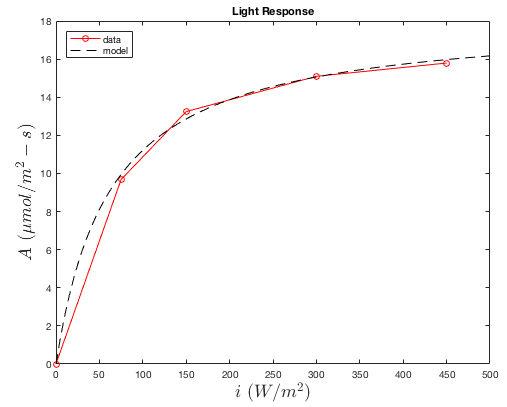
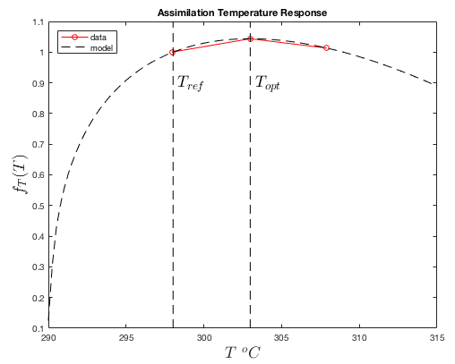
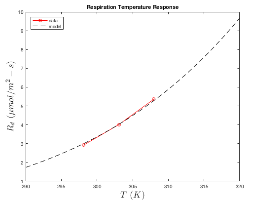
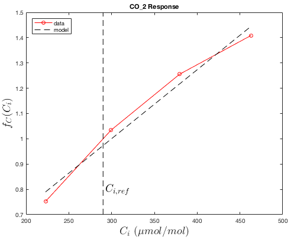

# Photosynthesis Model Plugin Documentation {#PhotosynthesisDoc}

[TOC]

<table>
<tr><th>Dependencies</th><td>None</td></tr>
<tr><th>Python Import</th><td>`from pyhelios import PhotosynthesisModel`</td></tr>
<tr><th>Main Class</th><td>\ref pyhelios.PhotosynthesisModel.PhotosynthesisModel "PhotosynthesisModel"</td></tr>
</table>

## System Requirements

<table>
  <tr>
    <th>Dependencies</th>
    <td>None</td>
  </tr>
  <tr>
    <th>Platforms</th>
    <td>Windows, Linux, macOS</td>
  </tr>
  <tr>
    <th>GPU</th>
    <td>Not required</td>
  </tr>
</table>

## Quick Start

```python
from pyhelios import Context, PhotosynthesisModel
from pyhelios.types import vec3, vec2

with Context() as context:
    # Create a simple patch
    patch_uuid = context.addPatch(center=vec3(0, 0, 0), size=vec2(0.1, 0.1))

    # Set required primitive data
    context.setPrimitiveDataFloat(patch_uuid, "radiation_flux_PAR", 500.0)  # W/m²
    context.setPrimitiveDataFloat(patch_uuid, "temperature", 298.15)  # K
    context.setPrimitiveDataFloat(patch_uuid, "air_CO2", 400.0)  # µmol/mol
    context.setPrimitiveDataFloat(patch_uuid, "moisture_conductance", 0.3)  # mol/m²-s
    context.setPrimitiveDataFloat(patch_uuid, "boundarylayer_conductance", 1.0)  # mol/m²-s

    # Create photosynthesis model
    with PhotosynthesisModel(context) as photo:
        # Use species from library
        photo.setFarquharCoefficientsFromLibrary("Almond")

        # Run model
        photo.run()

        # Get results
        A = context.getPrimitiveData(patch_uuid, "net_photosynthesis")
        print(f"Net photosynthesis: {A[0]:.2f} µmol CO₂/m²-s")
```

## Class Constructor {#PhotoConstructor}

<table>
<tr><th>Constructors</th></tr>
<tr><td>\ref pyhelios.PhotosynthesisModel.PhotosynthesisModel "PhotosynthesisModel"</td></tr>
</table>

## Primitive Data {#PhotoVarsAndProps}

### Input Primitive Data {#PhotoInputData}

 <table>
 <tr><th>Primitive Data Label</th><th>Symbol</th><th>Units</th><th>Data Type</th><th>Description</th><th>Available Plug-ins</th><th>Default Value</th></tr>
 <tr><td>radiation\_flux\_PAR</td><td>\f$Q\f$</td><td>W/m<sup>2</sup></td><td>\htmlonly<span style="font-family: Courier, monospace; color: green;">float</span>\endhtmlonly</td><td>Radiative flux in PAR band. NOTE: this is automatically converted to units of photon flux density, which are the units used in the photosynthesis model.</td><td>Can be computed by \ref pyhelios.RadiationModel.RadiationModel "RadiationModel" plug-in.</td><td>0</td></tr>
 <tr><td>temperature</td><td>\f$T_s\f$</td><td>Kelvin</td><td>\htmlonly<span style="font-family: Courier, monospace; color: green;">float</span>\endhtmlonly</td><td>Primitive surface temperature.</td><td>Can be computed by \ref pyhelios.EnergyBalance.EnergyBalanceModel "EnergyBalanceModel" plug-in.</td><td>300 K</td></tr>
 <tr><td>air\_CO2</td><td>\f$C_a\f$</td><td>\f$\mu\f$mol CO<sub>2</sub>/mol air</td><td>\htmlonly<span style="font-family: Courier, monospace; color: green;">float</span>\endhtmlonly</td><td>CO<sub>2</sub> concentration of air outside of primitive boundary-layer.</td><td>N/A</td><td>390 \f$\mu\f$mol/mol</td></tr>
 <tr><td>moisture\_conductance</td><td>\f$g_S\f$</td><td>mol air/m<sup>2</sup>-s</td><td>\htmlonly<span style="font-family: Courier, monospace; color: green;">float</span>\endhtmlonly</td><td>Conductance to moisture between sub-stomatal cells and leaf surface (i.e., stomatal conductance).</td><td>Can be computed by \ref pyhelios.StomatalConductance.StomatalConductanceModel "StomatalConductanceModel" plug-in.</td><td>0.25 mol/m<sup>2</sup>-s</td></tr>
 <tr><td>boundarylayer\_conductance**</td><td>\f$g_H\f$</td><td>mol air/m<sup>2</sup>-s</td><td>\htmlonly<span style="font-family: Courier, monospace; color: green;">float</span>\endhtmlonly</td><td>Conductance to heat between leaf surface and outside of the boundary-layer (i.e., boundary-layer conductance).</td><td>Can be computed by \ref pyhelios.BoundaryLayerConductance.BoundaryLayerConductanceModel "BLConductanceModel" plug-in, or by \ref pyhelios.EnergyBalance.EnergyBalanceModel "EnergyBalanceModel" plug-in if optional output primitive data "boundarylayer_conductance_out" is enabled.</td><td>1.0 mol/m<sup>2</sup>-s</td></tr>
 <tr><td>twosided\_flag <td>N/A <td>N/A <td>\htmlonly<span style="font-family: Courier, monospace; color: green;">uint</span>\endhtmlonly <td>Flag indicating the number of primitive faces with heat transfer (twosided\_flag = 0 for one-sided heat transfer; twosided\_flag = 1 for two-sided heat transfer). This value is retrieved from the primitive's assigned material when available (see Context::getMaterialTwosidedFlag()), with fallback to primitive data if no user-assigned material exists. <td>N/A <td>1 </tr>
 <tr><td>stomatal\_sidedness <td>\f$\zeta\f$ <td>unitless <td>\htmlonly<span style="font-family: Courier, monospace; color: green;">float</span>\endhtmlonly <td>Ratio of stomatal density on the upper leaf surface to the sum of the stomatal density on upper and lower leaf surfaces. Note: if "twosided_flag" is equal to 0, stomatal\_sidedness will be automatically set to 0.<td>N/A <td>0  </tr>
 </table>

 \*\*The photosynthesis model will also check for primitive data "boundarylayer_conductance_out" if "boundarylayer_conductance" does not exist. If you are using the energy balance model to calculate the boundary-layer conductance, you should enable optional output primitive data "boundarylayer_conductance_out" so that other plug-ins can use it.
 
### Default Output Primitive Data {#PhotoOutputData}

 <table>
 <tr><th>Primitive Data Label</th><th>Symbol</th><th>Units</th><th>Data Type</th><th>Description</th></tr><tr><td>net_photosynthesis</td><td>\f$A\f$</td><td>\f$\mu\f$mol CO<sub>2</sub>/m<sup>2</sup>-sec</td><td>\htmlonly<span style="font-family: Courier, monospace; color: green;">float</span>\endhtmlonly</td><td>Net rate of carbon transfer per unit one-sided area.</td></tr>
 </table>

### Optional Output Primitive Data {#PhotoOptionalOutputData}

**Note**: Optional output primitive data functionality is not yet implemented in PyHelios. In native Helios C++, this is done by calling `PhotosynthesisModel::optionalOutputPrimitiveData()`, which has no PyHelios equivalent at present.

 <table>
 <tr><th>Primitive Data Label</th><th>Symbol</th><th>Units</th><th>Data Type</th><th>Description</th></tr>
 <tr><td>Ci</td><td>\f$C_i\f$</td><td>\f$\mu\f$mol CO<sub>2</sub>/mol</td><td>\htmlonly<span style="font-family: Courier, monospace; color: green;">float</span>\endhtmlonly</td><td>Intercellular CO<sub>2</sub> concentration.</td></tr>
  <tr><td>Gamma\_CO2</td><td>\f$\Gamma\f$</td><td>\f$\mu\f$mol CO<sub>2</sub>/mol</td><td>\htmlonly<span style="font-family: Courier, monospace; color: green;">float</span>\endhtmlonly</td><td>Photosynthetic CO<sub>2</sub> compensation point (including "dark respiration"). FvCB model only.</td></tr>
 <tr><td>limitation\_state</td><td>N/A</td><td>N/A</td><td>\htmlonly<span style="font-family: Courier, monospace; color: green;">int</span>\endhtmlonly</td><td>Photosynthesis limitation state. FvCB (C3): 0 = Rubisco-limited, 1 = electron-transport-limited. C4 (von Caemmerer 2021): 1 = enzyme-limited, 2 = electron-transport-limited.</td></tr>
 <tr><td>Cm</td><td>\f$C_m\f$</td><td>\f$\mu\f$bar</td><td>\htmlonly<span style="font-family: Courier, monospace; color: green;">float</span>\endhtmlonly</td><td>Mesophyll cytosolic CO<sub>2</sub> partial pressure. C4 model only (helios-core v1.3.72+).</td></tr>
 <tr><td>Vp</td><td>\f$V_p\f$</td><td>\f$\mu\f$mol CO<sub>2</sub>/m<sup>2</sup>-sec</td><td>\htmlonly<span style="font-family: Courier, monospace; color: green;">float</span>\endhtmlonly</td><td>PEP carboxylation rate. C4 model only (helios-core v1.3.72+).</td></tr>
 </table>

## C4 Model (von Caemmerer 2021) {#C4Description}

PyHelios v0.1.21+ exposes the <a href="https://doi.org/10.1093/jxb/erab266">von Caemmerer (2021)</a> steady-state C4 photosynthesis model (helios-core v1.3.72+). Activate it with `setModelTypeC4()`, then load species defaults from the C4 library or apply your own parameter array:

```python
from pyhelios import Context, PhotosynthesisModel
from pyhelios.PhotosynthesisModel import AVAILABLE_C4_SPECIES

with Context() as context:
    # ... add geometry, set inputs ...
    with PhotosynthesisModel(context) as photo:
        photo.setModelTypeC4()
        photo.setC4CoefficientsFromLibrary("Maize_Massad2007")
        photo.run()
```

### C4 Coefficient Layout {#C4CoefficientLayout}

The 43-float coefficient array returned by `getC4CoefficientsFromLibrary()` / `getC4ModelCoefficients()` (and consumed by `setC4ModelCoefficients()`) is laid out as follows:

| Group | Slots | Fields |
|---|---|---|
| Temperature-responsive rates (4 floats each: `value_at_25C`, `dHa`, `Topt_C`, `dHd`) | 0–19 | Vpmax, Vcmax, Jmax, Rd, gm |
| Rubisco + PEPC kinetic constants at 25 °C | 20–24 | Kc, Ko, Kp, γ\*, Om |
| Activation energies (kJ/mol) | 25–29 | dH_Kc, dH_Ko, dH_Kp, dH_γ\*, dH_Om |
| User-tunable scalars | 30–42 | α_psII_fraction, x_etr_partition, Vpr, Rm_frac, fcyc, gbs, ao, absorptance, f_spectral, θ_etr, h_protons, H_J, H_Jcyc |

Each temperature-responsive rate uses the same `-1` sentinel convention as `setFarquharMesophyllConductance` — a negative `dHa` means "no temperature response", a negative `Topt_C` means "monotonic Arrhenius", a negative `dHd` means "default deactivation energy".

### C4 Parameter Reference {#C4ParamRef}

| Parameter | Symbol | Units | Default (Setaria) | Description |
|---|---|---|---|---|
| **Temperature-responsive rates** | | | | |
| Vpmax | V<sub>pmax</sub> | μmol/m²/s | 200 (dHa=50.1) | Maximum PEPC activity. Boyd et al. (2015). |
| Vcmax | V<sub>cmax</sub> | μmol/m²/s | 40 (dHa=78.0) | Maximum Rubisco activity. Boyd et al. (2015). |
| Jmax | J<sub>max</sub> | μmol/m²/s | 247.69 (peaked, Topt=43, dHd=260) | Maximum linear ETR. Re-fit from von Caemmerer (2021) Gaussian. |
| Rd | R<sub>d</sub> | μmol/m²/s | 1.0 (dHa=66.4) | Mitochondrial respiration. |
| gm | g<sub>m</sub> | mol/m²/s/bar | 1.0 (dHa=49.8) | Mesophyll conductance. Ubierna et al. (2017). |
| **Kinetic constants (simple Arrhenius, edit struct fields directly)** | | | | |
| Kc_25, dH_Kc | K<sub>c</sub> | μbar | 1210 / Ea=64.2 | Rubisco Michaelis constant for CO₂. |
| Ko_25, dH_Ko | K<sub>o</sub> | μbar | 292 000 / Ea=10.5 | Rubisco Michaelis constant for O₂ (=292 mbar). |
| Kp_25, dH_Kp | K<sub>p</sub> | μbar | 82 / Ea=38.3 | PEPC Michaelis constant for CO₂. |
| gamma_star_25, dH_gamma_star | γ\* | unitless | 3.8168×10⁻⁴ / Ea=**+31.1** | 0.5 / S<sub>Rubisco</sub>. **Positive Ea** — γ\* increases with T because Rubisco specificity decreases. The von Caemmerer (2021) Setaria spreadsheet lists −31.1 (transcription error: it copied Boyd 2015's Ea for S<sub>c/o</sub> without the required reciprocal sign flip); Woodford et al. (2025) Table 1 silently corrects to +31.1. |
| Om_25, dH_Om | O<sub>m</sub> | μbar | 210 000 / Ea=0 | Mesophyll O₂ partial pressure (ambient). |
| **User-tunable scalars** | | | | |
| alpha_psII_fraction | α | 0..1 | 0 | Fraction of PSII activity in the bundle sheath (0 for NADP-ME; 0.5 recommended for NAD-ME / PCK species per Woodford et al. 2025). |
| x_etr_partition | x | 0..1 | 0.4 | Fraction of linear ETR partitioned to the mesophyll. |
| Vpr | V<sub>pr</sub> | μmol/m²/s | 80 | PEP regeneration cap. |
| Rm_frac | — | unitless | 0.5 | R<sub>m</sub> = Rm_frac · R<sub>d</sub>. |
| fcyc | f<sub>cyc</sub> | 0..1 | 0.45 | Cyclic electron flow fraction. Updated from 0.3 (vC2021) to 0.45 (Woodford et al. 2025) reflecting NDH-dominated cyclic flow. |
| H_J | H<sub>J</sub> | H⁺/e⁻ | 3 | Protons per electron, linear ETR (Woodford et al. 2025). |
| H_Jcyc | H<sub>J,cyc</sub> | H⁺/e⁻ | 3.4 | Protons per electron, cyclic ETR (NDH-dominated). |
| gbs | g<sub>bs</sub> | mol/m²/s/bar | 0.003 | Bundle-sheath conductance to CO₂. |
| ao | a<sub>o</sub> | unitless | 0.047 | O₂/CO₂ solubility-diffusivity ratio. |
| absorptance | — | unitless | 0.85 | Leaf PAR absorptance. |
| f_spectral | f | unitless | 0.15 | Spectral-quality correction to absorbed PAR. |
| theta_etr | θ | unitless | 0.7 | Curvature of the J ~ I₂ non-rectangular hyperbola. |
| h_protons | — | H⁺/ATP | 4 | Protons required per ATP synthesized. |

### C4 Species Library {#C4Library}

PyHelios ships three published C4 parameter sets accessible via `setC4CoefficientsFromLibrary()` and `getC4CoefficientsFromLibrary()`. Each entry specifies **every** parameter the model reads — including the "complementary" kinetic constants (K<sub>c</sub>, K<sub>o</sub>, K<sub>p</sub>) and scalar structural parameters that the source paper held fixed while fitting the headline rate constants. **Mixing the headline values from one entry with the fixed-parameter assumptions of another will produce biased predictions**, so treat each entry as atomic. Unknown species keys raise `RuntimeError`; key matching is case-insensitive.

| Species key | Subtype | Vcmax(25) | Vpmax(25) | Jmax(25) | Rd(25) | gm(25) | T-response | Source |
|---|---|---|---|---|---|---|---|---|
| `SetariaViridis_vC2021` | NADP-ME | 40 | 200 | 247.69 | 0.4 | 1.0 | Arrhenius (Jmax peaked) | von Caemmerer (2021) Table 1; kinetics Boyd et al. (2015); gm Ubierna et al. (2017); fcyc / H_Jcyc per Woodford et al. (2025). |
| `GenericC4_vC2000` | NADP-ME | 60 | 120 | 400 | 1.0 | ∞ (10⁴) | Q10≈2.3 → Arrhenius Ea≈61.6 | von Caemmerer (2000) *Biochemical Models of Leaf Photosynthesis*; plantecophys AciC4 defaults. |
| `Maize_Massad2007` | NADP-ME | 60 | 120 | 400 | 0.6 | ∞ (10⁴) | Peaked Arrhenius | Massad et al. (2007) *Plant Cell Environ.* 30:1191; plantecophys defaults at 25 °C. |

Units: μmol CO₂ / m² / s for all rate constants; mol CO₂ / m² / s / bar for gm.

**Per-entry caveats:**

- **`SetariaViridis_vC2021`** — the C4 struct's default constructor also carries this parameterization, except R<sub>d</sub>: the library entry uses R<sub>d</sub> = 0.01 · V<sub>cmax</sub> = 0.4 μmol/m²/s per the original paper's convention, while the struct constructor sets R<sub>d</sub> = 1.0 for historical compatibility.
- **`GenericC4_vC2000`** — the original parameterization uses Q10 temperature responses. Helios approximates these with Arrhenius (E<sub>a</sub> = R · T<sub>ref</sub>² · ln(Q₁₀)/10 with T<sub>ref</sub> = 298.15 K), matching Q10 behaviour within ~1 % over 15–40 °C. `fcyc=0` recovers the linear-electron-flow ATP stoichiometry of the original vC2000 model.
- **`Maize_Massad2007`** — Massad fitted the headline rate constants against Bernacchi (2001) C3-derived K<sub>c</sub>/K<sub>o</sub> (much smaller than the Boyd 2015 C4 values used for Setaria). **Do not substitute Setaria's K<sub>c</sub>/K<sub>o</sub> into this entry** — the V<sub>cmax</sub> value is only internally consistent with the Bernacchi values. The paper assumed infinite mesophyll conductance, so the entry sets g<sub>m</sub> = 10⁴ mol/m²/s/bar as effectively infinite. The K<sub>p</sub> temperature response is from Boyd (2015) rather than Massad's own Q10=2.1 (Massad's value overestimates K<sub>p</sub> temperature sensitivity). The 0.6 μmol/m²/s default for R<sub>d</sub> is a library convention (0.01 · V<sub>cmax</sub>) — Massad themselves used R<sub>d</sub> = 0 and reported results as insensitive to the R<sub>d</sub> choice.

> **Implementation notes (vs. the paper's supplementary spreadsheet):**
> 1. The Jmax temperature response uses peaked Arrhenius (same API as C3) rather than the paper's Gaussian — Jmax(25 °C) = 247.69 matches the Gaussian at 25 °C; users who need exact Gaussian behaviour at other temperatures should fit peaked-Arrhenius parameters or set Jmax as a constant.
> 2. The V<sub>pr</sub> cap in Eq. 19 is always applied; the paper's spreadsheet omits it, so Helios gives slightly lower A at high C<sub>m</sub> when V<sub>p,MM</sub> > V<sub>pr</sub>.

### Manual Override of Mesophyll Cytosolic CO₂ (Testing) {#C4ManualCm}

For testing or validation against the von Caemmerer (2021) reference spreadsheet, `setCm()` lets you bypass the iterative `Cm = Ci - A/gm` solve and prescribe the mesophyll cytosolic CO₂ directly. The stomatal balance on Ci is also bypassed (Ci is back-computed from `Ci = Cm + A/gm`):

```python
photo.setCm(150.0, [uuid])  # ubar
photo.run()
```

### Per-Material C4 Setters {#C4ByMaterial}

Both `setC4CoefficientsFromLibrary()` and `setC4ModelCoefficients()` accept a `material_label=` keyword to apply coefficients to every primitive sharing a material rather than to a UUID list. `material_label` and `uuids` are mutually exclusive:

```python
context.addMaterial("leaf_c4")
context.assignMaterialToPrimitive(uuid, "leaf_c4")

with PhotosynthesisModel(context) as photo:
    photo.setModelTypeC4()
    photo.setC4CoefficientsFromLibrary("Maize_Massad2007", material_label="leaf_c4")
```

## Introduction {#PhotoDescription}

The \ref pyhelios.PhotosynthesisModel.PhotosynthesisModel "PhotosynthesisModel" plug-in implements three types of models: the C<sub>3</sub> biochemical model of <a href="https://link.springer.com/article/10.1007/BF00386231">Farquhar, von Caemmerer, and Berry (1980)</a>, the C<sub>4</sub> biochemical model of <a href="https://doi.org/10.1093/jxb/erab266">von Caemmerer (2021)</a>, and an empirical model similar to that of <a href="../../plugins/photosynthesis/doc/Johnson_2010_PlantMod.pdf">Johnson (2010)</a>. Each is described separately below.

By default, the plug-in uses the C<sub>3</sub> Farquhar model. The model can either be set explicitly, as illustrated in the code below, or the model type will be inferred based on the model coefficients that are set (see descriptions below).

```python
from pyhelios import Context, PhotosynthesisModel

with Context() as context:
    with PhotosynthesisModel(context) as photo:
        # Use the C3 Farquhar-von Caemmerer-Berry model
        photo.setModelTypeFarquhar()
        photo.run()

        # Switch to the C4 von Caemmerer (2021) model
        photo.setModelTypeC4()

        # Switch to the empirical model
        photo.setModelTypeEmpirical()
```

## Farquhar, von Caemmerer, Berry Model Description {#FarquharDescription}

The \ref pyhelios.PhotosynthesisModel.PhotosynthesisModel "PhotosynthesisModel" implements the biochemical model of <a href="https://link.springer.com/article/10.1007/BF00386231">Farquhar, von Caemmerer, and Berry (1980)</a>. The form used here predicts photosynthetic production as a function of photoshynthetically active radiation flux, ambient CO<sub>2</sub> concentration, and stomatal conductance, which may itself provide responses to a number of additional environmental variables.

 The implementation used here calculates the net rate of CO<sub>2</sub> exchange as

 \f[A=\left(1-\frac{\Gamma^*}{C_i}\right)\mathrm{min}\left\{W_c,W_j,W_p\right\}-R_d,\f]

 where

 \f[W_c=\frac{V_{cmax}C_i}{C_i+K_{co}}\f]

 is the rate limited by Rubisco, with

 \f[K_{co}=K_c\left(1+\frac{O}{K_O}\right),\f]

 where \f$O\f$ is oxygen concentration.

 \f[W_j=\dfrac{J C_i}{4C_i+8\Gamma^*}\f]

 is the rate limited by RuBP regeneration.

 The light response of \f$J\f$, the potential electron transport rate, can be described as a rectangular hyperbola with 1 shape parameter, or non-rectangular hyperbola with 2 shape parameters.
 The rectangular hyperbola takes the form

 \f[ J(Q) = \dfrac{J_{max} \alpha Q}{\alpha Q + J_{max}} \f]

 where \f$Q\f$ is the photosynthetically active absorbed radiation flux (\f$\mu mol\,m^{-2}\,s^{-1}\f$), \f$J_{max}\f$ is the temperature-dependent maximum potential electron transport rate (\f$\mu mol\,m^{-2}\,s^{-1}\f$), and \f$\alpha\f$ is the intrinsic quantum efficiency of electron transport (\f$electron\,photon^{-1}\f$) which defines the initial slope of the light response, determines its resulting shape in the rectangular hyperbolic form, and is thought to be relatively conserved around 0.5.
 The non-rectangular hyperbola takes the form

 \f[J(Q) = \dfrac{\alpha Q + J_{max} - \sqrt{(\alpha Q + J_{max})^2 - 4 \theta \alpha Q J_{max}}}{2 \theta}\f]

 where \f$\theta\f$ is an additional parameter (unitless) that shapes the light response curve beyond its initial slope. When \f$\theta\f$ approaches zero, the two forms become equivalent. In Photosynthesis Plugin, the rectangular form will be assumed unless \f$\theta\f$ is specified by the user.

 \f[W_p=\dfrac{3\,TPU\,C_i}{C_i-\Gamma^*}\f]

 is the rate limited by triose phosphate utilization. Note that if the TPU parameter is not set by the user, this state is ignored.

 The intercellular CO<sub>2</sub> concentration \f$C_i\f$ is determined from the relation

 \f$A=0.75g_M\left(C_{a}-C_i\right)\f$

 which is solved numerically using the Secant method, since \f$A\f$ is a complex nonlinear function of \f$C_i\f$ which prevents an analytical solution for \f$C_i\f$. The 0.75 factor comes from the fact that diffusion of CO<sub>2</sub> in air is slower than that of water vapor (see Eq. 7.33 of <a href="http://www.springer.com/us/book/9780387949376#otherversion=9781461216261">Campbell and Norman</a>).

 \f$g_M\f$ is the conductance to moisture transfer between the leaf interior and just outside of the leaf boundary-layer, and is calculated as

 \f$g_M = 1.08g_Hg_S\left[\dfrac{\zeta}{1.08g_H+g_S\zeta}+\dfrac{(1-\zeta)}{1.08g_H+g_S(1-\zeta)}\right]\f$,

 where \f$g_H\f$ is the boundary-layer conductance to heat, and \f$1.08g_H\f$ gives the boundary-layer conductance to moisture considering the differences in diffusivity between water vapor and heat. \f$n_s\f$ is the number of primitive faces, which is determined by the value of "twosided_flag" retrieved from the primitive's assigned material when available (see Context::getMaterialTwosidedFlag()), with fallback to primitive data if no user-assigned material exists (twosided\_flag=0 is single-sided and \f$n_s=1\f$, twosided\_flag=1 is two-sided and \f$n_s=2\f$).

 \f$\zeta=\dfrac{D_{upper}}{D_{lower}+D_{upper}}\f$

 is the stomatal sidedness, which is the ratio of the stomatal density of the upper leaf surface to the sum of the upper and lower leaf surface densities, which is set by the primitive data value "stomatal_sidedness". For leaves, \f$\zeta=0\f$ corresponds to hypostomatous leaves (stomata on one side), and \f$\zeta=0.5\f$ to amphistomatous leaves (stomata equally on both sides). It is important to note that if \f$n_s=1\f$, then the value of \f$\zeta\f$ will be overridden and set to 0.


### Mesophyll Conductance (optional) {#FvCBmesophyll}

By default the implementation assumes the chloroplast CO<sub>2</sub> concentration equals the intercellular value, \f$C_c \equiv C_i\f$ (infinite mesophyll conductance). A finite mesophyll conductance \f$g_m\f$ (mol CO<sub>2</sub> m<sup>-2</sup> s<sup>-1</sup> bar<sup>-1</sup>) can be supplied to model diffusion from the intercellular airspace to the sites of carboxylation:

\f[ C_c = C_i - \dfrac{A}{g_m}. \f]

Substituting \f$C_c\f$ into the Rubisco-limited and electron-transport-limited forms of \f$A\f$ gives two quadratic equations in the net assimilation, one per branch, that are solved analytically following <a href="https://onlinelibrary.wiley.com/doi/10.1111/j.1365-3040.2004.01140.x">Ethier & Livingston (2004)</a> and <a href="https://onlinelibrary.wiley.com/doi/full/10.1111/j.1365-3040.2007.01710.x">Sharkey et al. (2007)</a>. The physically meaningful (smaller) root is selected and combined with \f$A_p = 3 \cdot TPU - R_d\f$ via the same smooth-min used elsewhere.

`gm` has the same temperature-response options as every other rate parameter: constant, Arrhenius, peaked-Arrhenius (with default `dHd`), and peaked-Arrhenius with explicit `dHd`. The Python wrapper collapses the four C++ overloads into a single method whose unused arguments default to the `-1` sentinel:

```python
# Constant gm with no temperature response
photo.setFarquharMesophyllConductance(0.4, uuids=[uuid])

# Arrhenius (Ubierna et al. 2017): gm(25 C) = 0.4, dHa = 49.8 kJ/mol
photo.setFarquharMesophyllConductance(0.4, dha=49.8, uuids=[uuid])

# Peaked Arrhenius with optimum at 35 C
photo.setFarquharMesophyllConductance(0.4, dha=49.8, topt=35.0, uuids=[uuid])
```

The default value `gm = +∞` reproduces the legacy Farquhar `Cc = Ci` behaviour bit-for-bit, so existing parameter libraries that do not set `gm` are unaffected.


### Temperature response of model parameters {#FvCBtemperature}

Two different temperature response functions are commonly used in photosynthetic modeling and supported in the Photosynthesis Plugin. One is an Arrhenius equation, which is exponentially increasing with no decline in the region of use. The other is a modified Arrhenius equation with a peak or temperature optimum, beyond which there is a decline in the value of the function, representing a denaturing of an enzyme and subsequent reduction of its activity.

 \f[
 \begin{aligned}
 k &= k_{25} \cdot \exp \left[\frac{\Delta H_a}{R} \left(\frac{1}{298}-\frac{1}{T_{leaf}} \right) \right] \frac{f(298)}{f(T_{leaf})}, \\
 f(T_{leaf}) &= 1+\exp \left[\frac{\Delta H_d}{R} \left(\frac{1}{T_{opt}} - \frac{1}{T_{leaf}} \right) - \ln \left(\frac{\Delta H_d}{\Delta H_a}-1 \right) \right]
 \end{aligned}
 \f]

In this form, the model is conveniently parameterized by the commonly used standard reference rate at 25\f$^\circ\f$C, \f$k_{25}\f$, as well as the energy of activation, \f$A = \Delta H_a = dH_a\f$ of the Arrhenius equation, but also by the observable temperature optimum, \f$T_{opt}\f$ and one additional fitted parameter, the energy of deactivation, \f$D = \Delta H _d = dH_d\f$, related to the rate of decline from the optimum.

As \f$T_{opt}\f$ \f$\to \infty\f$, then the peaked form approaches the standard, unpeaked Arrhenius equation, allowing for mathematical backwards compatibility for parameters obtained from fitting to the standard unpeaked form.

In the Photosynthesis Plugin, the Arrhenius form will be assumed as it requires fewer parameters, unless the additional parameters \f$dH_d\f$ and \f$T_{opt}\f$ are specified by the user.

\warning The peaked form evaluates \f$\ln\left(dH_d/dH_a-1\right)\f$, which requires \f$dH_d > dH_a\f$. As of helios-core 1.3.80, supplying \f$dH_d \le dH_a\f$ to a **four-argument** setter raises an error rather than silently producing NaN. This affects `setVcmax()`, `setJmax()`, `setRd()`, `setQuantumEfficiency_alpha()`, `setTPU()`, `setLightResponseCurvature_theta()` and `setMesophyllConductance_gm()` when called with all four arguments. The three-argument (\f$k_{25}\f$, \f$dH_a\f$, \f$T_{opt}\f$) setters are unaffected: they default \f$dH_d = 10\,dH_a\f$, which always satisfies the constraint.

| Parameter | Description                            | Units                     |
| --------- | -------------------------------------- | ------------------------- |
| \f$k_{25}\f$  | reference rate at 25\f$^\circ\f$C     | \f$\mu mol\,m^{-2}\,s^{-1}\f$ |
| \f$dH_a\f$    | activation energy (rate of increase)   | \f$kJ\,mol^{-1}\f$            |
| \f$dH_d\f$    | deactivation energy (rate of decrease) | \f$kJ\,mol^{-1}\f$            |
| \f$T_{opt}\f$ | optimum temperature in Kelvin          | \f$K\f$                       |
| \f$T_{leaf}\f$| leaf surface temperature in Kelvin     | \f$K\f$                       |
| \f$R\f$       | ideal gas constant, 0.008314           | \f$kJ\,mol^{-1}\,K^{-1}\f$    |

 Additional temperature parameters that are not typically fit to use the standard Arrhenius form with the parameters obtained by <a href="https://onlinelibrary.wiley.com/doi/full/10.1111/j.1365-3040.2001.00668.x">Bernacchi et al. (2001)</a>, and are given by the following equations

 \f[
 \begin{aligned}
 \Gamma^* &= 42.60 \cdot \exp \left[ \frac{37.83}{R} \left(\frac{1}{298} - \frac{1}{T_{leaf}} \right) \right] \\
 K_c &= 400.3 \cdot \exp \left[ \frac{79.43}{R} \left(\frac{1}{298} - \frac{1}{T_{leaf}} \right) \right] \\
 K_o &= 275.1 \cdot \exp \left[ \frac{36.38}{R} \left(\frac{1}{298} - \frac{1}{T_{leaf}} \right) \right] \\
 R_d &= R_{d,25} \cdot \exp \left[ \frac{46.39}{R} \left(\frac{1}{298} - \frac{1}{T_{leaf}} \right) \right]
 \end{aligned}
 \f]

#### Summary of FvCB Model Independent Variables {#FvCBPhotoVars}

<table>
 <tr><th>Variable</th><th>Units</th><th>Description</th></tr>
 <tr><td>\f$Q\f$</td><td>\f$\mu\f$mol/m<sup>2</sup>-sec.</td><td>Photosynthetic radiation energy flux.</td></tr>
 <tr><td>\f$T_s\f$</td><td>Kelvin</td><td>Surface temperature.</td></tr>
 <tr><td>\f$C_{a}\f$</td><td>\f$\mu\f$mol CO<sub>2</sub>/mol air</td><td>Ambient CO<sub>2</sub> concentration outside of boundary-layer.</td></tr>
 <tr><td>\f$g_M\f$</td><td>mol air/m<sup>2</sup>-s</td><td>Conductance to moisture transfer between inside the leaf and leaf surface (i.e., stomatal conductance).</td></tr>
 <tr><td>\f$g_H\f$</td><td>mol air/m<sup>2</sup>-s</td><td>Conductance to heat transfer between the leaf surface and outside the boundary-layer (i.e., boundary-layer conductance).</td></tr>
 </table>
 
#### Summary of FvCB Model Parameters {#FvCBPhotoParams}

The table below gives example model parameters obtained for several different species. These parameters were fit from leaf-level gas exchange data using the <a href="https://github.com/GEMINI-Breeding/photorch">PhoTorch</a> Python package. Note that the parameter sets are based on different temperature response functions depending on the data that was available.

| Species            | \f$V_{cmax25}\f$ | \f$J_{max25}\f$ | \f$TPU_{25}\f$ | \f$R_{d25}\f$ | \f$\alpha\f$ | \f$\theta\f$ | \f$\Delta H_{a,Vcmax}\f$ | \f$T _{opt,Vcmax}\f$ | \f$\Delta H_{d,Vcmax}\f$ | \f$\Delta H_{a,Jmax}\f$ | \f$T _{opt,Jmax}\f$ | \f$\Delta H_{d,Jmax}\f$ | \f$\Delta H_{a,TPU}\f$ | \f$T _{opt,TPU}\f$ | \f$\Delta H_{d,TPU}\f$ |
| ----------         | ------------ | ----------- | ---------- | --------- | -------- | -------- | -------------------- | ---------------- | -------------------- | ------------------- | --------------- | ------------------- | ------------------ | -------------- | ------------------ |
| Almond             | 72.6         | 144.2       | 6.4        | 0.2       | 0.094    | 0        | 27.3                 | 315.3            | 478.4                | 64.1                | 314.9           | 508.4               | 37.1               | 311.3          | 477.9              |
| California Bay     | 97.5         | 193         | 3.3        | 0.1       | 0.037    | 0        | 49.1                 | 308.6            | 505.8                | 34                  | 308.5           | 456.7               | 0.1                | 309.4          | 477.5              |
| Elderberry         | 37.7         | 149.7       | 7.3        | 1.3       | 0.202    | 0.472    | 66                   | 319.4            | 496                  | 24.5                | 314.8           | 492.9               | 33.6               | 314.5          | 497.5              |
| Grape              | 74.5         | 180.2       | 7.7        | 1.3       | 0.304    | 0        | 76.1                 | 318.8            | 499.8                | 23                  | 313.8           | 502.3               | 24                 | 314.6          | 496.4              |
| Maple              | 96.4         | 168         | 2.7        | 0.1       | 0.077    | 0        | 48.9                 | 307.1            | 505                  | 8.5                 | 304.7           | 476.7               | 32.1               | 308.3          | 471.6              |
| Olive              | 75.9         | 170.4       | 8.3        | 1.9       | 0.398    | 0        | 55.4                 | 315.2            | 497                  | 32.2                | 312.5           | 493.4               | 37.2               | 311.7          | 498.9              |
| Pistachio (female) | 101.8        | 223.0       | 9.8        | 1.5       | 0.216    | 0.65     | 56.5                 | 316.6            | 483.1                | 27.7                | 314.6           | 458.5               | 39.9               | 315.4          | 494.3              |
| Pistachio (male)   | 154.17       | 243.20      | --         | 2.05      | 0.335    | 0        | 65.33                | --               | --                   | 50.89               | --              | --                  | --                 | --             | --                 |
| Toyon              | 52.8         | 142.4       | 6.6        | 0.8       | 0.29     | 0.532    | 42.1                 | 315.1            | 483                  | 9                   | 313             | 486.2               | 14                 | 314.8          | 493.8              |
| Walnut             | 81.6         | 201.9       | 10.2       | 0.9       | 0.362    | 0        | 85.3                 | 316.5            | 500.6                | 41.4                | 308.6           | 308.2               | 21.9               | 310.4          | 434.9              |
| Redbud             | 68.5         | 132.4       | 6.6        | 0.8       | 0.41     | 0.04     | 66.6                 | 315.1            | 496                  | 41.2                | 313.1           | 474                 | 34.3               | 312.8          | 463.2              |
| Apple              | 101.08       | 167.03      | --         | 3.00      | 0.432    | 0        | 65.33                | --               | --                   | 47.62               | --              | --                  | --                 | --             | --                 |
| Cherry             | 75.65        | 129.06      | --         | 2.12      | 0.404    | 0        | 65.33                | --               | --                   | 48.49               | --              | --                  | --                 | --             | --                 |
| Pear               | 107.69       | 176.71      | --         | 1.51      | 0.274    | 0        | 65.33                | --               | --                   | 46.04               | --              | --                  | --                 | --             | --                 |
| Prune              | 75.88        | 129.41      | --         | 1.65      | 0.402    | 0        | 65.33                | --               | --                   | 48.58               | --              | --                  | --                 | --             | --                 |

All \f$T_{opt}\f$ values in the table are in Kelvin, matching the \f$T_{opt}\f$ convention of the temperature response equations above. Note that the PyHelios and C++ setter functions take \f$T_{opt}\f$ in **degrees Celsius**, so a table entry of 315.3 K is passed to `setVcmax()` as `42.15`. A `--` in a \f$T_{opt}\f$ or \f$\Delta H_d\f$ column means that species uses the unpeaked Arrhenius form for that rate; a `--` in the \f$TPU_{25}\f$ column means TPU limitation is disabled for that species.

\note As of helios-core 1.3.80, Almond, Pistachio (female) and Walnut were re-fit to the **peaked** temperature response with **TPU limitation enabled** (previously they used the unpeaked Arrhenius form with no TPU term). The Prune \f$R_{d25}\f$ was also updated to 1.65. Results from these four species will differ from earlier Helios versions.

\note Pistachio is available as two separate cultivar fits. The species keys `"PistachioFemale"` and the bare key `"Pistachio"` both select the female parameter set. The key `"PistachioMale"` selects the separate male fit, which uses the unpeaked Arrhenius form with no TPU limitation.

#### Setting FvCB Model Parameters {#FvCBSettingPhotoParams}

The model coefficients can be set manually or by using the library of coefficients provided in the table above.

To load the FvCB parameters from the library, call the function \ref pyhelios.PhotosynthesisModel.PhotosynthesisModel::setFarquharCoefficientsFromLibrary "setFarquharCoefficientsFromLibrary()" with the species name as an argument. This will automatically set the parameters for all primitives. Alternatively, a list of UUIDs can be passed to this function to set the parameters for a subset of primitives.

To set the parameters manually, first create an instance of the \ref pyhelios.types.photosynthesis.FarquharModelCoefficients "FarquharModelCoefficients" class, and then set the parameters using the setter methods. Finally, call the \ref pyhelios.PhotosynthesisModel.PhotosynthesisModel::setFarquharModelCoefficients "setFarquharModelCoefficients()" method with the coefficients object as an argument.

Each parameter has a setter function, which is the means by which the underlying response function to be used is specified.

<u>Parameter Temperature Response</u>
1. No temperature response: Call the setter function (e.g., \ref pyhelios.types.photosynthesis.FarquharModelCoefficients::setVcmax "setVcmax()") with a single argument. This will make the parameter constant with temperature.
2. Standard Arrhenius temperature response: Call the setter function (e.g., \ref pyhelios.types.photosynthesis.FarquharModelCoefficients::setVcmax "setVcmax()") with two arguments - the first parameter being the value at 25<sup>o</sup>C, and the second being the \f$dH_a\f$ of the parameter temperature response.
3. Arrhenius temperature response with an optimum: Call the setter function (e.g., \ref pyhelios.types.photosynthesis.FarquharModelCoefficients::setVcmax "setVcmax()") with four arguments - the first parameter being the value at 25<sup>o</sup>C, the second being the \f$dH_a\f$ of the parameter temperature response, the third being the \f$T_{opt}\f$ of the parameter temperature response, and the fourth being the \f$dH_d\f$ of the parameter temperature response.

<u>Light Response</u>
1. Rectangular hyperbola: Call the setter function \ref pyhelios.types.photosynthesis.FarquharModelCoefficients::setQuantumEfficiency_alpha "setQuantumEfficiency_alpha()" to set only the alpha parameter. This will enable the rectangular hyperbola light response. Note also the \ref pyhelios.types.photosynthesis.FarquharModelCoefficients::setQuantumEfficiency_alpha "setQuantumEfficiency_alpha()" function can be called with multiple arguments in order to specify a temperature response as described above.
2. Non-rectangular hyperbola: Call both setter functions \ref pyhelios.types.photosynthesis.FarquharModelCoefficients::setQuantumEfficiency_alpha "setQuantumEfficiency_alpha()" and \ref pyhelios.types.photosynthesis.FarquharModelCoefficients::setLightResponseCurvature_theta "setLightResponseCurvature_theta()". This will enable the non-rectangular hyperbola light response. Each of these can also be called with multiple arguments to specify a temperature response as described above.

Note that the parameter sets in the library vary in terms of which response functions are used based on the data available for parameter fitting.

<u>Deprecated Scalar Fields</u>

\warning \ref pyhelios.types.photosynthesis.FarquharModelCoefficients "FarquharModelCoefficients" also exposes the scalar fields `Vcmax`, `Jmax`, `Rd` and `alpha`, which are **deprecated legacy parameters** retained only for backwards compatibility. Assigning one directly (rather than calling the setter) selects a simple non-peaked Arrhenius response built from the corresponding `c_*`/`dH_*` coefficient, bypassing the temperature response object entirely. As of helios-core 1.3.80, calling the matching setter resets the scalar field to its `-1` sentinel so that the setter is always authoritative — the two representations can no longer silently disagree about which value the model uses. Prefer the setter API in new code; mixing the two is not supported.

Because every species in the library is populated through the setters, the scalar fields alone cannot round-trip a peaked response. PyHelios therefore passes a flat coefficient array of **38 floats** across the C++ interface:

| Slots | Contents |
| ----- | -------- |
| 0–17  | Legacy fields: `Vcmax`, `Jmax`, `alpha`, `Rd`, `O`, `TPU_flag`, then the 12 `c_*`/`dH_*` temperature constants |
| 18–21 | Mesophyll conductance \f$g_m\f$ response: (`gm_at_25C`, `dHa`, `Topt_C`, `dHd`) |
| 22–37 | Full temperature response blocks of (`value_at_25C`, `dHa`, `Topt_C`, `dHd`) for \f$V_{cmax}\f$, \f$J_{max}\f$, \f$R_d\f$, \f$\alpha\f$, in that order |

Each 4-float block uses the `-1` sentinel convention: `dHa < 0` means constant (no temperature response), `Topt_C < 0` means a monotonic Arrhenius response, and `dHd < 0` means the default deactivation energy. Note that `Topt_C` is stored in **degrees Celsius**, not Kelvin. Because slots 22–37 carry the full response, a peaked response round-trips correctly through \ref pyhelios.PhotosynthesisModel.PhotosynthesisModel::getFarquharModelCoefficients "getFarquharModelCoefficients()" and \ref pyhelios.PhotosynthesisModel.PhotosynthesisModel::setFarquharModelCoefficients "setFarquharModelCoefficients()". Shorter arrays are still accepted on read for backwards compatibility (the 18-float layout predating \f$g_m\f$, and the 22-float layout predating the rate response blocks); the corresponding responses are simply left unset.

```python
from pyhelios import Context, PhotosynthesisModel
from pyhelios.types import FarquharModelCoefficients

with Context() as context:
    with PhotosynthesisModel(context) as photo:
        # Use the Farquhar-von Caemmerer-Berry model
        photo.setModelTypeFarquhar()

        # Use a species from the library
        photo.setFarquharCoefficientsFromLibrary("almond")

        # Or set parameters manually:
        fmc = FarquharModelCoefficients()
        fmc.setVcmax(74.5, 76.1)                    # standard Arrhenius
        fmc.setJmax(180.2, 23.0, 40.65, 502.3)      # Arrhenius with optimum
        fmc.setRd(1.3)                              # No temperature response
        # Note: TPU is set via fmc.TPU_flag = 1 in PyHelios
        # Setting both alpha and theta, so will use non-rectangular hyperbola light response
        fmc.setQuantumEfficiency_alpha(0.304)       # No temperature response
        fmc.setLightResponseCurvature_theta(0.601)  # No temperature response

        photo.setFarquharModelCoefficients(fmc)  # setting the parameters manually for all primitives

        photo.run()
```

### Material-Based Coefficients (C++ Helios) {#PhotoMaterialBasedCoeffs}

The native Helios C++ library uses a material-based approach for setting photosynthesis model coefficients:

**C++ Approach (Native Helios):**
```cpp
Context context;
PhotosynthesisModel photo_model(&context);

// 1. Create materials for different species
context.addMaterial("almond_leaf");
context.addMaterial("grape_leaf");

// 2. Set coefficients from species library
photo_model.setFarquharCoefficientsFromLibrary("Almond", "almond_leaf");
photo_model.setFarquharCoefficientsFromLibrary("Grape", "grape_leaf");

// 3. Create primitives and assign materials
std::vector<uint> almond_leaves = context.addPatch(...);
context.assignMaterialToPrimitive(almond_leaves, "almond_leaf");

// 4. Run model - coefficients automatically applied based on material
photo_model.run();
```

**Advantages of material-based approach (C++):**
- Memory efficient: Coefficients stored once per material
- Automatic XML serialization with Context
- Simplified canopy management: Update one material to change entire plant/organ
- Performance: Caching minimizes Context lookups

**PyHelios Implementation Note:**

PyHelios currently uses a **UUID-based approach** rather than the material-based system. Pass a list of primitive UUIDs to set coefficients for specific primitives:

```python
from pyhelios import Context, PhotosynthesisModel

with Context() as context:
    with PhotosynthesisModel(context) as photo:
        # Create primitives for different species
        almond_uuids = [context.addPatch(...) for _ in range(10)]
        grape_uuids = [context.addPatch(...) for _ in range(10)]

        # Set coefficients from species library for specific UUIDs
        photo.setFarquharCoefficientsFromLibrary("Almond", almond_uuids)
        photo.setFarquharCoefficientsFromLibrary("Grape", grape_uuids)

        # Run model - coefficients applied to specified primitives
        photo.run()
```

The UUID-based approach provides similar functionality, allowing you to group primitives logically and set parameters per group.

## Empirical Model Description {#EmpiricalDescription}

The \ref pyhelios.PhotosynthesisModel.PhotosynthesisModel "PhotosynthesisModel" also implements an empirical photosynthesis model using \ref pyhelios.types.photosynthesis.EmpiricalModelCoefficients "EmpiricalModelCoefficients". The net photosynthetic rate is described by the equation:

   \f$A = A_{sat} f_L f_T f_C - R_d\f$

   \f$A_{sat}\,({\mu}mol/m^2-s)\f$ is the photosynthesis assimilation rate at saturating irradiance and reference temperature (\f$T_{ref}\f$) and intercellular CO<sub>2</sub> concentration (\f$C_{i,ref}\f$).

### Light Response Function {#LightResponse}

The response of photosynthesis to light is given by a simple exponential function, which is defined by only one parameter:

   \f$f_L(i) = \dfrac{i}{\theta+i}\f$,

   where \f$\theta\f$ is the light response curvature.

### Temperature Response {#TempResponse}

It is assumed that the maximum CO<sub>2</sub> assimilation rate \f$A_{max}\f$ decreases exponentially about some optimum temperature \f$T_{opt}\f$. The temperature response function is given by:

   \f$f_T(T_s) = \left(\dfrac{T_s-T_{min}}{T_{ref}-T_{min}}\right)^q\left(\dfrac{(1+q)T_{opt}-T_{min}-qT_s}{(1+q)T_{opt}-T_{min}-qT_{ref}}\right)\f$,

   where \f$T_{min}\f$ is the minimum temperature at which assimilation occurs, \f$T_{opt}\f$ is the temperature at which the maximum assimilation rate occurs, \f$T_{ref}\f$ is the reference temperature chosen to define \f$A_{ref}\f$, and \f$q\f$ is a shape parameter. All four are in Kelvin (\f$q\f$ is unitless).

\note **Changed in helios-core 1.3.80:** the empirical model now actually applies \f$f_T\f$. In earlier versions the \f$T_{min}\f$, \f$T_{opt}\f$, \f$T_{ref}\f$ and \f$q\f$ coefficients were settable and were serialized, but were completely **inert** — a leaf at 5 &deg;C and a leaf at 45 &deg;C returned the same gross assimilation rate. Gross assimilation is now scaled by \f$f_T\f$ as the equation \f$A = A_{sat}f_Lf_Tf_C-R_d\f$ has always claimed, so empirical-model results will differ from earlier Helios versions wherever the leaf temperature is away from \f$T_{ref}\f$.

   \f$f_T\f$ is clamped to zero outside the range over which it is defined: at or below \f$T_{min}\f$, and above the upper temperature at which the second factor \f$\left((1+q)T_{opt}-T_{min}-qT_s\right)\f$ changes sign. In those regimes gross assimilation is zero and the net rate reduces to \f$A = -R_d\f$. \f$f_T\f$ therefore never goes negative.

\warning Coefficient sets that make the reference denominator of \f$f_T\f$ degenerate are rejected with an error. The coefficients must satisfy \f$T_{ref} > T_{min}\f$ and \f$(1+q)T_{opt}-T_{min}-qT_{ref} \neq 0\f$. This validation is performed **before** the \f$T_s \le T_{min}\f$ early return, so an invalid coefficient set raises on every timestep regardless of the leaf temperature — it will not be silently skipped on cold timesteps and reported as a well-formed \f$A = -R_d\f$.

   The "dark" respiration rate \f$R_d\f$ is assumed to increase exponentially with temperature following the Arrhenius equation (and assumed not to vary with ambient CO<sub>2</sub> concentration).  Thus, the dark respiration rate is calculated simply as

   \f$R_d = R\sqrt{T_s-273}\;\mathrm{exp}\left(-E_R/T_s\right)\f$,

   where \f$R\f$ and \f$E_R\f$ are parameters, and \f$T_s\f$ is the surface temperature in Kelvin (the \f$-273\f$ inside the square root converts to degrees Celsius).

### CO2 Response Function {#CO2Response}

We assume that the maximum assimilation rate varies linearly with intercellular CO<sub>2</sub> concentration over the range of expected concentrations, and is zero at zero CO<sub>2</sub>.  Thus, the response function is simply

   \f$f_C(C_i) = k_C\dfrac{C_i}{C_{i,ref}}\f$,

   where \f$C_i\f$ is intercellular CO<sub>2</sub> concentration (\f$\mu\f$mol CO<sub>2</sub>/mol air).

### Intercellular CO2 Concentration {#Ci}

The intercellular CO<sub>2</sub> concentration is estimated as a function of the boundary-layer conductance, stomatal conductance, and ambient CO<sub>2</sub> concentration outside of the primitive boundary-layer.  The rate of transport of CO<sub>2</sub> to the leaf (i.e., assimilation rate) is given by

   \f$A = 0.75g_M\left(C_{amb}-C_i\right)\f$,

   where \f$g_M\f$ is the conductance to moisture from the sub-stomatal cells to outside of the boundary-layer. The 0.75 factor comes from the fact that diffusion of CO<sub>2</sub> in air is slower than that of water vapor (see Eq. 7.33 of <a href="http://www.springer.com/us/book/9780387949376#otherversion=9781461216261">Campbell and Norman</a>).

   Since \f$A\f$ is dependent on \f$C_i\f$ and vice-versa, an iterative solution is required for \f$A\f$.

### Empirical Model Calibration Procedure {#PhotoCalib}

#### Summary of Empirical Model Independent Variables {#PhotoVars}

   <table>
   <tr><th>Variable</th><th>Units</th><th>Description</th></tr>
   <tr><td>\f$i\f$</td><td>W/m<sup>2</sup></td><td>Photosynthetic radiation energy flux.</td></tr>
   <tr><td>\f$T_s\f$</td><td>Kelvin</td><td>Surface temperature.</td></tr>
   <tr><td>\f$C_{amb}\f$</td><td>\f$\mu\f$mol CO<sub>2</sub>/mol air</td><td>Ambient CO<sub>2</sub> concentration outside of boundary-layer.</td></tr>
   <tr><td>\f$g_{bl}\f$</td><td>mol air/m<sup>2</sup>-s</td><td>Boundary-layer conductance.</td></tr>
   <tr><td>\f$g_s\f$</td><td>mol air/m<sup>2</sup>-s</td><td>Stomatal conductance.</td></tr>
   </table>

#### Summary of Empirical Model Parameters {#PhotoParams}

<table>
   <tr><th>Parameter</th><th>Units</th><th>Description</th></tr>
   <tr><td>\f$A_{sat}\f$</td><td>mol CO<sub>2</sub>/m<sup>2</sup>-sec</td><td>Assimilation rate at saturating irradiance and reference temperature and intercellular CO<sub>2</sub> concentration.</td></tr>
   <tr><td>\f$\theta\f$</td><td>µmol/m<sup>2</sup>·s</td><td>Shape parameter for response to light (PPFD; i_PAR is converted from W/m<sup>2</sup> before use).</td></tr>
   <tr><td>\f$T_{min}\f$</td><td>Kelvin</td><td>Minimum temperature at which assimilation occurs.</td></tr>
   <tr><td>\f$T_{opt}\f$</td><td>Kelvin</td><td>Temperature at which maximum assimilation rate occurs.</td></tr>
   <tr><td>\f$q\f$</td><td>unitless</td><td>Temperature response shape function.</td></tr>
   <tr><td>\f$R\f$</td><td>\f${\mu}\f$mol K<sup>1/2</sup>/m<sup>2</sup>-s</td><td>Pre-exponential factor for respiration temperature response.</td></tr>
   <tr><td>\f$E_R\f$</td><td>1/Kelvin</td><td>Respiration temperature response rate.</td></tr>
   <tr><td>\f$k_C\f$</td><td>unitless</td><td>CO<sub>2</sub> response rate.</td></tr>
   </table>

#### Response of Assimilation Rate to Light {#PhotoLightParam}

The response of the assimilation rate to light is obtained from gas exchange measurements at reference temperature (\f$T_{ref}\f$) and CO<sub>2</sub> (\f$C_{i,ref}\f$) in which the irradiance is varied across some range.  However, one important detail is that the dark respiration rate should be removed such that \f$A=0\f$ in the dark (see plot below).  This can be done by measuring the net CO<sub>2</sub> flux starting in the dark, then subtracting the dark flux from the total flux for each subsequent light level.



#### Response of Assimilation Rate to Temperature {#PhotoTempParam}

The response of the assimilation rate to temperature is obtained using gas exchange measurements at saturating light levels and the reference CO<sub>2</sub> concentration.  The temperature is varied across some range, and the assimilation rate is measured.  It is assumed that the optimum temperature \f$T_{opt}\f$ is the temperature corresponding to the maximum measured assimilation rate.  The model is fit to the data to determine \f$T_{min}\f$ and \f$q\f$.



#### Response of Respiration Rate to Temperature {#PhotoRespParam}

The response of the dark respiration to temperature is obtained using gas exchange measurements in the dark.  The leaf is first acclimated to the dark chamber, then leaf temperature is varied across some range.  The model is then fit to the data to determine parameters.



#### Response of Assimilation Rate to CO2 {#PhotoCO2Param}

The response of the assimilation rate is obtained using gas exchange measurements at saturating light levels and the reference temperature \f$T_{ref}\f$, but with varying external CO<sub>2</sub> concentration (which produces varying intercellular CO<sub>2</sub>).


