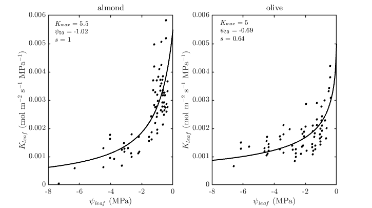
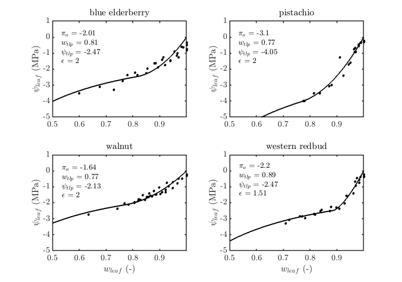

# Plant Hydraulics Model Plugin Documentation {#PlantHydraulicsDoc}

[TOC]

<table>
<tr><th>Dependencies</th><td>None</td></tr>
<tr><th>Python Import</th><td>`from pyhelios import PlantHydraulicsModel`</td></tr>
<tr><th>Main Class</th><td>\ref pyhelios.PlantHydraulics.PlantHydraulicsModel "PlantHydraulicsModel"</td></tr>
</table>

## Overview

PlantHydraulicsModel computes the water potential of the root and stem of each plant, and the water potential, relative water content, turgor pressure and osmotic potential of each of its leaf primitives. The plugin operates on a group of leaf primitives and treats the stem and the root each as a single compartment associated with those leaves, with soil water potential as an environmental input set by the user. The leaf quantities are computed for each leaf primitive from its transpiration, temperature and hydraulic model parameters.

Leaves are grouped into plants by a "plantID". It is read from the object data of a primitive's parent object, or from the primitive's own data, and can be assigned by this plugin or generated by other plugins such as \ref PlantArchitectureDoc "Plant Architecture".

## System Requirements

<table>
  <tr>
    <th>Dependencies</th>
    <td>None</td>
  </tr>
  <tr>
    <th>Platforms</th>
    <td>Windows, Linux, macOS</td>
  </tr>
  <tr>
    <th>GPU</th>
    <td>Not required</td>
  </tr>
</table>

## Known Issues

- Steady-state mode is functional; non-steady-state mode (`timespan > 0`) is under construction in the native plugin.
- `getModelCoefficients(UUID)` reads only coefficients that were set for specific primitives. The model-wide coefficients cannot be read back, so it raises for a primitive that has none of its own.

## Quick Start

```python
from pyhelios import Context, PlantHydraulicsModel, PlantHydraulicsModelCoefficients
from pyhelios.types import *

with Context() as context:
    # A 5x5 tile of leaves belonging to one plant
    obj = context.addTileObject(center=vec3(0, 0, 1), size=vec2(1, 1), subdiv=int2(5, 5))
    leaves = context.getObjectPrimitiveUUIDs(obj)
    context.setObjectDataInt(obj, "plantID", 1)

    # Transpiration of each leaf (W/m²), normally computed by the energy balance model
    context.setPrimitiveDataFloat(leaves, "latent_flux", 100.0)

    with PlantHydraulicsModel(context) as hydraulics:
        coeffs = PlantHydraulicsModelCoefficients()
        coeffs.setLeafHydraulicCapacitanceFromLibrary("pistachio")
        hydraulics.setModelCoefficients(coeffs)

        plantID = hydraulics.getPlantID(leaves)
        hydraulics.setSoilWaterPotentialOfPlant(plantID, -0.05)  # MPa

        hydraulics.run(leaves)

        print("Stem water potential:", hydraulics.getStemWaterPotential(leaves[0]), "MPa")
        print("Leaf water potential:", context.getPrimitiveData(leaves[0], "water_potential", float), "MPa")
```

## Primitive Data

### Input Primitive Data

| Primitive Data Label | Symbol | Units | Data Type | Description | Available Plugins | Default Value |
| -------------------- | ------ | ----- | --------- | ----------- | ----------------- | ------------- |
| temperature | \f$T_s\f$ | Kelvin | `float` | Primitive surface temperature | Can be computed by \ref EnergyBalanceDoc "Energy Balance Model" | 300 K |
| latent_flux | \f$E\f$ | W/m² | `float` | Latent heat flux (transpiration) | Can be computed by \ref EnergyBalanceDoc "Energy Balance Model" | 0 |
| water_potential | \f$\psi\f$ | MPa | `float` | Leaf water potential at which a water-potential dependent leaf conductance is evaluated | Output of a previous run of this plugin | -0.001 MPa |
| relative_water_content | \f$w\f$ | unitless | `float` | Initial leaf relative water content. Read by non-steady-state runs only. | Output of a previous run of this plugin | 1.0 |
| air_temperature | \f$T_a\f$ | Kelvin | `float` | Temperature of the stem; the root is taken to be 5 K cooler. Used only when stem or root conductance is temperature dependent, and read from a single primitive, the one with the lowest UUID in the plant. | N/A | 298.15 K |

"temperature" is used only for a temperature-dependent leaf conductance.

| Object Data Label | Symbol | Units | Data Type | Description | Available Plugins | Default Value |
| ----------------- | ------ | ----- | --------- | ----------- | ----------------- | ------------- |
| plantID | N/A | N/A | `int` | Unique plant identification number | Can be generated by \ref PlantArchitectureDoc "Plant Architecture" | N/A |

The default of 0 for "latent_flux" applies to an individual leaf's own water potential. A plant's transpiration, which sets its root and stem water potentials, is the area-weighted mean of "latent_flux" over only those primitives of the plant that have it. If none of them do, the plant transpires nothing and its root and stem water potentials equal the soil water potential. "latent_flux" must be set as a float.

Water-potential dependent conductances are evaluated once per run, at the water potentials from before the run: the "water_potential" primitive data for leaves, and the root and stem water potentials stored in the model from its previous run for that plant (-0.001 MPa before the first run). A steady-state run is therefore not iterated to a self-consistent solution, and repeated runs with identical inputs give different results when a conductance depends on water potential.

### Default Output Primitive Data

| Primitive Data Label | Symbol | Units | Data Type | Description |
| -------------------- | ------ | ----- | --------- | ----------- |
| water_potential | \f$\psi\f$ | MPa | `float` | Water potential |
| relative_water_content | \f$w\f$ | unitless | `float` | Relative water content |
| turgor_pressure | \f$p\f$ | MPa | `float` | Cellular turgor pressure |
| osmotic_potential | \f$\pi\f$ | MPa | `float` | Cellular osmotic potential |

### Optional Output Primitive Data

These are enabled with `outputConductancePrimitiveData(True)` and `outputCapacitancePrimitiveData(True)`, and are written by non-steady-state runs only.

| Primitive Data Label | Symbol | Units | Data Type | Description |
| -------------------- | ------ | ----- | --------- | ----------- |
| hydraulic_conductance | \f$K\f$ | mol m\f$^{-2}\f$ s\f$^{-1}\f$ MPa\f$^{-1}\f$ | `float` | Hydraulic conductance |
| hydraulic_capacitance | \f$C\f$ | mol m\f$^{-2}\f$ MPa\f$^{-1}\f$ | `float` | Hydraulic capacitance |

## Grouping Leaves into Plants

Primitives that share a plantID are treated as the leaves of one plant, with one shared stem, root and soil water potential. `getPlantID()` takes the plantID of a primitive from the object data "plantID" of its parent object if present, otherwise from the primitive data "plantID". The primitives of a plant are all those in the Context whose parent object data or primitive data "plantID" equals the plant's ID, so a primitive carrying different values in the two places belongs to both plants; avoid setting both.

The model runs for every plant that the primitives passed to `run()` belong to, and writes its output data to all primitives of those plants, not only to the primitives passed. Where non-leaf primitives carry the plantID (for example the internodes of a Plant Architecture plant), they are treated as leaves and receive output data too.

Primitives passed to `run()` that have no plantID are grouped into one new plant:

- A new polymesh object is created from those of them that do not already belong to an object. Primitives that already belong to an object stay in it.
- All of them are given the primitive data "plantID", set to the ID of the new object. No object data is written. The new ID is not checked against plantIDs already in use, so it can coincide with one you assigned.
- If every one of them already belongs to an object, no polymesh object can be created and `run()` raises `PlantHydraulicsModelError`. This is the case for the primitives of a tile or other compound object, or of Plant Architecture organs, that have no plantID. Set "plantID" on them yourself before running.

Calling `run()` with no UUIDs applies this to every primitive in the Context, so a ground surface or other non-plant geometry without a plantID becomes part of a plant. Pass the leaf UUIDs instead when the Context holds other geometry.

To control the grouping yourself, set "plantID" as object data or primitive data before running, or call `groupPrimitivesIntoPlantObject()`, which performs the grouping described above and returns the new plantID. It raises `ValueError` if any of the primitives already has a plantID.

```python
plantID = hydraulics.groupPrimitivesIntoPlantObject(leaves)
```

When the geometry comes from the Plant Architecture plugin, call `optionalOutputObjectData("plantID")` before building plants so that the leaves carry the ID of their plant (see the examples below), and pass the leaf UUIDs to `run()`. Not every organ of the plant receives a plantID, so calling `run()` with no UUIDs on such a Context can fail as described above.

## Governing Equations

Plant transpiration, \f$E_{plant}\f$ (mol m\f$^{-2}\f$ s\f$^{-1}\f$), is first obtained by aggregating the latent heat fluxes \f$E_i\f$ (W m\f$^{-2}\f$) of the \f$n\f$ primitives of the plant that have "latent_flux" data, weighted by their area \f$a_i\f$ (m\f$^2\f$), and converting to a molar flux with the latent heat of vaporization of water, \f$\lambda\f$ = 44000 J mol\f$^{-1}\f$:

\f[
E_{plant} = \frac{1}{\lambda}\frac{\sum_{i=1}^n E_i a_i}{\sum_{i=1}^n a_i}.
\f]

Stem and root water potentials, \f$\psi_{stem}\f$ and \f$\psi_{root}\f$ (MPa), are then solved for given \f$E_{plant}\f$ and soil water potential, \f$\psi_{soil}\f$, using

\f[
C(\psi_{root})\frac{d\psi_{root}}{dt} = K_{root}(\psi_{soil}-\psi_{root}) - K_{stem}(\psi_{root}-\psi_{stem})
\f]
\f[
C(\psi_{stem})\frac{d\psi_{stem}}{dt} = K_{stem}(\psi_{root}-\psi_{stem}) - E_{plant},
\f]

where \f$C(\psi)\f$ and \f$K(\psi)\f$ are the hydraulic capacitance and conductance, which depend on the current water status. When a timespan is specified, a backward Euler scheme solves the equations implicitly. When no timespan is specified, the steady-state water potentials are solved with \f$\frac{d\psi}{dt}=0\f$:

\f[
\psi_{root} = \psi_{soil} - \frac{E_{plant}}{K_{root}}
\f]
\f[
\psi_{stem} = \psi_{root} - \frac{E_{plant}}{K_{stem}}.
\f]

The steady-state water potential of each leaf follows from the stem water potential and the leaf's own latent heat flux,

\f[
\psi_{leaf,i} = \psi_{stem} - \frac{E_i}{\lambda K_{leaf}}.
\f]

Each compartment (leaf, stem and root) has a parameterized hydraulic conductance \f$K(\psi)\f$ and capacitance \f$C(\psi)\f$. Conductance is modeled as a symmetric sigmoid of the form

\f[
K(\psi) = K_{max}\left(1+\left|\frac{\psi}{\psi_{50}}\right|^s\right)^{-1},
\f]

where \f$K_{max}\f$ is the maximal conductance, \f$\psi_{50}\f$ is the water potential giving half of \f$K_{max}\f$, and \f$s\f$ controls the steepness. An optional temperature dependence adjusts conductance as \f$K(\psi,T) = K(\psi) \cdot \left(\frac{T}{298.15}\right)^7\f$, where \f$T\f$ is the primitive data "temperature" for a leaf, "air_temperature" for the stem, and "air_temperature" minus 5 K for the root.

The slope of the leaf pressure-volume relation defines the hydraulic capacitance, \f$C(\psi) = \frac{\partial w}{\partial \psi} W_{sat}\f$. Water potential (\f$\psi\f$, MPa) as a function of relative water content (\f$w\f$, unitless) is the sum of turgor pressure (\f$p\f$, MPa) and osmotic potential (\f$\pi\f$, MPa),

\f[
\psi(w)=p(w)+\pi(w) = -\pi_o \max\left(0,\frac{w-w_{tlp}}{1-w_{tlp}}\right)^\epsilon + \frac{\pi_o}{w},
\f]

where turgor pressure is parameterized by a saturated turgor pressure equal to the saturated osmotic pressure \f$-\pi_o\f$ at \f$w=1\f$, the relative water content at the turgor loss point, \f$w_{tlp}\f$ ([Sack et al. 2018](https://doi.org/10.1104/pp.17.01097)), and an empirical compartmental wall elasticity, \f$\epsilon\f$. Osmotic potential is the saturated osmotic pressure divided by relative water content, \f$\frac{\pi_o}{w}\f$ (\f$\pi_o\f$ is itself negative).

Osmotic potential at full turgor is given to the model as a single parameter. The model does not compute it, but it can be estimated from the moles of osmotica per area, \f$n_o\f$, and the saturated specific water content, \f$W_{sat}\f$, which together with \f$w\f$ give the osmotic concentration \f$c = \frac{n_o \rho_w}{wW_{sat}\mu_w}\f$ in the van 't Hoff relationship \f$\pi = -icRT\f$ with \f$i=1\f$, the molar mass \f$\mu_w\f$ and density \f$\rho_w\f$ of water, and a conversion from Pa to MPa, \f$\Upsilon\f$:

\f[
\pi_o = -\frac{n_o RT}{W_{sat}}\frac{\rho_w \Upsilon}{\mu_w}.
\f]

## Parameters

### Conductance Parameters

| Parameter | Description | Units | Default Value |
| --------- | ----------- | ----- | ------------- |
| \f$K_{max}\f$ | maximum hydraulic conductance of leaf, stem or root | mol m\f$^{-2}\f$ s\f$^{-1}\f$ MPa\f$^{-1}\f$ | 0.5 |
| \f$\psi_{50}\f$ | water potential at which conductance is half of its maximum | MPa | N/A |
| \f$s\f$ | steepness of conductance change with water potential around \f$\psi_{50}\f$ | unitless | N/A |



(The \f$K_{max}\f$ values in the figure legends are in mmol m\f$^{-2}\f$ s\f$^{-1}\f$ MPa\f$^{-1}\f$; the axes are in mol m\f$^{-2}\f$ s\f$^{-1}\f$ MPa\f$^{-1}\f$, the unit the model takes. Data from [Hernandez-Santana et al. 2016](https://doi.org/10.1093/treephys/tpv146)).

### Capacitance Parameters

| Parameter | Description | Units | Default Value |
| --------- | ----------- | ----- | ------------- |
| \f$\pi_o\f$ | osmotic potential at full turgor | MPa | -2.0 |
| \f$w_{tlp}\f$ | relative water content at turgor loss point | unitless | 0.8 |
| \f$\epsilon\f$ | empirical cell wall elasticity coefficient | unitless | 1.0 |
| \f$W_{sat}\f$ | specific water content at \f$w=1\f$ | mol m\f$^{-2}\f$ | 1.0 |



The figure legends show the fitted parameters rounded. The values used by the species library are listed under Species Library below, and differ slightly from the legends (for western redbud, \f$\epsilon\f$ is 1.5 in the library and 1.51 in the figure).

### Constants

The model itself uses one physical constant:

| Parameter | Description | Units | Value |
| --------- | ----------- | ----- | ----- |
| \f$\lambda\f$ | latent heat of vaporization of water | J mol\f$^{-1}\f$ | 44000 |

The following constants appear only in the estimate of \f$\pi_o\f$ given under Governing Equations, which the model does not evaluate:

| Parameter | Description | Units | Value |
| --------- | ----------- | ----- | ----- |
| \f$R\f$ | gas constant | J mol\f$^{-1}\f$ K\f$^{-1}\f$ | 8.314 |
| \f$\mu_w\f$ | molar mass of water | g mol\f$^{-1}\f$ | 18.015 |
| \f$\rho_w\f$ | density of water | g m\f$^{-3}\f$ | 10\f$^{6}\f$ |
| \f$\Upsilon\f$ | Pa to MPa | MPa Pa\f$^{-1}\f$ | 10\f$^{-6}\f$ |

### Species Library

Leaf pressure-volume curve parameters are available for the following species. Each can be given by any of the listed names; any other name raises `ValueError`.

| Species | Accepted Names | \f$\pi_o\f$ (MPa) | \f$w_{tlp}\f$ | \f$\epsilon\f$ |
| ------- | -------------- | ----------------- | ------------- | -------------- |
| Walnut | `Walnut`, `walnut` | -1.6386 | 0.7683 | 2.0 |
| Pistachio (female) | `PistachioFemale`, `pistachiofemale`, `pistachio_female`, `Pistachio_Female`, `Pistachio_female`, `pistachio`, `Pistachio` | -3.096 | 0.7652 | 2.0 |
| Elderberry | `Elderberry`, `elderberry`, `blue_elderberry` | -2.011 | 0.8135 | 2.0 |
| Western Redbud | `Western_Redbud`, `western_redbud`, `Redbud`, `redbud` | -2.1963 | 0.8872 | 1.5 |

The library can be applied to the whole model, leaving all other coefficients at their defaults, or to the leaf capacitance of a coefficients object:

```python
# All coefficients from the library (leaf capacitance from the species, defaults otherwise)
hydraulics.setModelCoefficientsFromLibrary("Walnut")

# Library leaf capacitance combined with other custom coefficients
coeffs = PlantHydraulicsModelCoefficients()
coeffs.setLeafHydraulicCapacitanceFromLibrary("Walnut")
coeffs.setLeafHydraulicConductance(0.05)
hydraulics.setModelCoefficients(coeffs)
```

## Setting Model Coefficients

Coefficients are collected in a \ref pyhelios.PlantHydraulics.PlantHydraulicsModelCoefficients "PlantHydraulicsModelCoefficients" object. Each compartment's conductance can be constant or a function of water potential. Capacitance is used as follows:

- The leaf pressure-volume curve parameters determine relative water content, turgor pressure and osmotic potential in every run.
- Setting a constant leaf capacitance replaces the leaf pressure-volume curve parameters with their defaults (-2 MPa, 0.8, 1), which are then used for those outputs. The constant itself only changes the optional "hydraulic_capacitance" output.
- Stem and root capacitance are not used by steady-state runs. Non-steady-state runs require them to be constants; pressure-volume curve parameters for the stem and root are accepted but never used.

```python
coeffs = PlantHydraulicsModelCoefficients()

# Conductance (mol/m²/s/MPa)
coeffs.setLeafHydraulicConductance(0.05, -1.5, 2.0)             # K_max, psi_50, steepness
coeffs.setLeafHydraulicConductanceTemperatureDependence(True)   # K(T) = K*(T/298.15)^7
coeffs.setStemHydraulicConductance(0.5)                         # constant
coeffs.setRootHydraulicConductance(0.5)                         # constant

# Capacitance
coeffs.setLeafHydraulicCapacitance(-2.0, 0.8, 1.0)              # pi_o, w_tlp, elasticity
coeffs.setStemHydraulicCapacitance(0.5)                         # constant; used by non-steady-state runs only
coeffs.setRootHydraulicCapacitance(0.5)                         # constant; used by non-steady-state runs only

hydraulics.setModelCoefficients(coeffs)
```

Leaf conductance and capacitance can also be set for a subset of leaves, which then use them in place of the model-wide values. Stem and root water potentials are always computed from the model-wide coefficients, so the stem and root settings of coefficients given for specific primitives are not used:

```python
hydraulics.setModelCoefficients(coeffs, UUIDs=sunlit_leaves)
```

Setting model-wide coefficients clears any coefficients previously set for specific primitives.

### Reading Coefficients

`getModelCoefficientsFromLibrary()` returns a species' library coefficients as a new `PlantHydraulicsModelCoefficients`, which can be inspected, modified and passed to `setModelCoefficients()`. `getModelCoefficients(UUID)` returns the coefficients set for one primitive:

```python
coeffs = hydraulics.getModelCoefficientsFromLibrary("Walnut")
print(coeffs.LeafHydraulicCapacitance.osmotic_potential_at_full_turgor)   # -1.6386
coeffs.setLeafHydraulicConductance(0.05)
hydraulics.setModelCoefficients(coeffs, UUIDs=sunlit_leaves)

leaf_coeffs = hydraulics.getModelCoefficients(sunlit_leaves[0])
print(leaf_coeffs.LeafHydraulicConductance.saturated_conductance)        # 0.05
```

Leaf capacitance taken from the species library comes back as its pressure-volume curve parameters, with `leaf_capacitance_species` set to `None`. `getModelCoefficients()` raises `PlantHydraulicsModelError` for a primitive that has no coefficients of its own, since it uses the model-wide ones.

## Examples

### Plant Architecture Canopy

The examples below use the Plant Architecture plugin to create the leaves. `optionalOutputObjectData("plantID")` makes the leaves carry the plantID of their plant, which the hydraulics model uses to group them. It must be called before the plant is built.

```python
from pyhelios import Context, PlantArchitecture, PlantHydraulicsModel, PlantHydraulicsModelCoefficients
from pyhelios.types import *

with Context() as context:
    with PlantArchitecture(context) as plantarchitecture:
        plantarchitecture.loadPlantModelFromLibrary("bean")
        plantarchitecture.optionalOutputObjectData("plantID")  # Important setting to output plantID
        plantarchitecture.buildPlantInstanceFromLibrary(base_position=vec3(0, 0, 0), age=20)
        leaves = plantarchitecture.getAllLeafUUIDs()

        # Transpiration of each leaf (W/m²), normally computed by the energy balance model
        context.setPrimitiveDataFloat(leaves, "latent_flux", 100.0)

        with PlantHydraulicsModel(context) as hydraulics:
            coeffs = PlantHydraulicsModelCoefficients()
            coeffs.setLeafHydraulicCapacitanceFromLibrary("pistachio")
            hydraulics.setModelCoefficients(coeffs)

            plantID = hydraulics.getPlantID(leaves)
            hydraulics.setSoilWaterPotentialOfPlant(plantID, -0.05)  # MPa
            hydraulics.run(leaves)

            # Query the water potentials throughout the system
            print("Soil water potential:", hydraulics.getSoilWaterPotential(leaves), "MPa")
            print("Root water potential:", hydraulics.getRootWaterPotential(leaves), "MPa")
            print("Stem water potential:", hydraulics.getStemWaterPotential(leaves), "MPa")
            for leaf in leaves[:5]:
                print("Leaf", leaf, "water potential:",
                      context.getPrimitiveData(leaf, "water_potential", float), "MPa")
```

### Variable and Constant Compartment Hydraulics

```python
from pyhelios import Context, PlantArchitecture, PlantHydraulicsModel, PlantHydraulicsModelCoefficients
from pyhelios.types import *

with Context() as context:
    with PlantArchitecture(context) as plantarchitecture:
        plantarchitecture.loadPlantModelFromLibrary("bean")
        plantarchitecture.optionalOutputObjectData("plantID")
        plantarchitecture.buildPlantInstanceFromLibrary(base_position=vec3(0, 0, 0), age=20)
        leaves = plantarchitecture.getAllLeafUUIDs()
        context.setPrimitiveDataFloat(leaves, "latent_flux", 100.0)

        with PlantHydraulicsModel(context) as hydraulics:
            coeffs = PlantHydraulicsModelCoefficients()

            Kl_max = 0.05      # maximum conductance of leaf (mol/m²/s/MPa)
            Ks = 0.5           # constant conductance of stem (mol/m²/s/MPa)
            Kr = 0.5           # constant conductance of root (mol/m²/s/MPa)
            psi50 = -1.5       # water potential at which conductance is reduced by half (MPa)
            sensitivity = 2.0  # how steep the reduction in conductance with water potential is (-)

            coeffs.setLeafHydraulicConductance(Kl_max, psi50, sensitivity)  # function of water potential
            coeffs.setLeafHydraulicConductanceTemperatureDependence(True)   # function of temperature
            coeffs.setStemHydraulicConductance(Ks)                          # constant
            coeffs.setRootHydraulicConductance(Kr)                          # constant

            pi_o = -2.0        # osmotic potential at full turgor (MPa)
            w_tlp = 0.8        # relative water content at turgor loss (-)
            elasticity = 1.0   # cell wall elasticity exponent (-)
            Cs = 0.5           # constant capacitance (mol/m²/MPa)
            Cr = 0.5           # constant capacitance (mol/m²/MPa)

            coeffs.setLeafHydraulicCapacitance(pi_o, w_tlp, elasticity)  # pressure-volume curve
            coeffs.setStemHydraulicCapacitance(Cs)                       # constant; not used by this steady-state run
            coeffs.setRootHydraulicCapacitance(Cr)                       # constant; not used by this steady-state run
            hydraulics.setModelCoefficients(coeffs)

            plantID = hydraulics.getPlantID(leaves)
            hydraulics.setSoilWaterPotentialOfPlant(plantID, -0.05)  # MPa
            hydraulics.run(leaves)

            print("Root water potential:", hydraulics.getRootWaterPotentialOfPlant(plantID), "MPa")
            print("Stem water potential:", hydraulics.getStemWaterPotentialOfPlant(plantID), "MPa")
```

### Pressure-Volume and Vulnerability Curves

The curve functions used by the model are available directly, for example to plot a pressure-volume curve or to check a parameterization:

```python
from pyhelios import PlantHydraulicsModel, HydraulicCapacitance, HydraulicConductance

walnut = HydraulicCapacitance(osmotic_potential_at_full_turgor=-1.6386,
                              relative_water_content_at_turgor_loss=0.7683,
                              cell_wall_elasticity_exponent=2.0)

for w in (1.0, 0.9, 0.8, 0.7):
    print(w,
          PlantHydraulicsModel.computeTurgorPressure(walnut, w),
          PlantHydraulicsModel.computeOsmoticPotential(walnut, w),
          PlantHydraulicsModel.computeWaterPotential(walnut, w))

vulnerability = HydraulicConductance(saturated_conductance=0.5, potential_at_half_saturated=-2.0, sensitivity=3.0)
print(PlantHydraulicsModel.computeConductance(vulnerability, water_potential=-1.5))
```

### Turgor-Driven Wilting

`docs/examples/planthydraulics_wilting_movie.py` couples the model to radiation, stomatal conductance and the energy balance over one day for a tomato plant, and sets the leaf angle distribution and petiole droop of the plant from the computed turgor pressure at each timestep. It renders a movie of the plant wilting in the afternoon and recovering in the evening, which is a quick visual check of the model's output.

### Error Handling

```python
from pyhelios import Context, PlantHydraulicsModel, PlantHydraulicsModelError

with Context() as context:
    try:
        with PlantHydraulicsModel(context) as hydraulics:
            hydraulics.setModelCoefficientsFromLibrary("Almond")  # not in the library
    except ValueError as e:
        print(f"Parameter error: {e}")
    except PlantHydraulicsModelError as e:
        print(f"Plant hydraulics error: {e}")
```

Invalid arguments (an unknown species, a non-positive conductance, an empty UUID list) raise `ValueError` before the model is called. Failures in the model itself, such as querying the stem water potential of a plant the model has not been run for, raise `PlantHydraulicsModelError`.

## Troubleshooting

### Plugin Not Available

If creating a `PlantHydraulicsModel` reports that the plugin is not available, check whether it is in the native library, and rebuild if it is not:

```bash
python -m pyhelios.plugins info planthydraulics   # reports whether the plugin is available
build_scripts/build_helios                        # builds all available plugins
```

### Primitive Has No plantID

`getPlantID()` and `getUniquePlantIDs()` raise `PlantHydraulicsModelError` if a primitive has neither parent object data nor primitive data "plantID". Set "plantID" yourself, as object data on the parent object or as primitive data. For primitives that do not belong to any object, you can instead call `groupPrimitivesIntoPlantObject()` or run the model on them, which groups them into a plant.

### No Polymesh Object Could Be Created

`run()` and `groupPrimitivesIntoPlantObject()` raise this when all of the primitives without a plantID already belong to an object (see Grouping Leaves into Plants). Set "plantID" on those primitives or their parent objects yourself.

### UUIDs Do Not Share the Same plantID

The list forms of `getPlantID()` and the water potential getters expect the leaves of a single plant. Use `getUniquePlantIDs()` and the `...OfPlant(plantID)` getters when working with several plants.

### Non-Steady-State Run Fails

Runs with `timespan > 0` raise `PlantHydraulicsModelError` unless the stem and root capacitances are constants (`setStemHydraulicCapacitance(C)`, `setRootHydraulicCapacitance(C)`).
