\page API User/API Guide

# User/API Guide

This section provides detailed API documentation for PyHelios core functionality.

### Vector Types {#VecTypes}

There are several vector types commonly used by the Context and other plugins. These are Python classes with at least two member variables. Helios vector types are available by importing:

```python
from pyhelios.types import *
```

Note that vector types are also available when importing Context.

Available vector types are detailed below.

| Type | Description | Data Fields | Member Functions | Math Operators | Creation |
|------|-------------|-------------|------------------|----------------|----------|
| [vec2](pyhelios.wrappers.DataTypes.vec2) | 2D vector of floats | `x`, `y` | [normalize()](pyhelios.wrappers.DataTypes.vec2.normalize), [magnitude()](pyhelios.wrappers.DataTypes.vec2.magnitude) | * (dot product), * (mult. by scalar), /, +, -, +=, ==, != | `vec2(x, y)` |
| [vec3](pyhelios.wrappers.DataTypes.vec3) | 3D vector of floats | `x`, `y`, `z` | [normalize()](pyhelios.wrappers.DataTypes.vec3.normalize), [magnitude()](pyhelios.wrappers.DataTypes.vec3.magnitude) | * (dot product), * (mult. by scalar), /, +, -, +=, ==, != | `vec3(x, y, z)` |
| [vec4](pyhelios.wrappers.DataTypes.vec4) | 4D vector of floats | `x`, `y`, `z`, `w` | none | * (dot product), * (mult. by scalar), /, +, -, +=, ==, != | `vec4(x, y, z, w)` |
| [int2](pyhelios.wrappers.DataTypes.int2) | 2D vector of integers | `x`, `y` | none | +, -, +=, ==, != | `int2(x, y)` |
| [int3](pyhelios.wrappers.DataTypes.int3) | 3D vector of integers | `x`, `y`, `z` | none | +, -, +=, ==, != | `int3(x, y, z)` |
| [int4](pyhelios.wrappers.DataTypes.int4) | 4D vector of integers | `x`, `y`, `z`, `w` | none | +, -, +=, ==, != | `int4(x, y, z, w)` |
| [SphericalCoord](pyhelios.wrappers.DataTypes.SphericalCoord) | Spherical coordinate | `radius`, `elevation`, `zenith`, `azimuth` | none | ==, != | `SphericalCoord(radius, elevation, azimuth)` |
| [RGBcolor](pyhelios.wrappers.DataTypes.RGBcolor) | red-green-blue color code (values normalized to 1) | `r`, `g`, `b` | [scale()](pyhelios.wrappers.DataTypes.RGBcolor.scale) | ==, != | `RGBcolor(r, g, b)` |
| [RGBAcolor](pyhelios.wrappers.DataTypes.RGBAcolor) | red-green-blue-alpha color code (values normalized to 1) | `r`, `g`, `b`, `a` | [scale()](pyhelios.wrappers.DataTypes.RGBAcolor.scale) | ==, != | `RGBAcolor(r, g, b, a)` |
| [Time](pyhelios.wrappers.DataTypes.Time) | Time of day | `hour`, `minute`, `second` | none | ==, != | `Time(hour, minute, second)` |
| [Date](pyhelios.wrappers.DataTypes.Date) | Calendar date (YYYY,MM,DD) | `year`, `month`, `day` | [JulianDay()](pyhelios.wrappers.DataTypes.Date.JulianDay), [incrementDay()](pyhelios.wrappers.DataTypes.Date.incrementDay), [isLeapYear()](pyhelios.wrappers.DataTypes.Date.isLeapYear) | ==, != | `Date(year, month, day)` |

Vector types can be initialized directly. For example, `i2 = int2(1, 2)` creates an int2 with members `i2.x = 1` and `i2.y = 2`.

#### R-G-B(-A) color vectors

There are several predefined RGB color vectors (see RGBcolor) that can be used, which are tabulated below:

| Color | RGB Values | Color Swatch |
|-------|------------|--------------|
| RGB::black | (0,0,0) | <div style="width:50px;height:30px;background-color:rgb(0,0,0);border:1px solid #ccc;"></div> |
| RGB::white | (1,1,1) | <div style="width:50px;height:30px;background-color:rgb(255,255,255);border:1px solid #ccc;"></div> |
| RGB::red | (1,0,0) | <div style="width:50px;height:30px;background-color:rgb(255,0,0);"></div> |
| RGB::blue | (0,0,1) | <div style="width:50px;height:30px;background-color:rgb(0,0,255);"></div> |
| RGB::green | (0,0.6,0) | <div style="width:50px;height:30px;background-color:rgb(0,153,0);"></div> |
| RGB::cyan | (0,1,1) | <div style="width:50px;height:30px;background-color:rgb(0,255,255);"></div> |
| RGB::magenta | (1,0,1) | <div style="width:50px;height:30px;background-color:rgb(255,0,255);"></div> |
| RGB::yellow | (1,1,0) | <div style="width:50px;height:30px;background-color:rgb(255,255,0);"></div> |
| RGB::orange | (1,0.5,0) | <div style="width:50px;height:30px;background-color:rgb(255,127,0);"></div> |
| RGB::violet | (0.5,0,0.5) | <div style="width:50px;height:30px;background-color:rgb(127,0,127);"></div> |
| RGB::lime | (0,1,0) | <div style="width:50px;height:30px;background-color:rgb(0,255,0);"></div> |
| RGB::silver | (0.75,0.75,0.75) | <div style="width:50px;height:30px;background-color:rgb(191,191,191);"></div> |
| RGB::gray | (0.5,0.5,0.5) | <div style="width:50px;height:30px;background-color:rgb(127,127,127);"></div> |
| RGB::navy | (0,0,0.5) | <div style="width:50px;height:30px;background-color:rgb(0,0,127);"></div> |
| RGB::brown | (0.55,0.27,0.075) | <div style="width:50px;height:30px;background-color:rgb(140,69,19);"></div> |
| RGB::khaki | (0.94,0.92,0.55) | <div style="width:50px;height:30px;background-color:rgb(240,235,140);"></div> |
| RGB::greenyellow | (0.678,1,0.184) | <div style="width:50px;height:30px;background-color:rgb(173,255,47);"></div> |
| RGB::forestgreen | (0.133,0.545,0.133) | <div style="width:50px;height:30px;background-color:rgb(34,139,34);"></div> |
| RGB::yellowgreen | (0.6,0.8,0.2) | <div style="width:50px;height:30px;background-color:rgb(153,204,51);"></div> |
| RGB::goldenrod | (0.855,0.647,0.126) | <div style="width:50px;height:30px;background-color:rgb(218,165,32);"></div> |

Note that the above colors can be directly used with RGBAcolor to specify an alpha (transparency) value:

```python
from pyhelios.types import RGBAcolor, RGBcolorcolor

# Create red color first, then use its components
red = RGBcolor(1, 0, 0)
red_trans = RGBAcolor(red.r, red.g, red.b, 0.5)

# Or directly:
red_trans = RGBAcolor(1.0, 0.0, 0.0, 0.5)
```

### Context {#ContextSect}

The Context is a Python class that manages data and functions associated with the Helios framework. The functions of the Context are:

1. Add and manage geometric objects
2. Manage data associated with geometric objects and models in general
3. Manage inputs and outputs

In simplest terms, the Context stores information associated with geometric objects (primitives) and their corresponding data.

In order to use the Context, it must be imported:

```python
from pyhelios import Context
```

The context is typically created within the main function or script:

```python
from pyhelios import Context

# Basic instantiation
context = Context()

# Recommended: Use context manager for automatic cleanup
with Context() as context:
    # Add geometry, run simulations, etc.
    pass
```

The Context is usually passed to plugins, which gives them access to geometry and data.

### Coordinate System {#Coord}

Helios uses a right-handed Cartesian coordinate system. (x,y,z) coordinates are typically specified using the 'vec3' data structure (see Vector Types).

Rotations are typically specified using spherical angles (see Vector Types). A rotation of the elevation angle θ rotates the object about its y-axis. A rotation of the azimuthal angle φ rotates the object clockwise about its z-axis.

When compass directions are used, +y corresponds to North, and +x corresponds East. The azimuthal angle φ is measured clockwise from North.

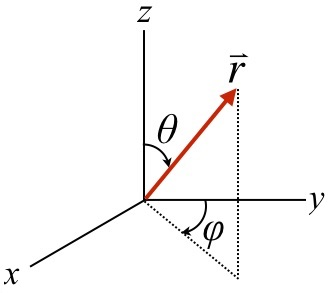

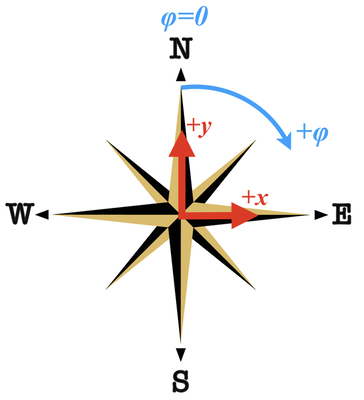

### Geometry {#Geom}

The Helios framework is centered around geometric objects called 'primitives'. Primitive elements build up the geometry of the domain, and typically store the data that couples models. For example, each primitive may have an associated surface temperature value that is updated or used by several different models.

#### Primitive Types {#PrimitiveTypes}

The available geometric primitive types are detailed below. Each primitive type has an enumeration that can be used in the code to reference each primitive type.

| Primitive | Description | Enumeration |
|-----------|-------------|-------------|
| Patch | Rectangular polygon with coplanar vertices. A patch is specified by the (x,y,z) coordinate of its center and by the lengths of its sides in the x- and y-directions. The default orientation of a patch is horizontal (i.e., it's normal is in the +z direction). | PRIMITIVE_TYPE_PATCH |
| Triangle | Triangular polygon specified by its three vertices. | PRIMITIVE_TYPE_TRIANGLE |
| Voxel | Parallelpiped or rectangular prism. A voxel is specified by the (x,y,z) coordinate of its center and by the lengths of its sides in the x-, y-, and z-directions. The default orientation of a voxel is axis-aligned. | PRIMITIVE_TYPE_VOXEL |

#### Adding Primitives {#AddingPrims}

Primitives are referenced by their 'universal unique identifier' or UUID. When a function is called to add a primitive to the context, a UUID is returned that can be used later to reference the primitive. Objects can be formed simply by storing a group of UUIDs corresponding to the primitives that make up the object.

Each primitive type has a different function that is used to add it to the Context, which are detailed in the table below.

| Primitive | Adder function |
|-----------|----------------|
| Patch | <ul><li>[addPatch(center, size)](pyhelios.Context.Context.addPatch)</li><li>[addPatch(center, size, rotation)](pyhelios.Context.Context.addPatch)</li><li>[addPatch(center, size, rotation, color)](pyhelios.Context.Context.addPatch)</li></ul> |
| Triangle | <ul><li>[addTriangle(vertex0, vertex1, vertex2)](pyhelios.Context.Context.addTriangle)</li><li>[addTriangle(vertex0, vertex1, vertex2, color)](pyhelios.Context.Context.addTriangle)</li><li>[addTriangleTextured(vertex0, vertex1, vertex2, texture_file, uv0, uv1, uv2)](pyhelios.Context.Context.addTriangleTextured)</li></ul> |
| Voxel | **Not implemented in PyHelios.** Use [addBox()](pyhelios.Context.Context.addBox) for box geometry. |

##### Adding Patches {#AddingPatch}

Patches are added by specifying the (x,y,z) coordinate of its center, the lengths of its sides in the x- and y-directions, and optionally its spherical rotation (see Coordinate System) and r-g-b color. The following is an example of using the `addPatch()` function to add a simple patch:

```python
from pyhelios import Context
from pyhelios.types import vec3, vec2

context = Context()

center = vec3(0, 0, 1)
size = vec2(1, 1)

UUID = context.addPatch(center, size)
```

This will add the Patch shown below, with the default orientation of horizontal. (Note that the addition of the checkerboard ground and the 'Visualizer' plugin is needed to replicate this image, which is not shown in the example code.)

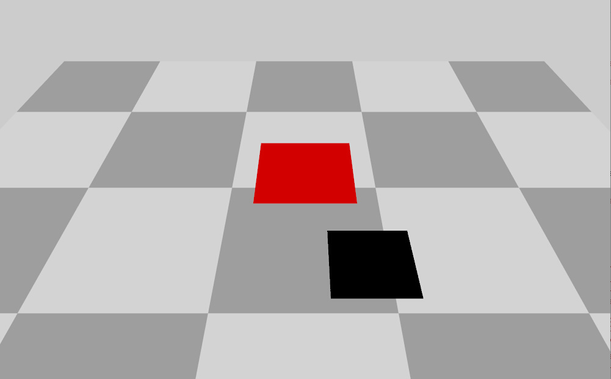

The patch can also be rotated by adding the optional SphericalCoord argument:

```python
from pyhelios.types import SphericalCoord
import math

center = vec3(0, 0, 1)
size = vec2(1, 1)
rotation = SphericalCoord(1, 0.25*math.pi, 0.5*math.pi)
context.addPatch(center, size, rotation)
```

This will first rotate the patch by 0.25π rad about the x-axis such that its normal is pointing toward the +y direction, THEN it will apply a clockwise azimuthal rotation of 0.5π rad such that its normal is pointing in the +x direction (which will be its final orientation). Note that in order to have more control over rotations, it is recommended to use the [rotatePrimitive()](pyhelios.Context.Context.rotatePrimitive) function (see "Primitive Transformations" section below).

##### Adding Triangles {#AddingTriangle}

Triangles are added by specifying the (x,y,z) coordinates of the triangle's three vertices, and optionally its r-g-b color. The following is an example of using the `addTriangle()` function to add a simple triangle:

```python
from pyhelios import Context
from pyhelios.types import vec3, RGBcolorcolor

context = Context()

v0 = vec3(-0.5, -0.5, 1)
v1 = vec3(0.5, -0.5, 1)
v2 = vec3(0, 0.5, 1)

UUID = context.addTriangle(v0, v1, v2, RGBcolorcolor(1, 0, 0))
```

This will add the Triangle shown below. (Note that the addition of the checkerboard ground and the 'Visualizer' plugin is needed to replicate this image, which is not shown in the example code.)

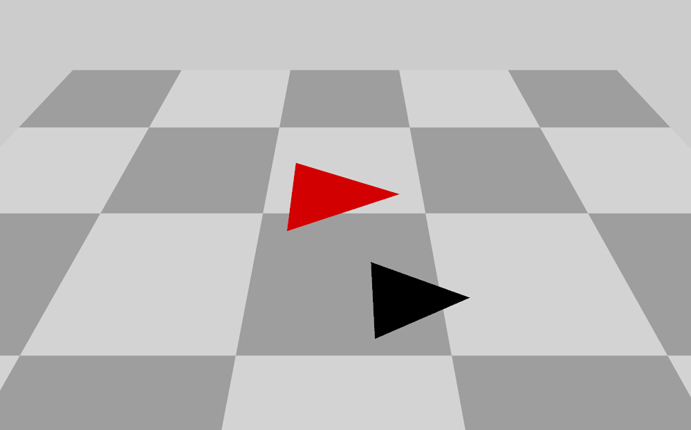

An important note for triangles is that the normal direction of the triangle follows the right-hand rule: use your right hand to connect each of the vertices in the order specified, and your thumb will point in the normal direction. This is illustrated in the figure below.

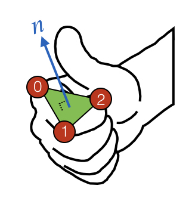

##### Adding Voxels {#AddingVoxel}

**Note: The `addVoxel()` method is not yet implemented in PyHelios.** Voxel geometry can be created by importing 3D models (PLY, OBJ formats) or using box compound geometry.

For box-shaped geometry, use:

```python
from pyhelios import Context
from pyhelios.types import vec3, int3, RGBcolorcolor

context = Context()

center = vec3(0, 0, 1)
size = vec3(1, 1, 1)
subdivisions = int3(1, 1, 1)

# Use addBox for voxel-like geometry
UUIDs = context.addBox(center, size, subdivisions, RGBcolorcolor(1, 0, 0))
```

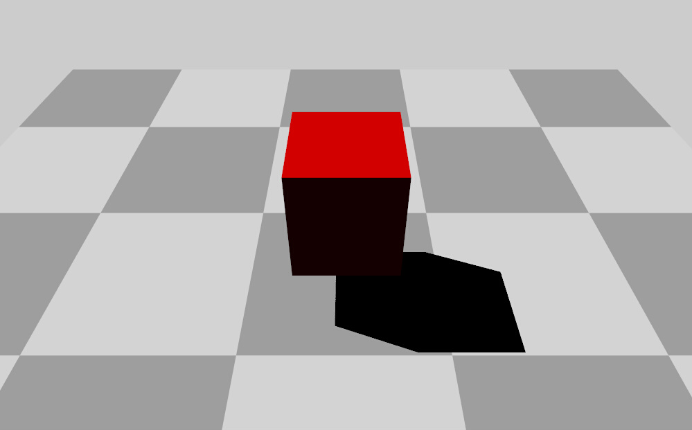

The voxel representation shown above is from the C++ Helios library. For PyHelios, use box geometry or import 3D models.

#### Primitive Transformations {#PrimTransform}

After primitives have been added to the Context, their position, size, and orientation can be further modified through transformations.

The [scalePrimitive()](pyhelios.Context.Context.scalePrimitive) function takes a vec3 that denotes a scaling factor to apply in each Cartesian direction (x,y,z). The [translatePrimitive()](pyhelios.Context.Context.translatePrimitive) function moves the primitive based on values provided by a vec3 that specifies the distance to translate in the x-, y-, and z-directions.

The [rotatePrimitive()](pyhelios.Context.Context.rotatePrimitive) function rotates the primitive about an axis through an angle specified in radians. To rotate about one of the x-, y-, or z-axes, the function can be supplied a string of 'x', 'y', or 'z', respectively. The primitive can also be rotated about an arbitrary axis described by a unit vector argument. By default, the axis passes through the origin, but there is also an option to specify an arbitrary axis of rotation passing through an arbitrary origin point.

It is important to note that the order in which transformations are applied matters. Each transformation is applied based on the primitives current state. Rotating a primitive centered about the origin will cause the primitive to rotate about its own center. However, if a primitive is first translated then rotated, the primitive will be rotated about the origin (0,0,0), which does not necessarily coincide with the primitive's center if it has been translated.

The table below gives a list of primitive transformation functions, each of which take either a single UUID or a vector of UUIDs to apply the same transformation to multiple primitives.

| Transformation | Function |
|----------------|----------|
| Translation | <ul><li>[translatePrimitive(UUID, shift)](pyhelios.Context.Context.translatePrimitive)</li><li>[translatePrimitive(UUIDs, shift)](pyhelios.Context.Context.translatePrimitive)</li></ul> |
| Rotation | <ul><li>[rotatePrimitive(UUID, rotation_radians, axis)](pyhelios.Context.Context.rotatePrimitive)</li><li>[rotatePrimitive(UUIDs, rotation_radians, axis)](pyhelios.Context.Context.rotatePrimitive)</li><li>[rotatePrimitive(UUID, rotation_radians, axis_vector)](pyhelios.Context.Context.rotatePrimitive)</li><li>[rotatePrimitive(UUIDs, rotation_radians, axis_vector)](pyhelios.Context.Context.rotatePrimitive)</li><li>[rotatePrimitive(UUID, rotation_radians, axis_vector, origin)](pyhelios.Context.Context.rotatePrimitive)</li><li>[rotatePrimitive(UUIDs, rotation_radians, axis_vector, origin)](pyhelios.Context.Context.rotatePrimitive)</li></ul> |
| Scaling | <ul><li>[scalePrimitive(UUID, scale)](pyhelios.Context.Context.scalePrimitive)</li><li>[scalePrimitive(UUIDs, scale)](pyhelios.Context.Context.scalePrimitive)</li></ul> |

Below is a code example of applying a transformation using a pointer to the primitive:

```python
from pyhelios import Context
from pyhelios.types import vec3, vec2

# Initialize the Context
context = Context()

# Add 'Patch' primitive
center = vec3(0, 0, 1)
size = vec2(1, 1)
UUID = context.addPatch(center, size)

# Apply translation
translation = vec3(1, 0, 0)
context.translatePrimitive(UUID, translation)
```

#### Primitive Properties {#PrimProps}

All primitives have a common set of data that can be accessed by the same set of functions, such as the primitive surface area, the primitive vertices, etc.

The table below gives a list of all available primitive property setter and getter functions. In some case, there is no setter function when it is an intrinsic property of the primitive that is not changeable.

| Property | Setter Function | Getter Function |
|----------|-----------------|-----------------|
| Primitive Type | N/A | [getPrimitiveType(UUID)](pyhelios.Context.Context.getPrimitiveType) |
| Surface Area | N/A | [getPrimitiveArea(UUID)](pyhelios.Context.Context.getPrimitiveArea) |
| Normal Vector | N/A | [getPrimitiveNormal(UUID)](pyhelios.Context.Context.getPrimitiveNormal) |
| Vertex Coordinates (x,y,z) | N/A | [getPrimitiveVertices(UUID)](pyhelios.Context.Context.getPrimitiveVertices) |
| Parent Object ID | N/A | [getPrimitiveParentObjectID(UUID)](pyhelios.Context.Context.getPrimitiveParentObjectID) |
| Diffuse R-G-B color code | <ul><li>[setPrimitiveColor(UUID, color)](pyhelios.Context.Context.setPrimitiveColor)</li><li>[setPrimitiveColor(UUIDs, color)](pyhelios.Context.Context.setPrimitiveColor)</li></ul> | [getPrimitiveColor(UUID)](pyhelios.Context.Context.getPrimitiveColor) |
| Diffuse R-G-B-A color code | <ul><li>[setPrimitiveColor(UUID, color)](pyhelios.Context.Context.setPrimitiveColor)</li><li>[setPrimitiveColor(UUIDs, color)](pyhelios.Context.Context.setPrimitiveColor)</li></ul> | [getPrimitiveColorRGBA(UUID)](pyhelios.Context.Context.getPrimitiveColorRGBA) |
| Affine Transformation Matrix | <ul><li>[setPrimitiveTransformationMatrix(UUID, transform)](pyhelios.Context.Context.setPrimitiveTransformationMatrix)</li><li>[setPrimitiveTransformationMatrix(UUIDs, transform)](pyhelios.Context.Context.setPrimitiveTransformationMatrix)</li></ul> | [getPrimitiveTransformationMatrix(UUID)](pyhelios.Context.Context.getPrimitiveTransformationMatrix) |

Some primitives have special functions specific to that type of primitive. For example, one may want to query the length and width of a Patch. These primitive-specific functions are tabulated below. If the type of the primitive corresponding to the UUID passed to the function does not match the primitive type for that function, an error will be thrown (for example passing a Triangle UUID to the function getPatchSize()).

| Primitive Type/Property | Getter Function |
|-------------------------|-----------------|
| Patch Center | [getPatchCenter(UUID)](pyhelios.Context.Context.getPatchCenter) |
| Patch Size | [getPatchSize(UUID)](pyhelios.Context.Context.getPatchSize) |
| Triangle Vertex | [getTriangleVertex(UUID, vertex_number)](pyhelios.Context.Context.getTriangleVertex) |
| Voxel Center | [getVoxelCenter(UUID)](pyhelios.Context.Context.getVoxelCenter) |
| Voxel Size | [getVoxelSize(UUID)](pyhelios.Context.Context.getVoxelSize) |

```python
from pyhelios import Context
from pyhelios.types import vec3, vec2, RGBcolor

# Initialize the Context
context = Context()

# Add 'Patch' primitive
center = vec3(0, 0, 1)
size = vec2(1, 1)
UUID = context.addPatch(center, size, color=RGBcolor(1, 0, 0))

# Get Patch size
SIZE = context.getPatchSize(UUID)
```

#### Texture Mapping {#Texture}

Images can be overlaid on patches and triangles through a process called [texture mapping](https://en.wikipedia.org/wiki/Texture_mapping). There are typically two reasons for doing this. One is simply for visualization purposes, as it easily allows for complex coloring of a surface by coloring a surface according to an image. The other is to create a more complex shape by removing a portion of the primitive surface according to the transparency channel of an image. Each of these cases are described in detail below.

##### Coloring Primitives by Texture Map {#TextureColor}

Patches: To color a Patch based on an image, simply pass the path to a PNG or JPEG image to the appropriate argument of the addPatch() command. Note that the path should either be absolute, or relative to the directory where the executable will be run (typically the `build' directory).

```python
from pyhelios.types import SphericalCoord

center = vec3(0, 0, 1)
size = vec2(2.5, 1)
rotation = SphericalCoord(1, 0, 0)
context.addPatch(center, size, rotation, "PSL_logo_white.png")
```

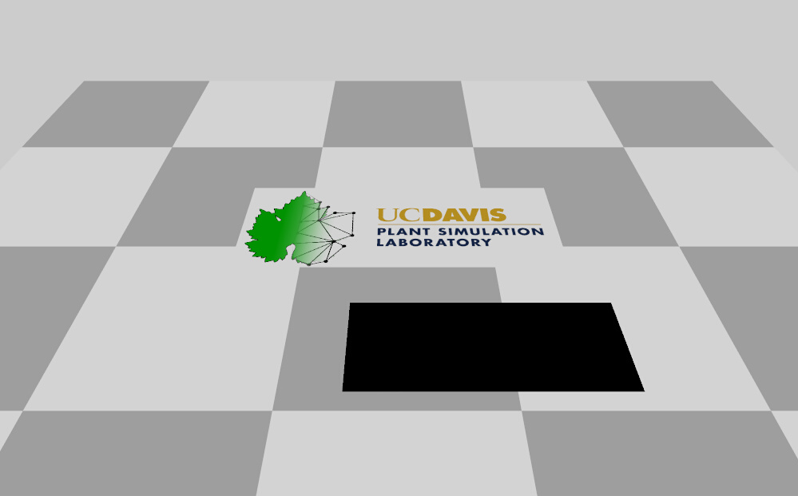

By default, the image is stretched to fill the entire surface of the patch. Alternatively, custom mapping coordinates can be supplied as illustrated below. Texture mapping coordinates are normalized to the dimensions of the image, such that the point (u,v)=(0,0) is in the lower left of the image, (u,v)=(1,1) is in the upper right of the image and so on.

Patches: For patches, the center and size of the box used to crop the texture are specified in (u,v) coordinates. In this example, the portion of the image inside of the red box would be mapped onto the patch, while the rest would be discarded.

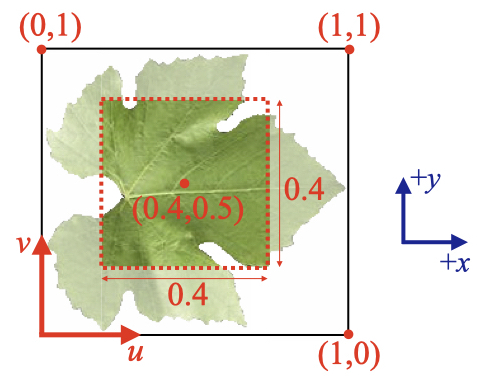

Triangles: For triangles, the (u,v) coordinates of the three triangle vertices are specified. For triangles, custom (u,v) coordinates must be specified when texture mapping.

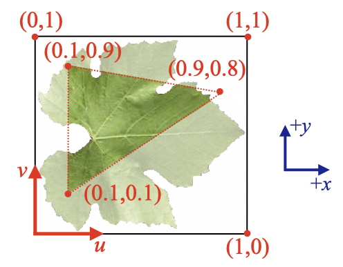

##### Masking Primitives by Image Transparency Channel {#TextureMask}

If the image provided for texture mapping has a transparency channel, the portion of the primitive that is transparent will automatically be removed, and the rest of the non-transparent portion of the primitive will be colored according to the image. Note that only PNG images are supported, since JPEG images do not have transparency. An example is given below.

```python
from pyhelios import Context
from pyhelios.types import vec3, vec2, SphericalCoord

# Initialize the Context
context = Context()

# Add 'Patch' primitive with transparency mask
center = vec3(0, 0, 1)
size = vec2(1, 1)

UUID = context.addPatch(center, size, SphericalCoord(1, 0, 0), "GrapeLeaf.png")
```

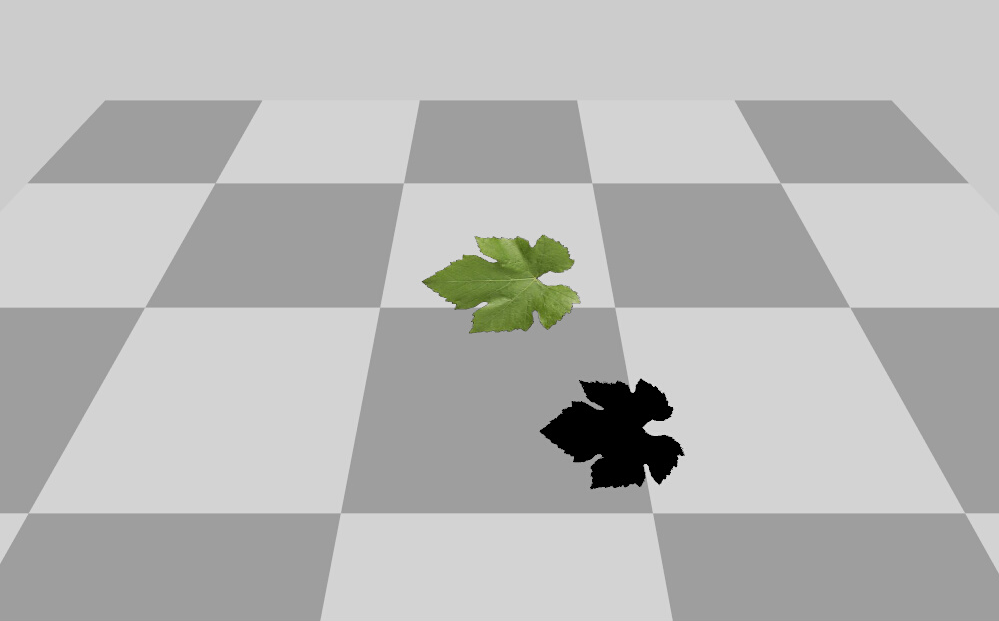

**A very important performance note when using texture-masked primitives with transparency:** When a texture-masked primitive with transparency is added to the Context, the solid surface area of the primitive is calculated by determining which fraction of pixels are non-transparent. This is a computationally expensive process when the image is high resolution (e.g., millions of pixels).

If you are adding many identical primitives/objects with transparency, it is better to add it to the Context one time, then copy and translate it as many times as you need. An example of this is given in the code below.

```python
from pyhelios import Context
from pyhelios.types import vec3, vec2, SphericalCoord

# Initialize the Context
context = Context()

# Add 'Patch' primitive with transparency mask
# We will add a patch at the origin and with unit size, and copy it multiple times
center = vec3(0, 0, 0)
size = vec2(1, 1)

UUID = context.addPatch(center, size, SphericalCoord(1, 0, 0), "GrapeLeaf.png")

for i in range(10):
    UUID_copy = context.copyPrimitive(UUID)

    position = vec3(i*3, 0, 0)

    context.translatePrimitive(UUID_copy, position)

# Let's delete the original "template"
context.deletePrimitive(UUID)
```

| Property | Getter Function |
|----------|-----------------|
| Texture File Name | [getPrimitiveTextureFile(UUID)](pyhelios.Context.Context.getPrimitiveTextureFile) |
| Size/resolution of Texture | [getPrimitiveTextureSize(UUID)](pyhelios.Context.Context.getPrimitiveTextureSize) |
| U,V Texture Coordinates | [getPrimitiveTextureUV(UUID)](pyhelios.Context.Context.getPrimitiveTextureUV) |
| Texture Transparency | [primitiveTextureHasTransparencyChannel(UUID)](pyhelios.Context.Context.primitiveTextureHasTransparencyChannel) |
| Texture Transparency Data | [getPrimitiveTextureTransparencyData(UUID)](pyhelios.Context.Context.getPrimitiveTextureTransparencyData) |
| Texture Color Override | [isPrimitiveTextureColorOverridden(UUID)](pyhelios.Context.Context.isPrimitiveTextureColorOverridden) |
| Solid Fraction | [getPrimitiveSolidFraction(UUID)](pyhelios.Context.Context.getPrimitiveSolidFraction) |

#### Compound Geometry {#Compound}

The Context has functions to rapidly generate various shapes, which consist of many primitives. These functions simply add the primitives needed to make the specified geometry, and return a vector of UUIDs corresponding to each of the primitives. The important distinction between these functions and those to add "Objects" (described below) is that Objects retain information about the overall 3D object such as the radius of the sphere.

Functions for adding compound geometry are listed below.

| Geometry | Description | Adder function(s) | Example |
|----------|-------------|-------------------|---------|
| Tile | Patch subdivided into uniform grid of sub-patches. | <ul><li>[addTile(center, size, rotation, subdiv)](pyhelios.Context.Context.addTile)</li><li>[addTile(center, size, rotation, subdiv, color)](pyhelios.Context.Context.addTile)</li><li>[addTile(center, size, rotation, subdiv, texturefile)](pyhelios.Context.Context.addTile)</li></ul> | 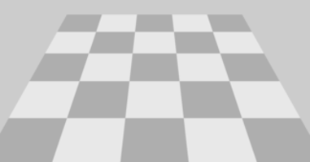 |
| Sphere | Spherical object tessellated with Triangle primitives. | <ul><li>[addSphere(Ndivs, center, radius)](pyhelios.Context.Context.addSphere)</li><li>[addSphere(Ndivs, center, radius, color)](pyhelios.Context.Context.addSphere)</li><li>[addSphere(Ndivs, center, radius, texturefile)](pyhelios.Context.Context.addSphere)</li></ul> | 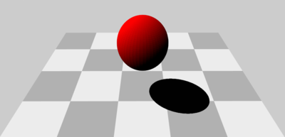 |
| Tube | Cylindrical tube object tessellated with Triangle primitives. Follows a specified path and can change radius along its length. | <ul><li>[addTube(Ndivs, nodes, radius)](pyhelios.Context.Context.addTube)</li><li>[addTube(Ndivs, nodes, radius, color)](pyhelios.Context.Context.addTube)</li></ul> | 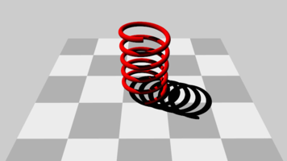 |
| Box | Rectangular prism object tessellated with Patch primitives. | <ul><li>[addBox(center, size, subdiv)](pyhelios.Context.Context.addBox)</li><li>[addBox(center, size, subdiv, color)](pyhelios.Context.Context.addBox)</li><li>[addBox(center, size, subdiv, color, reverse_normals)](pyhelios.Context.Context.addBox)</li></ul> | 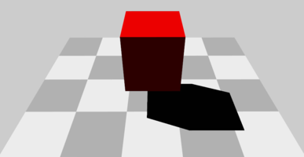 |
| Disk | Ellipsoidal disk object tessellated with Triangle primitives. | <ul><li>[addDisk(Ndiv, center, size)](pyhelios.Context.Context.addDisk)</li><li>[addDisk(Ndiv, center, size, rotation)](pyhelios.Context.Context.addDisk)</li><li>[addDisk(Ndiv, center, size, rotation, color)](pyhelios.Context.Context.addDisk)</li><li>[addDisk(Ndiv, center, size, rotation, color)](pyhelios.Context.Context.addDisk)</li><li>[addDisk(Ndiv, center, size, rotation, texture_file)](pyhelios.Context.Context.addDisk)</li></ul> | 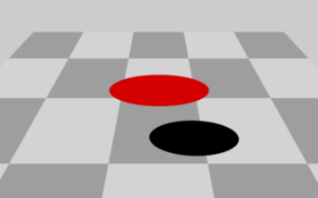 |

#### Objects {#Objects}

Objects are geometries consisting of many primitive elements. The critical difference between "Objects" and the compound objects described above is that Objects retain information about the overall geometry such as length, radius, etc., and have many sub-functions for manipulating them and assigning data. This is often useful when you want to know information about the overall object or want to manipulate the entire object in unison.

Functions for adding objects return a uint that serves as a unique identifier for the object, which can be used for later reference and manipulation. Functions for adding objects are listed in the table below.

| Object | Description | Adder function(s) | Example |
|--------|-------------|-------------------|---------|
| Tile | Patch subdivided into uniform grid of sub-patches. | <ul><li>[addTileObject(center, size, rotation, subdiv)](pyhelios.Context.Context.addTileObject)</li><li>[addTileObject(center, size, rotation, subdiv, color)](pyhelios.Context.Context.addTileObject)</li><li>[addTileObject(center, size, rotation, subdiv, texturefile)](pyhelios.Context.Context.addTileObject)</li></ul> |  |
| Sphere | Spherical object tessellated with Triangle primitives. | <ul><li>[addSphereObject(Ndivs, center, radius)](pyhelios.Context.Context.addSphereObject)</li><li>[addSphereObject(Ndivs, center, radius, color)](pyhelios.Context.Context.addSphereObject)</li><li>[addSphereObject(Ndivs, center, radius, texturefile)](pyhelios.Context.Context.addSphereObject)</li></ul> |  |
| Tube | Cylindrical tube object tessellated with Triangle primitives. Follows a specified path and can change radius along its length. | <ul><li>[addTubeObject(Ndivs, nodes, radius)](pyhelios.Context.Context.addTubeObject)</li><li>[addTubeObject(Ndivs, nodes, radius, color)](pyhelios.Context.Context.addTubeObject)</li></ul> |  |
| Box | Rectangular prism object tessellated with Patch primitives. | <ul><li>[addBoxObject(center, size, subdiv)](pyhelios.Context.Context.addBoxObject)</li><li>[addBoxObject(center, size, subdiv, color)](pyhelios.Context.Context.addBoxObject)</li><li>[addBoxObject(center, size, subdiv, color, reverse_normals)](pyhelios.Context.Context.addBoxObject)</li></ul> |  |
| Disk | Ellipsoidal disk object tessellated with Triangle primitives. | <ul><li>[addDiskObject(Ndiv, center, size)](pyhelios.Context.Context.addDiskObject)</li><li>[addDiskObject(Ndiv, center, size, rotation)](pyhelios.Context.Context.addDiskObject)</li><li>[addDiskObject(Ndiv, center, size, rotation, color)](pyhelios.Context.Context.addDiskObject)</li><li>[addDiskObject(Ndiv, center, size, rotation, color)](pyhelios.Context.Context.addDiskObject)</li><li>[addDiskObject(Ndiv, center, size, rotation, texture_file)](pyhelios.Context.Context.addDiskObject)</li></ul> |  |
| Cone | Tapered cylinder/cone object tessellated with triangles. | <ul><li>[addConeObject(Ndivs, node0, node1, radius0, radius1)](pyhelios.Context.Context.addConeObject)</li><li>[addConeObject(Ndivs, node0, node1, radius0, radius1, color)](pyhelios.Context.Context.addConeObject)</li><li>[addConeObject(Ndivs, node0, node1, radius0, radius1, texturefile)](pyhelios.Context.Context.addConeObject)</li></ul> | 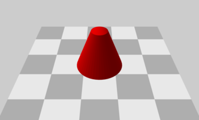 |

Similar to individual primitives, objects have functions to perform transformations on the entire object in unison. These functions are member functions of the CompoundObject class. As with primitives, you can use the identifier to an object to get its pointer, from which you can access member functions.

```python
from pyhelios.types import int2

objID = context.addTileObject(center, size, rotation, int2(2, 2))

# Get object pointer
obj = context.getObjectPointer(objID)

# Get object area
area = obj.getArea()
```

or a shorthand would be

```python
objID = context.addTileObject(center, size, rotation, int2(2, 2))
area = context.getObjectPointer(objID).getArea()
```

The table below gives a list of available Object functions.

| Property | Getter Function |
|----------|-----------------|
| Object ID | [getObjectID()](pyhelios.CompoundObject.getObjectID) |
| Object Type | [getObjectType()](pyhelios.CompoundObject.getObjectType) |
| Primitive Count | [getPrimitiveCount()](pyhelios.CompoundObject.getPrimitiveCount) |
| Member Primitive UUIDs | [getPrimitiveUUIDs()](pyhelios.CompoundObject.getPrimitiveUUIDs) |
| Member Primitive Check | [doesObjectContainPrimitive()](pyhelios.CompoundObject.doesObjectContainPrimitive) |
| Object Center | [getObjectCenter()](pyhelios.CompoundObject.getObjectCenter) |
| Surface Area | [getArea()](pyhelios.CompoundObject.getArea) |
| Override Texture | [overrideTextureColor()](pyhelios.CompoundObject.overrideTextureColor) |
| Use Texture | [useTextureColor()](pyhelios.CompoundObject.useTextureColor) |

Objects can be translated and rotated using functions similar to that of primitives:

| Transformation | Function |
|----------------|----------|
| Translate in x, y, or z direction | [translate(shift)](pyhelios.CompoundObject.translate) |
| Rotate about x, y, or z axis | [rotate(rotation_radians, axis)](pyhelios.CompoundObject.rotate) |
| Rotate about arbitrary axis | [rotate(rotation_radians, axis_vector)](pyhelios.CompoundObject.rotate) |
| Apply scaling factor in x, y, or z | [scale(scaling_factor)](pyhelios.CompoundObject.scale) |

Some objects have special functions specific to that type of object, which are listed below. In order to access these functions, you need to get a pointer to that type of object using the appropriate get[*]ObjectPointer() function.

| Object Type | Pointer Getter Function | Special Function |
|-------------|-------------------------|------------------|
| Tile | [getTileObjectPointer()](pyhelios.Context.Context.getTileObjectPointer) | <ul><li>[getSize()](pyhelios.Tile.getSize)</li><li>[getCenter()](pyhelios.Tile.getCenter)</li><li>[getSubdivisionCount()](pyhelios.Tile.getSubdivisionCount)</li><li>[getVertices()](pyhelios.Tile.getVertices)</li><li>[getNormal()](pyhelios.Tile.getNormal)</li><li>[getTextureUV()](pyhelios.Tile.getTextureUV)</li><li>[scale()](pyhelios.Tile.scale)</li></ul> |
| Sphere | [getSphereObjectPointer()](pyhelios.Context.Context.getSphereObjectPointer) | <ul><li>[getRadius()](pyhelios.Sphere.getRadius)</li><li>[getCenter()](pyhelios.Sphere.getCenter)</li><li>[getSubdivisionCount()](pyhelios.Sphere.getSubdivisionCount)</li><li>[scale()](pyhelios.Sphere.scale)</li></ul> |
| Tube | [getTubeObjectPointer()](pyhelios.Context.Context.getTubeObjectPointer) | <ul><li>[getNodes()](pyhelios.Tube.getNodes)</li><li>[getNodeRadii()](pyhelios.Tube.getNodeRadii)</li><li>[getSubdivisionCount()](pyhelios.Tube.getSubdivisionCount)</li><li>[scale()](pyhelios.Tube.scale)</li></ul> |
| Box | [getBoxObjectPointer()](pyhelios.Context.Context.getBoxObjectPointer) | <ul><li>[getSize()](pyhelios.Box.getSize)</li><li>[getCenter()](pyhelios.Box.getCenter)</li><li>[getSubdivisionCount()](pyhelios.Box.getSubdivisionCount)</li><li>[scale()](pyhelios.Box.scale)</li></ul> |
| Disk | [getDiskObjectPointer()](pyhelios.Context.Context.getDiskObjectPointer) | <ul><li>[getSize()](pyhelios.Disk.getSize)</li><li>[getCenter()](pyhelios.Disk.getCenter)</li><li>[getSubdivisionCount()](pyhelios.Disk.getSubdivisionCount)</li><li>[scale()](pyhelios.Disk.scale)</li></ul> |
| Cone | [getConeObjectPointer()](pyhelios.Context.Context.getConeObjectPointer) | <ul><li>[getNodeCoordinates()](pyhelios.Cone.getNodeCoordinates)</li><li>[getNodeCoordinate()](pyhelios.Cone.getNodeCoordinate)</li><li>[getNodeRadii()](pyhelios.Cone.getNodeRadii)</li><li>[getNodeRadius()](pyhelios.Cone.getNodeRadius)</li><li>[getSubdivisionCount()](pyhelios.Cone.getSubdivisionCount)</li><li>[getAxisUnitVector()](pyhelios.Cone.getAxisUnitVector)</li><li>[getLength()](pyhelios.Cone.getLength)</li><li>[scaleLength()](pyhelios.Cone.scaleLength)</li><li>[scaleGirth()](pyhelios.Cone.scaleGirth)</li></ul> |

## Data Structures {#Data}

Data structures that are moved in and out of plugins are managed by the Context.  There are two types of Context data structures that serve different purposes:

- **Primitive Data** - is a piece of data associated with a given primitive. An example of this may be the reflectivity or temperature of a given primitive. Primitive data is flexible in that it can have different data types, variable lengths, and can be different for different primitives.  For example, voxels could have a data value specifying the attenuation coefficient, but the attenuation coefficient would not be relevant for patches so they would not have this piece of data.  A given primitive could have an array of 10 integers as its data.  However, primitive data is limited to one-dimensional arrays, and mapping to multidimensional data is left to the user.
- **Global Data** - is similar to 'primitive data', except that global data is not necessarily associated with any particular primitive. An example of global data might be the solar radiative flux incident on the earth.

Implementation of data structure usage is detailed for each type of structure below.

PyHelios supports primitive and global data of the following types: `int`, `uint`, `float`, `double`, `vec2`, `vec3`, `vec4`, `int2`, `int3`, `int4`, and `str`. Unlike the C++ API which uses type enumeration constants, PyHelios uses type-specific methods (e.g., `setPrimitiveDataFloat()`, `setPrimitiveDataVec3()`) for clearer, more Pythonic code.

### Primitive Data {#PrimData}

#### Setting Primitive Data Values {#SetPrimData}

Primitive data values can be scalar or a one-dimensional array of values.

Primitive data is set for a given primitive via the Context using the [setPrimitiveData(UUID, label, value)](pyhelios.Context.Context.setPrimitiveData) function. Example use of this function for scalar data is given below.

```python
from pyhelios import Context
from pyhelios.types import vec3, vec2, RGBcolorcolor

context = Context()

center = vec3(0, 0, 0)
size = vec2(1, 1)

UUID = context.addPatch(center, size, RGBcolorcolor(1, 0, 0))

eps = 0.9
context.setPrimitiveDataFloat(UUID, "emissivity", eps)
```

For array/vector data, use the appropriate vector type. PyHelios provides type-specific methods for setting primitive data.

```python
from pyhelios import Context
from pyhelios.types import vec3, vec2, RGBcolor

context = Context()

center = vec3(0, 0, 0)
size = vec2(1, 1)

UUID = context.addPatch(center, size)

# For vec2 data, use setPrimitiveDataVec2
context.setPrimitiveDataVec2(UUID, "somedata", vec2(2.3, 9.2))

# Or pass components directly
context.setPrimitiveDataVec2(UUID, "somedata", 2.3, 9.2)
```

#### Getting Primitive Data Values {#GetPrimData}

If primitive data is a scalar value, it can be retrieved for a given primitive via the Context using the [getPrimitiveData(UUID, label)](pyhelios.Context.Context.getPrimitiveData) function:

```python
from pyhelios import Context

context = Context()

center = vec3(0, 0, 0)
size = vec2(1, 1)

UUID = context.addPatch(center, size)

eps = 0.9
context.setPrimitiveData(UUID, "emissivity", eps)

emissivity = context.getPrimitiveData(UUID, "emissivity")
```

In the above example, the value of 'emissivity' is 0.9.

#### Primitive Data Query Functions {#PrimDataHelpers}

It is often necessary to query information about primitive data. The following table lists functions used to query primitive data information.

| Function | Description |
|----------|-------------|
| [doesPrimitiveDataExist(UUID, label)](pyhelios.Context.Context.doesPrimitiveDataExist) | Check whether primitive data named 'label' exists for the primitive. |
| [getPrimitiveDataType(UUID, label)](pyhelios.Context.Context.getPrimitiveDataType) | Get the HeliosDataType for the primitive. |
| [getPrimitiveDataSize(UUID, label)](pyhelios.Context.Context.getPrimitiveDataSize) | Get the length/size of the primitive data named 'label'. |

<p> <br> </p>

```python
from pyhelios import Context

context = Context()

center = vec3(0, 0, 0)
size = vec2(1, 1)

UUID = context.addPatch(center, size)

eps = 0.9
context.setPrimitiveDataFloat(UUID, "emissivity", eps)

if context.doesPrimitiveDataExist(UUID, "emissivity"):
    data_type = context.getPrimitiveDataType(UUID, "emissivity")
    L = context.getPrimitiveDataSize(UUID, "emissivity")
```

### Global Data {#GlobalData}

Global data is similar to primitive data, except that it does not correspond to any particular primitive, rather it is a single instance of a certain data structure. The functions used to create global data within the Context are essentially the same as those used to create primitive data, except they do not take a primitive UUID as an argument (because they do not correspond to primitives).

### Data Timeseries (Weather Inputs) {#DataTimeseries}

Timeseries - or data points corresponding to discrete points in time - can be managed by the Context.  This typically corresponds to weather data that is measured by a sensor.  Timeseries data points are added to the Context by giving the value of the data point, along with Date and Time vectors.  An example is given below to manually add 15-min timeseries data to the Context.

Data in the timeseries can be accessed either via the queryTimeseriesData() function by giving the index of the data point, or by giving a date and time.  To loop through all data in the timeseries, we can query the length of the timeseries and make a for-loop.

```python
from pyhelios import Context
from pyhelios.types import Date, Time

# Initialize the Context
context = Context()

# Add data to timeseries
# Date constructor: Date(year, month, day)
date = Date(2000, 1, 2)  # 2 Jan. 2000

time = Time(13, 0, 0)  # 13:00:00
context.addTimeseriesData("temperature", 301.23, date, time)  # index #0

time = Time(13, 15, 0)  # 13:15:00
context.addTimeseriesData("temperature", 301.92, date, time)  # index #1

time = Time(13, 30, 0)  # 13:30:00
context.addTimeseriesData("temperature", 302.56, date, time)  # index #2

time = Time(13, 45, 0)  # 13:45:00
context.addTimeseriesData("temperature", 303.05, date, time)  # index #3

T = context.queryTimeseriesData("temperature", 1)  # Here, T = 301.92

time = Time(13, 15, 0)
T = context.queryTimeseriesData("temperature", date, time)  # Also here, T = 301.92

for i in range(context.getTimeseriesLength("temperature")):
    T = context.queryTimeseriesData("temperature", i)
    time = context.getTimeseriesTime("temperature", i)
    print(f"Temperature at time {time.hour:02d}:{time.minute:02d}:{time.second:02d} is {T}")
```

Typically, data is not entered manually, but rather through an XML or text file (see [Reading XML Files](#XMLread) for information).

It is often necessary to get the number of data points in a given timeseries, which can be accomplished with the command:

```python
N = context.getTimeseriesLength("temperature")
```

---

